# React 學習筆記

主要根據 [從 Hooks 開始，讓你的網頁 React 起來](https://pjchender.dev/react-bootcamp/) 整理的學習筆記，方便查閱。

> 以下皆使用 React 18 版本實作範例。

## 目錄

- React 基礎

  - [JSX 的使用](#jsx-的使用)

  - [用 JSX 寫 Hello World (CodePen)](#用-jsx-寫-hello-world-codepen)

  - [在 JSX 中帶入變數與表達式 (CodePen)](#在-jsx-中帶入變數與表達式-codepen)

  - [將計數器範例改用 JSX 來寫 (CodePen)](#將計數器範例改用-jsx-來寫-codepen)

  - [在 JSX 中套用 CSS inline-style （行內樣式）(CodePen)](#在-jsx-中套用-css-inline-style-行內樣式codepen)

  - [建立第一個 React 元件 (CodePen)](#建立第一個-react-元件-codepen)

  - [React 元件與 HTML 元素的命名規則與慣例](#react-元件與-html-元素的命名規則與慣例)

  - [React 中的事件處理 (CodePen)](#react-中的事件處理-codepen)

  - [React 元件中的資料狀態 - useState 的使用 (CodePen)](#react-元件中的資料狀態---usestate-的使用-codepen)

  - [條件轉譯的使用（conditional rendering）(CodePen)](#條件轉譯的使用conditional-renderingcodepen)

  - [動態添加 CSS 樣式來隱藏 HTML 元素 (CodePen)](#動態添加-css-樣式來隱藏-html-元素-codepen)

  - [計數器事件處理器的重構 (CodePen)](#計數器事件處理器的重構-codepen)

  - [JSX 中迴圈的使用 (CodePen)](#jsx-中迴圈的使用-codepen)

  - [JSX 元素只能有一個最外層元素 (CodePen)](#jsx-元素只能有一個最外層元素-codepen)

  - [React Hooks 不可這麼用](#react-hooks-不可這麼用)

- React 元件間的資料傳遞：props 的應用

  - [使用 Create React App 工具建立專案](#使用-create-react-app-工具建立專案)

  - [建立網速單位轉換器的 UI](#建立網速單位轉換器的-ui)

  - [React 中表單的基本應用](#react-中表單的基本應用)

  - [React 元件的拆分](#react-元件的拆分)

  - [React 元件間的資料傳遞 - props 的使用](#react-元件間的資料傳遞---props-的使用)

  - [使用 React FontAwesome](#使用-react-fontawesome)

## JSX 的使用

透過 JSX 讓開發者可以直接把 HTML 放到 JavaScript 中，將 JavaScript 內的用法與程式邏輯，直接套用到 HTML 的元素上，不再需要先用 `querySelector` 去選到指定元素後再進行更新操作。

## 用 JSX 寫 Hello World (CodePen)

[💻CodePen Demo](https://codepen.io/ypinpin/pen/MWNLGVR)

- 在 CodePen 上設定使用 Babel 做為 JavaScript 前處理器（Preprocessor），並且載入 React 和 ReactDOM 套件。

  - https://unpkg.com/react@18/umd/react.development.js

  - https://unpkg.com/react-dom@18/umd/react-dom.development.js

  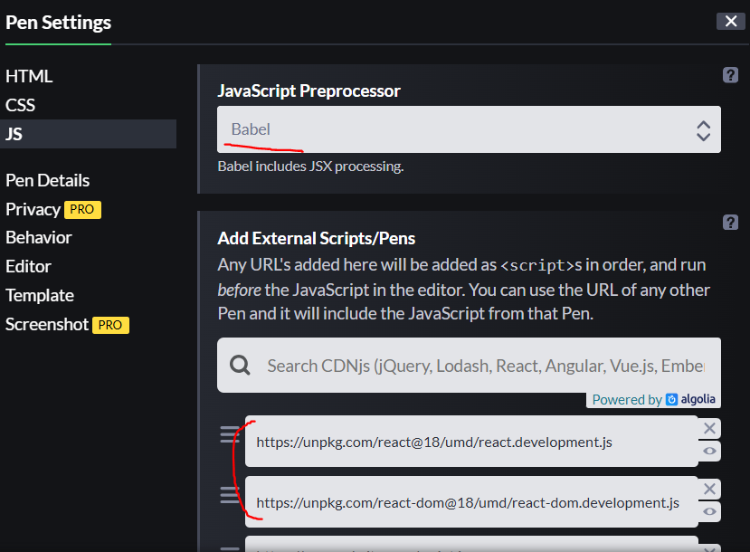

- 設定 HTML。

  ```html
  <div id="root"></div>
  ```

- 使用 JSX 顯示 Hello world。

  ```JSX
  const { createRoot } = ReactDOM;

  // 告訴 React 要把內容 render 在哪個 DOM element 內
  const rootElement = document.getElementById('root');
  const root = createRoot(rootElement);

  // 告訴 React 要 render 的內容是什麼
  root.render(<h1>Hello, world!</h1>);
  ```

  

## 在 JSX 中帶入變數與表達式 (CodePen)

- 要把 JavaScript 的變數帶入到 JSX 中，只需要在 JSX 中把 **JavaScript 變數**用 `{ }` 大括號包起來就可以了。

  ```JSX
  const { createRoot } = ReactDOM;

  const rootElement = document.getElementById('root');
  const root = createRoot(rootElement);

  // 使用變數
  const word = 'React';

  root.render(<h1>Hello, {word}!</h1>);
  ```

  [💻CodePen Demo](https://codepen.io/ypinpin/pen/eYqxKBJ)。

  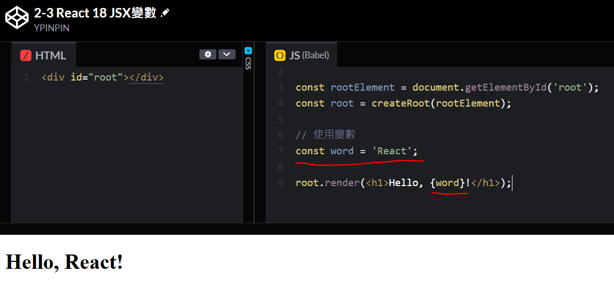

- 除了變數之外，也可以在 JSX 的 `{ }` 中放入 **JavaScript 表達式（expression）**，這個表達式的回傳值就會直接呈現在畫面上。

  > Tips：表達式（expression）指的是輸入之後會得到回傳值的語法；陳述句（statement）則不會有回傳值，像是 `if...else`, `for` 迴圈等等這類。

  ```JSX
  const { createRoot } = ReactDOM;

  const rootElement = document.getElementById('root');
  const root = createRoot(rootElement);

  // 使用變數及表達式
  const deviceName = 'Galaxy S24 Ultra';
  const currentPrice = 43900;
  const salePrice = (currentPrice, discount) => currentPrice * discount;

  root.render(
    <h1>
      現在 {deviceName} 的售價是 ${currentPrice}，特價 $
      {salePrice(currentPrice, 0.85)}
    </h1>
  );
  ```

  [💻CodePen Demo](https://codepen.io/ypinpin/pen/jOgdKxE)。

  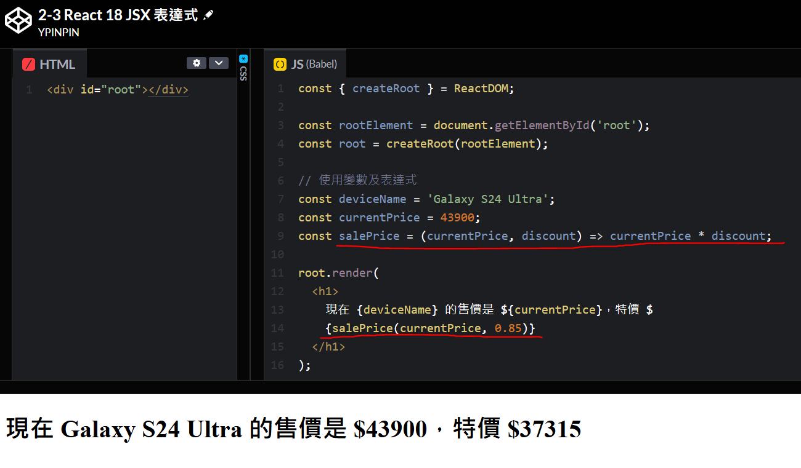

## 將計數器範例改用 JSX 來寫 (CodePen)

將此 [計數器範例](https://codepen.io/PJCHENder/pen/VwevJrz) 改用 JSX 來寫。

- 把 HTML 部分放入 JSX 中。

  ```JSX
  // 省略...

  root.render(
    <div class="container">
      <div class="chevron chevron-up"></div>
      <div class="number">256</div>
      <div class="chevron chevron-down"></div>
    </div>
  );
  ```

- 另外在 JavaScript 中，我們也可以**把寫在 JSX 中 HTML 的部分定義成一個變數，將 JSX 放入 `()` 中**，像是這裡可以把它定義為 `Counter`，然後再把這個變數放到 `root.render()` 中。

  ```JSX
  // 省略...

  // JSX 的內容可以放到 () 內當成變數
  const Counter = (
    <div class="container">
      <div class="chevron chevron-up"></div>
      <div class="number">256</div>
      <div class="chevron chevron-down"></div>
    </div>
  );

  root.render(Counter);
  ```

- 補充：在 JSX 中**當開始和結束的標籤（tag）之間沒有任何內容的時候，就可以把它自己關閉（self closing tag）起來**，也就是在開頭的 HTML 標籤最後加上 `/` 即可，結尾的 HTML 標籤即可移除，舉例來說 `<div></div>`，因為開頭和結尾的 HTML 標籤之間沒有任何內容，因此在 JSX 中會變成 `<div />`。

  ```JSX
  // 省略...

  // JSX 的內容可以放到 () 內當成變數
  const Counter = (
    <div class="container">
      <div class="chevron chevron-up" />
      <div class="number">256</div>
      <div class="chevron chevron-down" />
    </div>
  );

  root.render(Counter);
  ```

- 最後複製 CSS 樣式

  [💻CodePen Demo](https://codepen.io/ypinpin/pen/RwXvJdE)。

  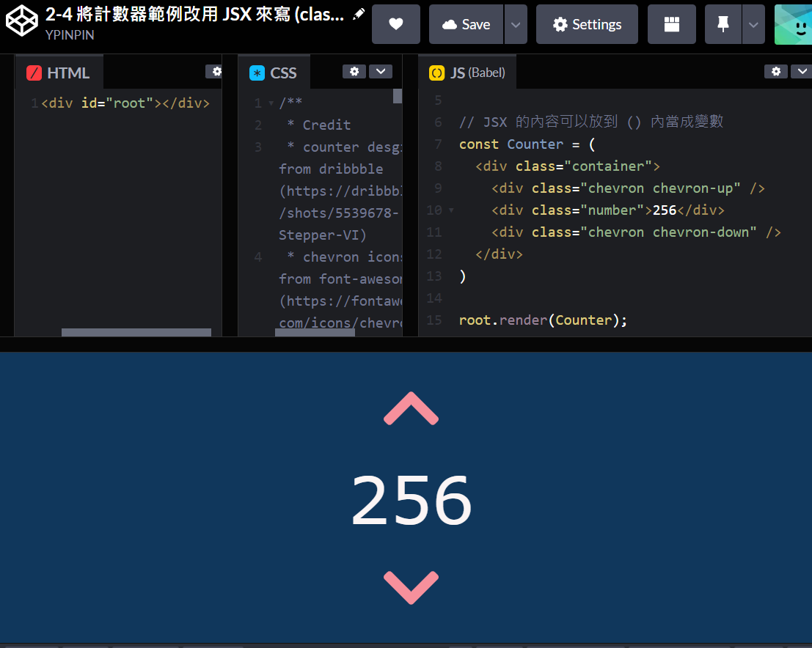

  現在雖然從 CodePen 看畫面都正常， CSS 樣式也都有顯示，但實際上透過 CodePen 上的 console 視窗，或用瀏覽器內建的開發者工具打開 console 視窗都會看到一個錯誤訊息：

  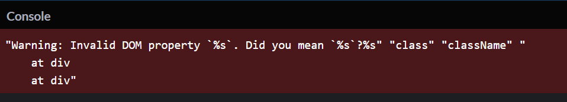

  這是因為在 JavaScript 中，`class` 本身就已經是個關鍵字，它主要是用來定義類別用的，因此為了避免踩到 JavaScript 的這個關鍵字，**需要把在 JSX 中會把原本 HTML 中使用的 `class=""` 都改用 `className=""`**，因此程式碼會變成：

  ```JSX
  // 省略...

  // 在 JSX 中使用 CSS class
  // 避免關鍵字衝突，在 JSX 中把原本的 CSS class 都改成用 className
  const Counter = (
    <div className="container">
      <div className="chevron chevron-up" />
      <div className="number">256</div>
      <div className="chevron chevron-down" />
    </div>
  );

  root.render(Counter);
  ```

  [💻CodePen Demo](https://codepen.io/ypinpin/pen/NWQoBwb)。

  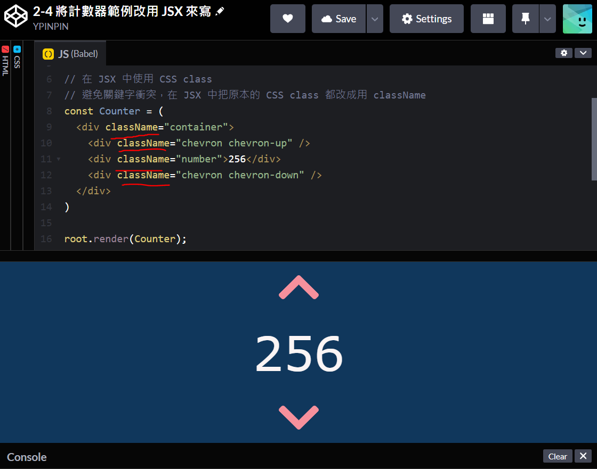

## 在 JSX 中套用 CSS inline-style （行內樣式）(CodePen)

除了前面介紹的使用 `className=""` 的方式設定 CSS class 樣式，如果我們需要在 JSX 中撰寫 CSS inline-style （行內樣式）的話，**可以在 HTML 標籤內的 `style` 屬性中以帶入「物件」的方式來完成**。

在 JSX 中可以使用 `{}` 來帶入變數，因此當我們想要撰寫 inline-style 時，就可以在 `<div style={} >` 的 `{}` 中放入「物件」。

**物件的屬性名稱會是 CSS 的屬性，但會用「小寫駝峰」來表示；屬性值則是 CSS 的值**，具體的寫法會像這樣：

```JSX
// 省略...

// 定義 inline-style 行內樣式
const someStyle = {
  backgroundColor: 'yellow',
  fontSize: '20px', // 也可以寫 20，引號和 px 可以省略
  border: '1px solid white',
  padding: 10, // 省略 px，樣式會自動帶入單位變成 '10px'
};

// 在 style 中帶入物件，即可撰寫出 inline-style
root.render(<div style={someStyle}>Hello, CSS inline-style</div>);
```

這裡我們可以注意到：

- **屬性名稱都會以小寫駝峰命名**，例如 `backgroundColor` 和 `fontSize`。

- 要記得這是 JavaScript 物件，所以想要直接使用顏色時，**要使用字串的方式表示**，所以使用 `'white'` 時有用引號包起來。

- **屬性值預設會以 `px` 為單位**，所以 `padding: 10` 指的就是 `'10px'`；而 `fontSize: '20px'` 可以縮寫成 `fontSize: 20`。

- 而因為這是 JavaScript 物件，**所以每個屬性的最後是使用 `,` 而不是 `;` 來做換行**。

[💻CodePen Demo](https://codepen.io/ypinpin/pen/eYqxjKr)。

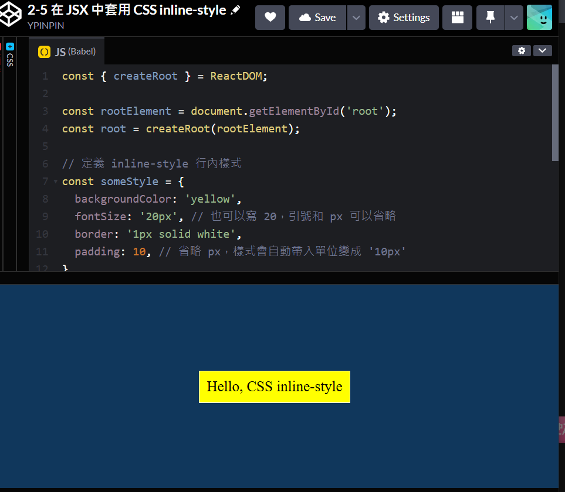

現在可以試著在計數器範例中添加 CSS inline-style：

```JSX
// 省略...

// 定義 inline-style 行內樣式
const shadow = {
  boxShadow: 'rgb(20, 76, 128) 0px 0px 10px 10px',
  padding: 20, // 省略 px，樣式會自動帶入單位變成 '20px'
};

const Counter = (
  <div className="container" style={shadow}>
    <div className="chevron chevron-up" />
    <div className="number">256</div>
    <div className="chevron chevron-down" />
  </div>
);

root.render(Counter);
```

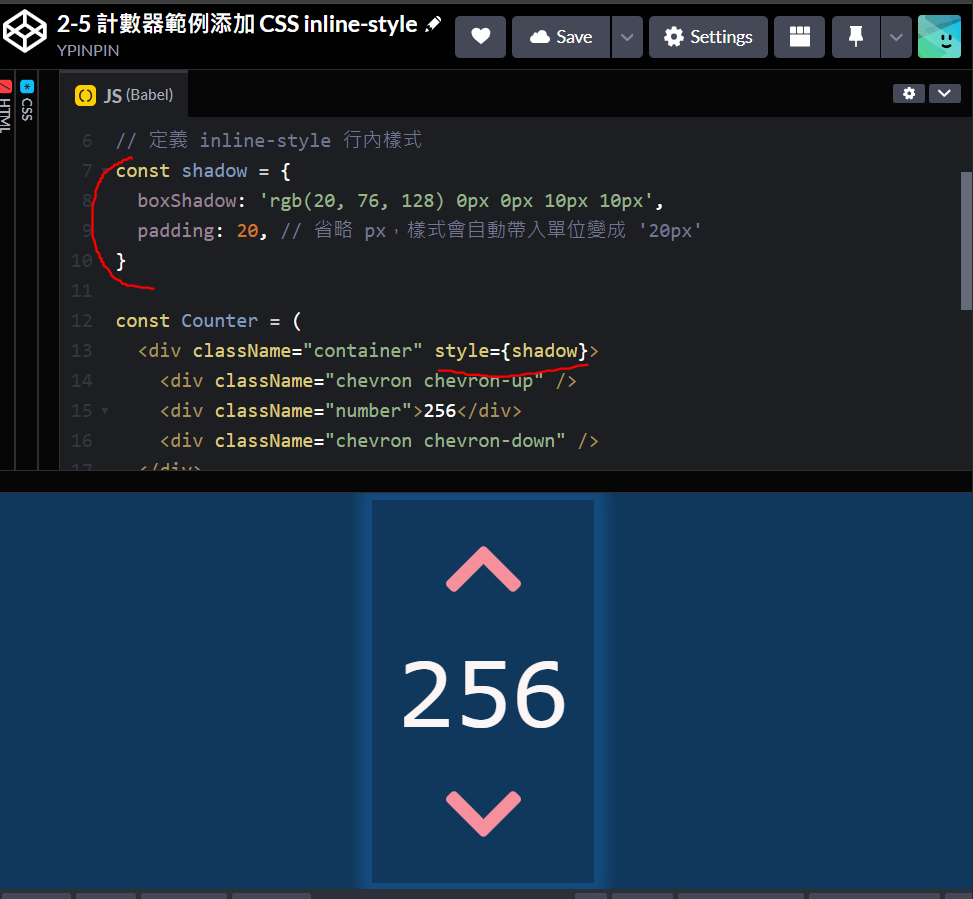

而有時候開發者可能不會先定義一個 inline-style 的物件，**而是直接把 inline-style 這個物件寫在 `style={}` 的 `{}` 內**，因此會看到 `style={{...}}` 這樣的寫法，實際上就只是在 `style={}` 的 `{}` 內再放入一個物件而已。

```JSX
// 省略...

// 定義 inline-style 行內樣式
const shadow = {
  boxShadow: 'rgb(20, 76, 128) 0px 0px 10px 10px',
  padding: 20, // 省略 px，樣式會自動帶入單位變成 '20px'
};

// 在 JSX 中使用行內樣式
// 在 style 屬性中直接帶入物件
const Counter = (
  <div className="container" style={shadow}>
    <div className="chevron chevron-up" />
    <div
      className="number"
      style={{
        color: '#DED5D5',
        textShadow: '4px 4px #434a54',
      }}
    >
      256
    </div>
    <div className="chevron chevron-down" />
  </div>
);

root.render(Counter);
```

[💻CodePen Demo](https://codepen.io/ypinpin/pen/NWQJRKg)。

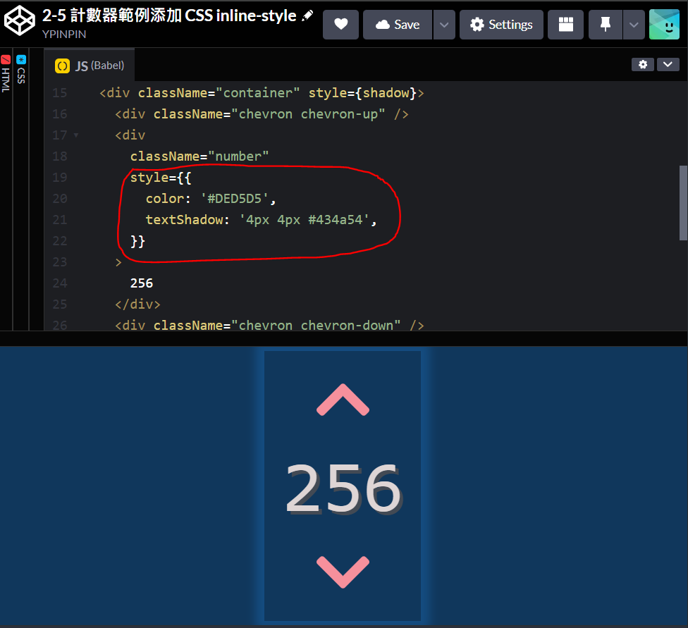

## 建立第一個 React 元件 (CodePen)

在 React 中，除了把 JSX 當成一個 JavaScript 變數直接傳遞之外，更常見的是**把 JSX 的內容包成一個 React 元件**，以下將使用函式來建立 React 元件。

[💻CodePen Demo](https://codepen.io/ypinpin/pen/vYoPXeX)。

- 建立 React Component

  我們可以**建立一個函式把 JSX 的內容回傳出來**。

  ```JSX
  // 建立一個名為 Counter 的 React 元件
  const Counter = () => {
    return (
      <div className="container">
        <div className="chevron chevron-up" />
        <div className="number">256</div>
        <div className="chevron chevron-down" />
      </div>
    );
  };
  ```

  而在箭頭函式（arrow function）中，當該函式只是單純回傳某一值時，可以把要回傳的內容直接放到 `=>` 後面而不用額外再寫 `return`，因此也可以精簡成以下程式碼：

  ```JSX
  // 建立一個名為 Counter 的 React 元件
  const Counter = () => (
    <div className="container">
      <div className="chevron chevron-up" />
      <div className="number">256</div>
      <div className="chevron chevron-down" />
    </div>
  );
  ```

  > Tips：這裡使用函式所建立出的 React 元件，稱作 Function Component，而稍後談到的 React Hooks 也只能在 Function Component 中使用。在還沒有 React Hooks 以前，則常會以 class 的方式來建立元件，稱作 Class Component。

- 使用 React Component

  現在只需把剛剛建立好的 React 元件當成一個 HTML 標籤 `<Counter />`
  放進 `root.render()` 中就可以了。

  ```JSX
  // 省略...

  // 建立一個名為 Counter 的 React 元件
  const Counter = () => (
    <div className="container">
      <div className="chevron chevron-up" />
      <div className="number">256</div>
      <div className="chevron chevron-down" />
    </div>
  );

  // 使用 <Counter /> 來帶入 React 元件
  root.render(<Counter />);
  ```

  可以發現這與原本建立變數並帶入的寫法差別並不大：

  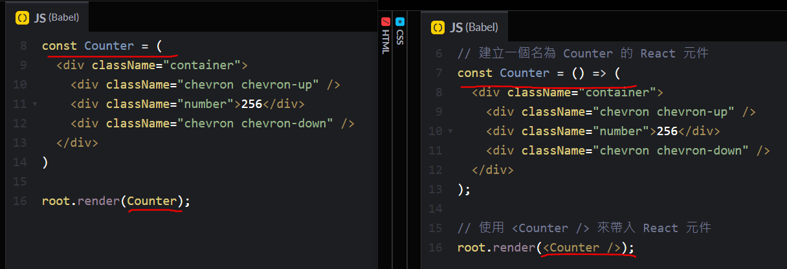

  而使用元件的好處在於讓開發者可以**輕鬆的重複使用這些元件**。當我們需要三個計數器時，只需要使用三次 `<Counter />` 就可以了，不需要複製同樣的 HTML 到程式碼中，並且因為 `querySelector` 會選到重複的元素，而必須要再去修改程式碼才能讓這三個計數器都擁有正常的功能。

  ```JSX
  // 省略...

  // 建立一個名為 Counter 的 React 元件
  const Counter = () => (
    <div className="container" style={{ margin: '0 30px' }}>
      <div className="chevron chevron-up" />
      <div className="number">256</div>
      <div className="chevron chevron-down" />
    </div>
  );

  // 使用 <Counter /> 來帶入 React 元件
  root.render(
    <div style={{ display: 'flex', justifyContent: 'space-between' }}>
      <Counter />
      <Counter />
      <Counter />
    </div>
  );
  ```

  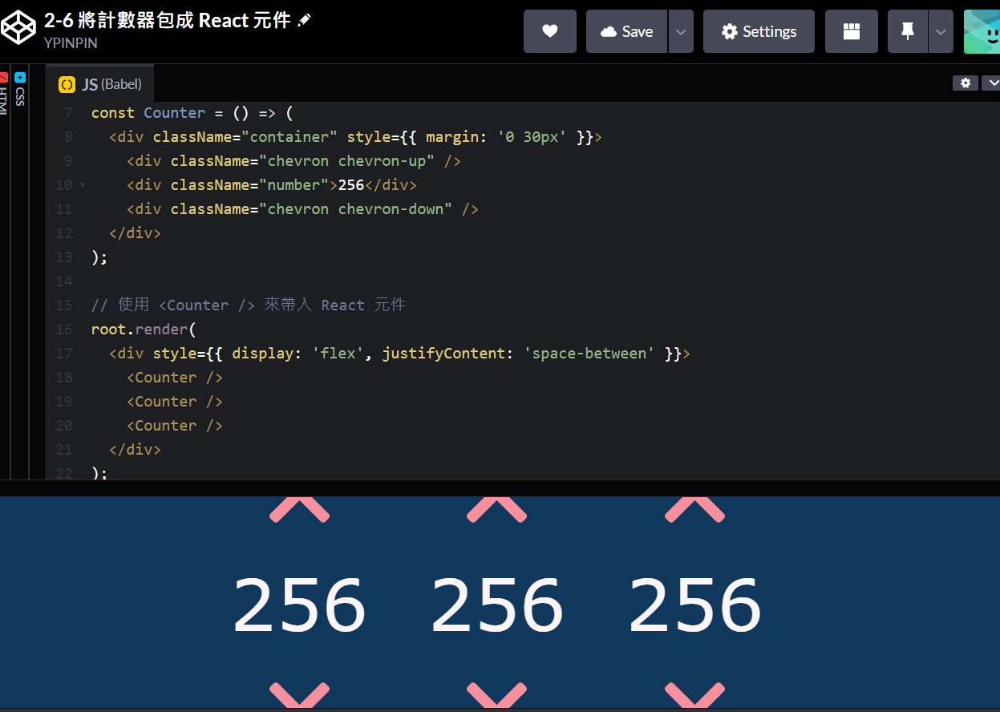

  而元件除了可以幫助開發者根據每個元素的功能去做切割分類以提高維護性外，重要的是**元件讓開發者可以建立可被重複使用的 HTML 元素、樣式或操作邏輯**，當未來需要修改的時候，不需要在到每隻檔案中去做修改，只需要修改這個被共用到的元件即可。

## React 元件與 HTML 元素的命名規則與慣例

在 React 中對於元件和 HTML 屬性、CSS 樣式等等有一些命名上的「慣例」。

React 的「元件名稱」會以**大寫駝峰**的方式來命名，也就是首字母大寫，例如， `Counter`，若該名稱由多個單字組成，則把每一單字的第一個字大寫，例如，`AdminHeader`、`PaymentButton`。如果沒這麼做的話，React 會把它當作一般的 HTML 元素處理，並跳出錯誤提示。

其他像是 HTML 中的屬性、CSS 樣式屬性或一般的函式來說，則會遵行 JavaScript 以**小寫駝峰**來命名變數的慣例，例如 `className`、`maxLength`、`backgroundColor` 等等。

舉例來說：

以 `<input type="text" maxlength="10" />` 為例，在 React 的 JSX 中需要把 `maxlength` 改成 `maxLength`，不然一樣會拋出錯誤。

[💻CodePen Demo](https://codepen.io/ypinpin/pen/GRVeNvG)。

```JSX
// 省略..

// 「元件名稱」會以大寫駝峰的方式來命名
// HTML 中的屬性、CSS 樣式屬性或一般的函式來說，則會遵行 JavaScript 以小寫駝峰來命名
const InputText1 = () => (<input type="text" maxlength="10" />)
// 正確寫法
const InputText2 = () => (<input type="text" maxLength="10" />)

root.render(
  <div style={{ display: 'flex', flexDirection: 'column' }}>
    <InputText1 />
    <InputText2 />
  </div>
);
```

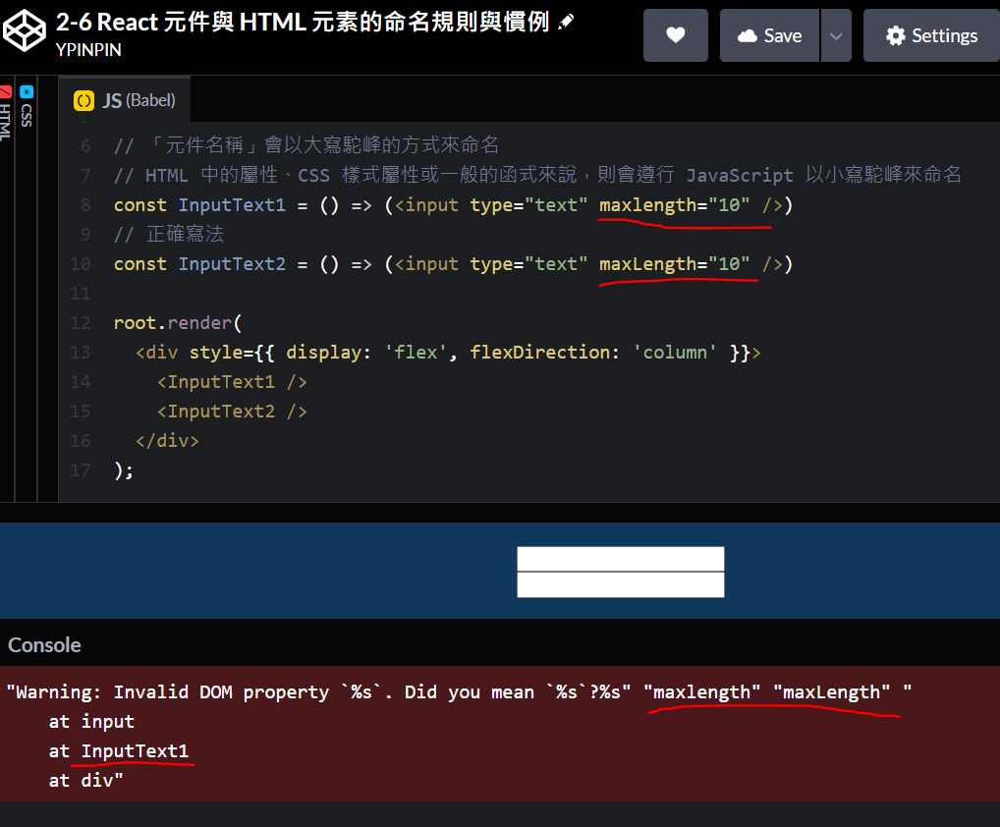

使用慣例的好處是可以從變數的命名了解它可能的類型，當看到以大寫駝峰方式命名的變數時，可以馬上知道這是個 React 元件而非一般的函式。

## React 中的事件處理 (CodePen)

在前面的介紹中，我們已經完成整個計數器的畫面，並且把計數器建立成一個 React 元件。接著要在 React 中進行事件處理來實現計數器的操作，包含在 JSX 中綁定 DOM 事件，以及定義事件處理的方法。

- 在 React 元件中使用變數

  首先將 `<Counter />` 元件中的數字部分改用變數顯示。而因為必須要在函式內加入變數，所以要改回一般箭頭函式的寫法 `() => {}`。

  > Tips：在 JSX 中因為它本質上是 JavaScript，所以如果想在 JSX 內撰寫註解的話，可以把註解寫在 `{}` 裡面，像是這樣 `{/* 這裡是註解 */}`。

  ```JSX
  // 省略...

  // 建立一個名為 Counter 的 React 元件
  const Counter = () => {
    // 定義變數
    const count = 5;

    return (
      <div className="container" style={{ margin: '0 30px' }}>
        <div className="chevron chevron-up" />
        {/* 使用變數 */}
        <div className="number">{count}</div>
        <div className="chevron chevron-down" />
      </div>
    );
  };

  root.render(<Counter />);
  ```

  [💻CodePen Demo](https://codepen.io/ypinpin/pen/WNVmoPe)。

  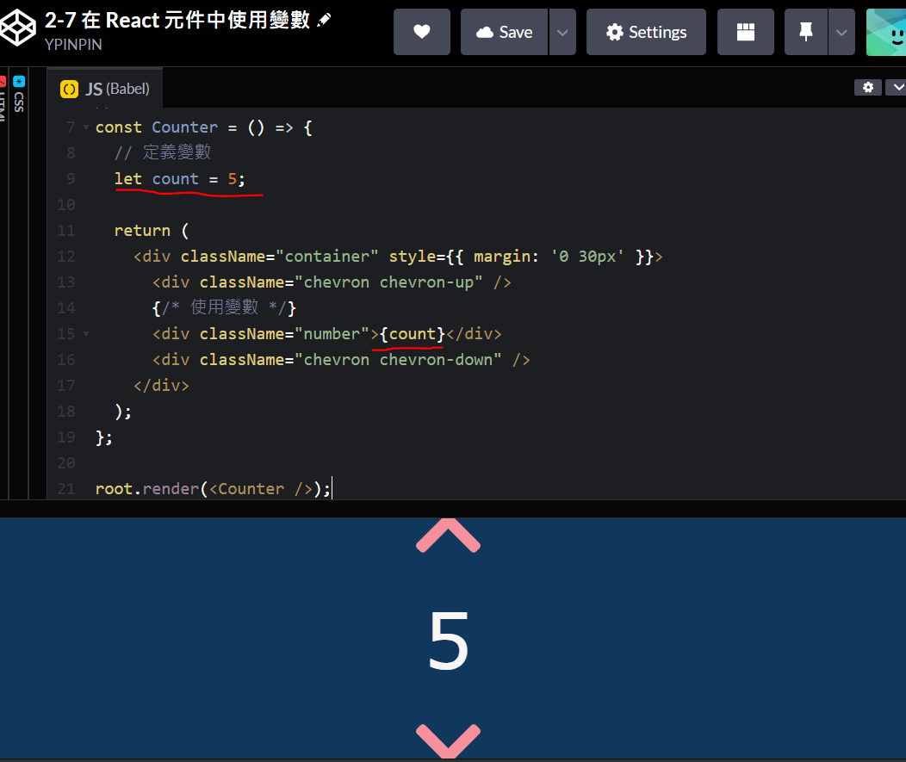

- 在 React 元件中綁定事件監聽器

  在這裡我們使用的是點擊事件，使用原生的 JavaScript 時，是使用 `addEventListener('click', ...)` 的方法，而在 React 元件中會透過 `onClick` 直接把事件綁定在 JSX 上面。

  > 但如同 HTML 一樣，我們還可以綁定各種其他的 DOM 事件，只是因為在 JSX 中 HTML 標籤的屬性慣例上是**使用小寫駝峰來命名**，因此可以使用像是鍵盤的 `onKeyPress`、`onKeyUp`；表單的 `onChange`、`onInput`、`onSubmit` 等等。

  在 `onClick={...}` 中 `{...}` 內要放的就是點擊後要做什麼處理，稱作事件處理器（event handlers），它會是一個函式。

  以下我們在「向上箭頭」的按鈕綁定點擊事件：

  ```JSX
  // 省略...

  // 建立一個名為 Counter 的 React 元件
  const Counter = () => {
    // 定義變數
    let count = 5;

    return (
      <div className="container" style={{ margin: '0 30px' }}>
        <div
          className="chevron chevron-up"
          onClick={() => {
            count = count + 1;
            console.log(`current Count is ${count}`);
          }}
        />
        {/* 使用變數 */}
        <div className="number">{count}</div>
        <div className="chevron chevron-down" />
      </div>
    );
  };

  root.render(<Counter />);
  ```

  [💻CodePen Demo](https://codepen.io/ypinpin/pen/WNVmReb)。

  但當我們點擊箭頭測試時會發現，雖然在瀏覽器 console 顯示的 count 數字有持續增加，但是畫面上的數字卻沒有改變。

  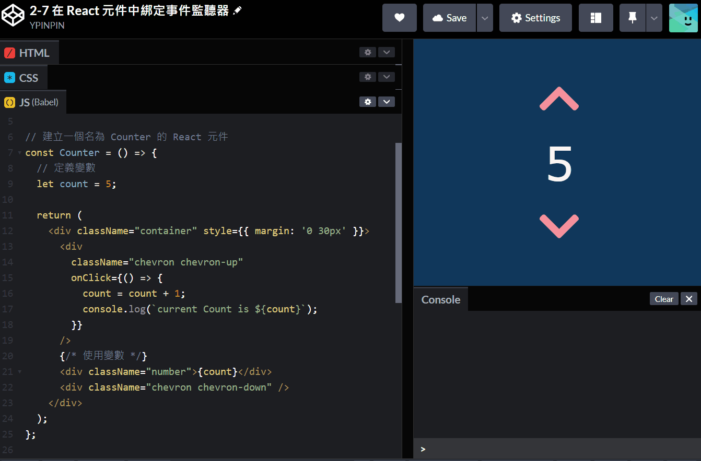

  這是因為雖然 count 的數字更新了，**但 React 並不知道數字有更新**，所以它不會去重新轉譯瀏覽器的畫面。

  我們可以在 JSX 中使用 `{console.log('render')}` 來看看是不是真的因為 React 元件的畫面沒有更新（重新轉譯），只要 React 有需要更新畫面的話，這個 JSX 就會被重新執行。

  ```JSX
  // 省略...

  // 建立一個名為 Counter 的 React 元件
  const Counter = () => {
    // 定義變數
    let count = 5;

    return (
      <div className="container" style={{ margin: '0 30px' }}>
        {/* 只要 React 有更新畫面的話，這個 JSX 就會被重新執行 */}
        {console.log('render')}
        <div
          className="chevron chevron-up"
          onClick={() => {
            count = count + 1;
            console.log(`current Count is ${count}`);
          }}
        />
        {/* 使用變數 */}
        <div className="number">{count}</div>
        <div className="chevron chevron-down" />
      </div>
    );
  };

  root.render(<Counter />);
  ```

  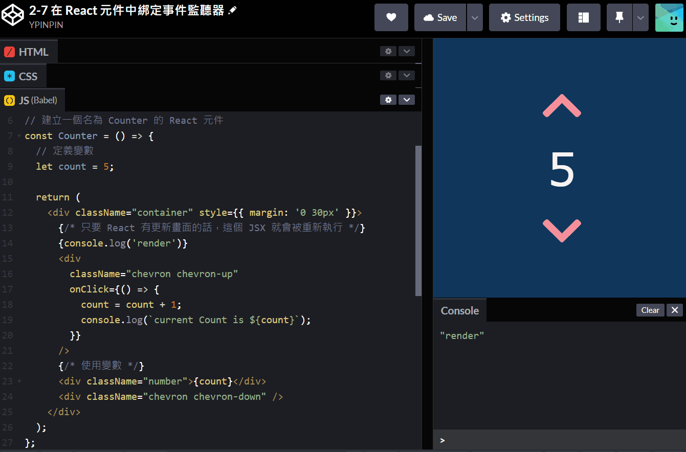

  可以發現一開始什麼都不做的時候出現了 "render"，而即使之後 count 變數更新了，畫面也沒有跟著更新（重新轉譯）。那麼要怎麼讓 React 知道，我們的數字改變了，並請它幫我們更新畫面呢？

  在下一個部分中我們會使用到第一個 React Hook，讓 React 知道我們的變數更新了，請 React 幫我們更新畫面。

## React 元件中的資料狀態 - useState 的使用 (CodePen)

在上一個部分中，我們發現雖然變數已經更新了，但因為 React 並不知道這件事，所以不知道要更新畫面來顯示最新的資料。

因此 React 提供了方法可以來監控並改變這些資料，就是第一個 React Hooks - `useState`，如果使用這個方法來修改資料， React 一發現到資料內容有變動時，就會自動更新畫面。

- 狀態（state）

  這個方法之所以叫做 `useState` 是因為在 React 元件中，**這些會連動導致畫面改變的「資料（data）」習慣上被稱作「狀態（state）」**，而方法前面之所以會多了個 `use` ，是因為這是在 React Hooks 中的慣例，**只要開頭為 `use` 的函式，就表示它是個 "Hook"**。

現在可以在計數器中使用 `useState` 方法來監控資料：

- 首先從 React 物件中取出 `useState` 方法。

  ```JSX
  const { useState } = React;
  ```

- 呼叫 `useState` 方法後，它實際上會**回傳一個陣列**，這個陣列中的第一個元素會是我們 **「想要監控的資料（count）」**，第二個元素會是 **「修改該資料的方法（setCount）」**，可以透過陣列的解構賦值來直接取得，而 `useState` 方法中的參數則是 count 的 **預設值**，這裡設為 5。

  ```JSX
  const [count, setCount] = useState('<資料預設值>');
  ```

  透過 `useState` 得到的變數和方法名稱是可以自己取的，而慣例上用來「修改該資料的方法」名稱會以 `set` 開頭；預設值也可以不一定要是字串或數值，而是可以帶入物件。

  下面這些例子都是合法的：

  ```JSX
  const [price, setPrice] = useState(1000);
  const [description, setDescription] = useState('This is description');
  const [product, setProduct] = useState({
    name: 'iPhone 11',
    price: 24900,
    os: 'iOS',
  });
  ```

- 最後在點擊按鈕觸發事件使用 `setCount` 來改變 count 的值。

  [💻CodePen Demo](https://codepen.io/ypinpin/pen/gOVEReO)。

  ```JSX
  // 省略...

  // 從 React 物件中取出 useState 方法
  const { useState } = React;

  const Counter = () => {
    // 呼叫 `useState` 方法，取得一個「變數（count）」和「改變該變數的方法（setCount）」
    const [ count, setCount ] = useState(5);

    // 使用 setCount 方法來改變 count 的值
    return (
      <div className="container" style={{ margin: '0 30px' }}>
        <div className="chevron chevron-up" onClick={() => setCount(count + 1)} />
        <div className="number">{count}</div>
        <div className="chevron chevron-down" onClick={() => setCount(count - 1)} />
      </div>
    );
  };

  root.render(<Counter />);
  ```

  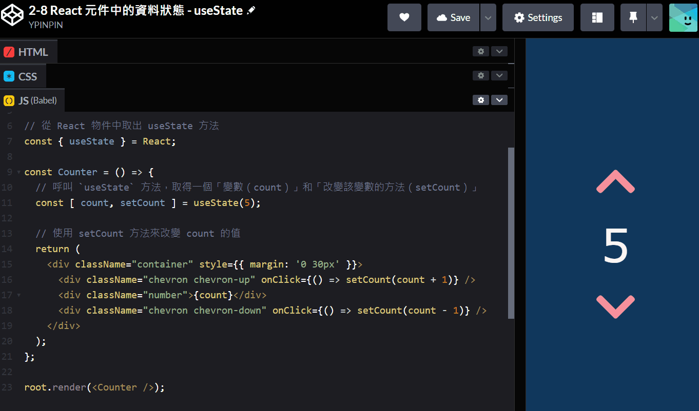

### React 畫面的重新轉譯

實際上 React 畫面之所以會更新並不是因為 count 的值改變了，而是因為：

- `setCount` 被呼叫到。

- **count 的值確實有改變**。

只有同時滿足上面這兩個條件，畫面才會進行更新，若是未使用 `setCount` 方法或是 count 值沒有變化，都不會進行畫面的更新。

而 React 在更新畫面時，同樣會很聰明的**只去更新有改變的部分**，它並不會把整個 DOM 都換掉，而是只換掉有變化的部分，也因此才能讓網頁運作的效能大大提升。

## 條件轉譯的使用（conditional rendering）(CodePen)

在上一部份中，計數器的基本功能已經完成，現在我們可以為計數器設定最大值及最小值，並根據條件來隱藏對應的箭頭按鈕。

```JSX
const Counter = () => {
  const [ count, setCount ] = useState(5);

  // 錯誤寫法
  return (
    <div className="container" style={{ margin: '0 30px' }}>
      if (count < 10) {
        <div className="chevron chevron-up" onClick={() => setCount(count + 1)} />
      }
      <div className="number">{count}</div>
      if (count > 0) {
        <div className="chevron chevron-down" onClick={() => setCount(count - 1)} />
      }
    </div>
  );
};
```

而由於先前提過的在 JSX 中的 `{}` 只能帶入表達式，而 `if...else...` 語法則是屬於陳述句。

**因此在 React 中很常會使用到邏輯運算子（ `||` , `&&` ）的語法**。

- `||`

  「或（or）」的意思，當 `||` 前面的值為 `false` （假） 時，就取後面的那個當值。

  ```JavaScript
  const a = 0 || 'iPhone';           // 因為 0 被轉型後為 false，所以 a 會是 'iPhone'

  const b = 26900 || 24900;          // 因為 26900 會轉型為 true，所以 b 會是 26900

  const c = true || '不會輪到我';     // 因為 true 為真，所以 c 是 true

  const d = false || '會輪到我'；     // 因為 false 為假，所以 d 是 '會輪到我'
  ```

- `&&`

  「與（and）」的意思，當 `&&` 前面的值為 `true` （真） 時，就取後面的那個當值。

  ```JavaScript
  const a = 0 && 'iPhone';          // 因為 0 被轉型後為 false，所以 a 會是 0

  const b = 26900 && 24900;         // 因為 26900 轉型為 true，所以 b 會是 24900

  const c = true && '會輪到我';     // 因為 true 為真，所以 c 是'會輪到我'

  const d = false && '不會輪到我'；     // 因為 false 為假，所以 d 是 false
  ```

### 透過邏輯運算子達到條件轉譯

現在我們可以透過使用 `&&` 邏輯運算子來實現 `if` 語法的功能，當 `&&` 前面的值為 `true` （真） 時，就取後面的那個當值。

當使用這種做法時，當條件符合的時候，**這個按鍵的元素會從 DOM 中完全移除**。

[💻CodePen Demo](https://codepen.io/ypinpin/pen/MWNxZJX)。

```JSX
// 省略...

const Counter = () => {
  const [ count, setCount ] = useState(5);

  // 使用邏輯運算子 && 來實現條件轉譯
  return (
    <div className="container" style={{ margin: '0 30px' }}>
      {
        count < 10 && (<div className="chevron chevron-up" onClick={() => setCount(count + 1)} />)
      }
      <div className="number">{count}</div>
      {
        count > 0 && (<div className="chevron chevron-down" onClick={() => setCount(count - 1)} />)
      }
    </div>
  );
};

root.render(<Counter />);
```

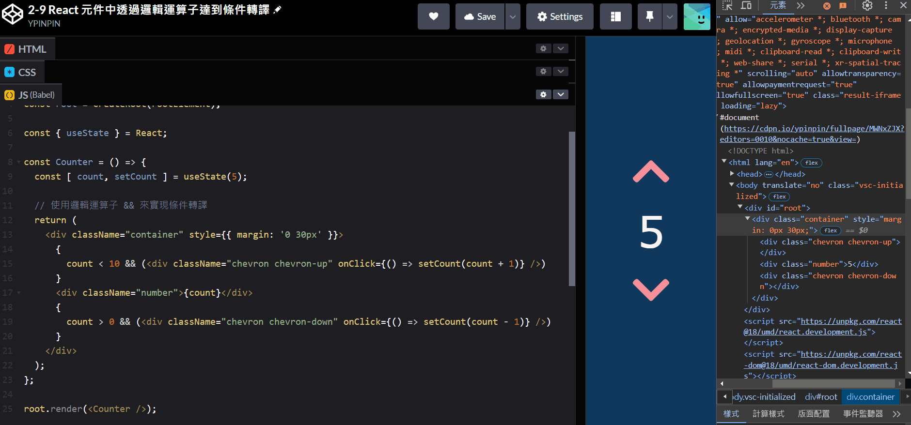

## 動態添加 CSS 樣式來隱藏 HTML 元素 (CodePen)

除了使用邏輯運算子來判斷該 HTML 區塊要不要呈現之外，另一個常用的方式是**使用 CSS 樣式，像是 `display: none;` 和 `visibility: hidden;`**，不論是哪一種，這個 HTML 元素仍然可以在開發者工具的 Elements 頁籤中被看到，只是透過 CSS 把它隱藏起來而已。

而 `display: none;` 和 `visibility: hidden;` 的差別在於 `display: none;` 在把該元素隱藏的情況下，**同時會移除該元素原本佔據在網頁上的空間**，因此畫面排版會因為該元素不見而導致「跳一下」。 `visibility: hidden;` 同樣會把該元素給隱藏起來，**但是原本該元素所佔據的空間還是會保留在那裡**，因此不會有因為東西被移除後而畫面排版「跳一下」的情況。

這裡為了避免畫面排版改變，因此修改為使用 CSS 樣式 `visibility: hidden;`。要做到動態變更套用的 CSS 樣式，則一樣會用到前面所提到的**邏輯運算子搭配行內樣式（inline-style）或是 CSS class**。

### 使用動態的行內樣式

在 `style={}` 屬性後的 `{}` 中帶入**帶有樣式的物件**即可。

[💻CodePen Demo](https://codepen.io/ypinpin/pen/wvVORxP)。

```JSX
// 省略...

const Counter = () => {
  const [ count, setCount ] = useState(5);

  // 使用動態的行內樣式來隱藏 HTML 元素
  return (
    <div className="container" style={{ margin: '0 30px' }}>
      <div
        className="chevron chevron-up"
        style={{ visibility: count >= 10 && 'hidden' }}
        onClick={() => setCount(count + 1)}
      />
      <div className="number">{count}</div>
      <div
        className="chevron chevron-down"
        style={{ visibility: count <= 0 && 'hidden' }}
        onClick={() => setCount(count - 1)}
      />
    </div>
  );
};

root.render(<Counter />);
```

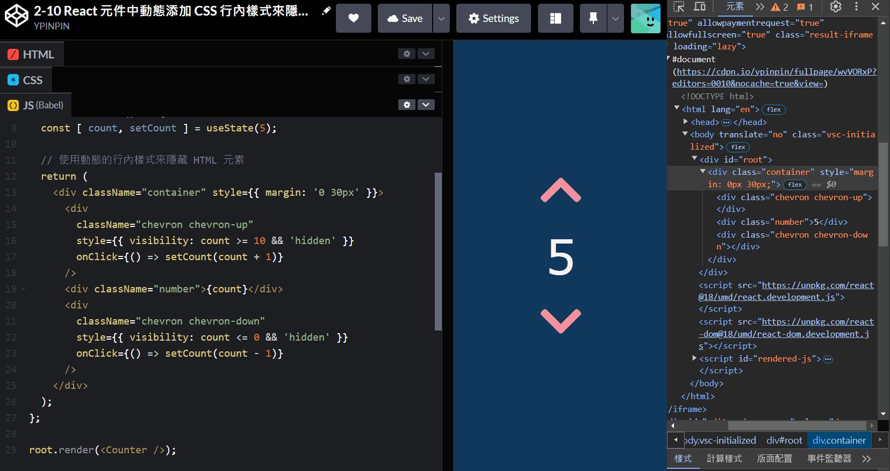

### 使用動態的 CSS class

也可以透過動態的 CSS class 來實現效果。

先在 CSS 的區塊中添加一個名為 `.visibility-hidden` 的樣式：

```css
.visibility-hidden {
  visibility: hidden;
}
```

原本的 `className` 是直接帶入字串，現在希望能夠動態改變後面帶入的 class，因此要改成用 `{}` 來帶入變數，這個變數會搭配「樣板字面值」的用法來讓它動態改變。

[💻CodePen Demo](https://codepen.io/ypinpin/pen/vYoPvMg)。

```JSX
// 省略...

const Counter = () => {
  const [ count, setCount ] = useState(5);

  // 使用動態的 CSS class樣式來隱藏 HTML 元素
  return (
    <div className="container" style={{ margin: '0 30px' }}>
      <div
        className={`chevron chevron-up ${count >= 10 && 'visibility-hidden'}`}
        onClick={() => setCount(count + 1)}
      />
      <div className="number">{count}</div>
      <div
        className={`chevron chevron-down ${count <= 0 && 'visibility-hidden'}`}
        onClick={() => setCount(count - 1)}
      />
    </div>
  );
};

root.render(<Counter />);
```

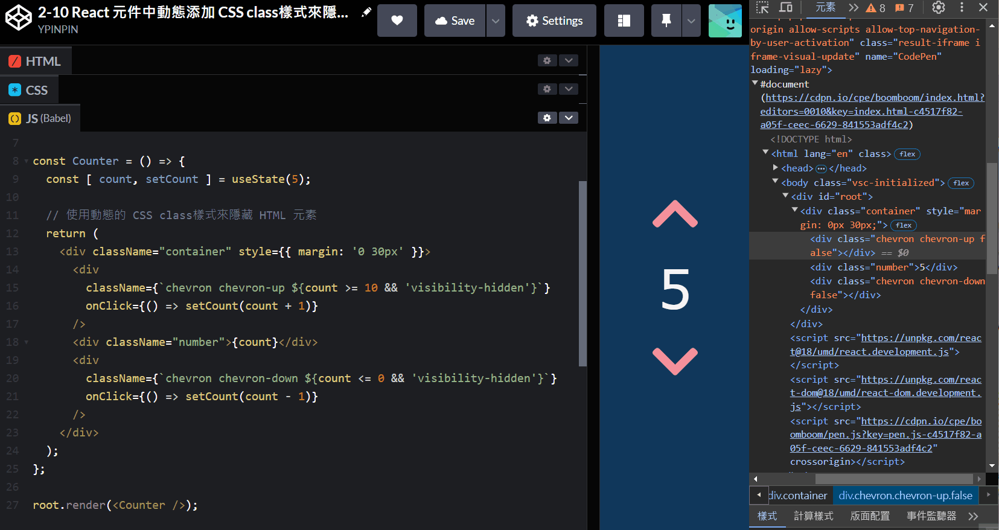

## 計數器事件處理器的重構 (CodePen)

一般在開發程式的過程中，有時候會先專注於功能的實作，等到功能實作出來，可以正常運作後，會再把整個程式碼做整理，這個動作一般我們稱作重構（refactoring）。

### 將事件處理的邏輯從 JSX 中抽離

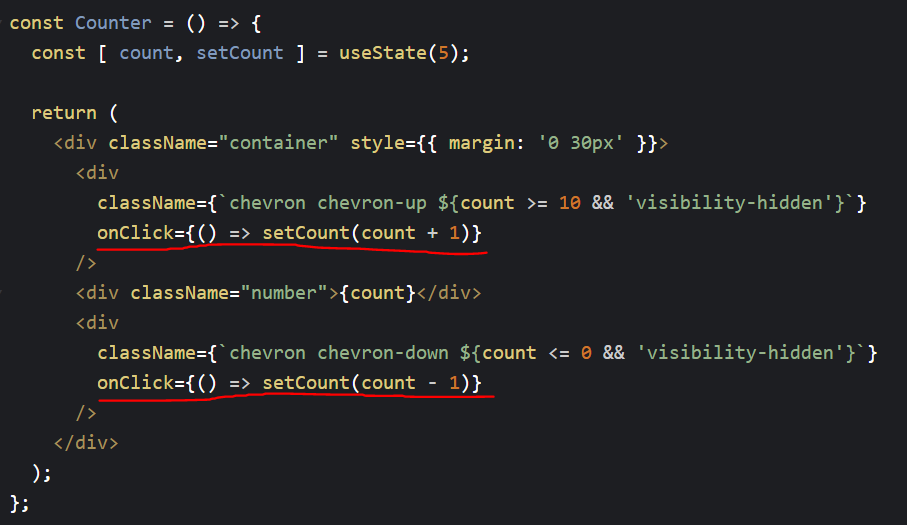

若 `onClick` 以後需要做更多的事情時，直接把事件處理器寫在 JSX 的行內可能就會變得比較難管理。

因此，為了程式碼管理上的方便，**可以把事件處理器先定義成一個函式，在 `onClick` 後去呼叫這個函式即可，如此可以達到畫面和邏輯的分離**。

把 `onClick` 裡面的函式拉出來，分別取名為 `handleIncrement` 和 `handleDecrement`：

```JSX
// 省略...

const Counter = () => {
  const [ count, setCount ] = useState(5);

  // 將事件處理器獨立成 handleIncrement 和 handleDecrement
  const handleIncrement = () => setCount(count + 1);
  const handleDecrement = () => setCount(count - 1);

  // 把事件處理器帶入
  return (
    <div className="container" style={{ margin: '0 30px' }}>
      <div
        className={`chevron chevron-up ${count >= 10 && 'visibility-hidden'}`}
        onClick={handleIncrement}
      />
      <div className="number">{count}</div>
      <div
        className={`chevron chevron-down ${count <= 0 && 'visibility-hidden'}`}
        onClick={handleDecrement}
      />
    </div>
  );
};

root.render(<Counter />);
```

### 同樣邏輯的程式碼不必重複

`handleIncrement` 和 `handleDecrement` 做的事差不多，因此也可以將其簡化成一個 `handleClick` 的函式，並帶入一個名為 `type` 的參數來處理不同的操作。

```JSX
// 簡化成一個名為 handleClick 的方法
const handleClick = (type) => {
  if(type == 'increment') {
    setCount(count + 1);
  }
  if(type == 'decrement') {
    setCount(count - 1);
  }
}
```

但這裡有一個 JavaScript 的概念要特別留意，現在 `handleClick` 本身是一個函式，如果我們在 JSX 中直接把 `type` 當成參數帶進去函式，像這樣的話：

```JSX
// 這是錯誤的寫法，請不要照做
// 向上點擊的箭頭
<div
  className={`chevron chevron-up ${count >= 10 && 'visibility-hidden'}`}
  onClick={handleClick('increment')}
/>
```

我們預期的是點擊按鈕時，會去執行 `handleClick('increment')` 這個方法，但實際上，因為 `handleClick` 後面直接加上了小括號 `('increment')`，**因此當 JavaScript 執行到這裡的時候，這個 `handleClick` 函式就已經被執行了**。

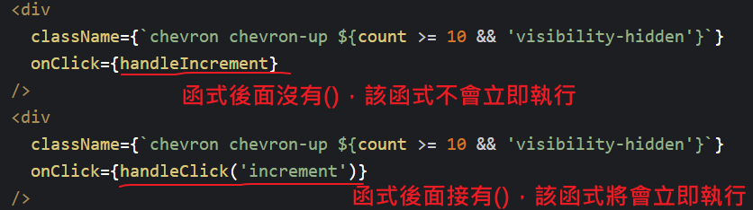

所以實際上畫面在轉譯（render）的時候，就執行了 `handleClick` 這個函式，這時候就呼叫到了 `setCount();`當 `setCount` 被呼叫到時，React 發現就會去檢查 count 的值，發現 count 不一樣之後，又會去更新畫面，於是就進入了無限迴圈 ...，並且顯示錯誤訊息。

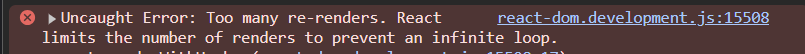

要解決這個問題只需要**把 `handleClick()` 包在一個函式中**，這樣的話，畫面轉譯的時候 `handleClick` 就不會馬上被執行，而是在使用者點擊按鈕的時候才會去執行 `() => handleClick('increment')` 這個函式。

```JSX
// 省略...

const Counter = () => {
  const [ count, setCount ] = useState(5);

  // 簡化成一個名為 handleClick 的方法
  const handleClick = (type) => {
    if(type == 'increment') {
      setCount(count + 1);
    }
    if(type == 'decrement') {
      setCount(count - 1);
    }
  }

  // 把事件處理器帶入
  return (
    <div className="container" style={{ margin: '0 30px' }}>
      <div
        className={`chevron chevron-up ${count >= 10 && 'visibility-hidden'}`}
        onClick={() => handleClick('increment')}
      />
      <div className="number">{count}</div>
      <div
        className={`chevron chevron-down ${count <= 0 && 'visibility-hidden'}`}
        onClick={() => handleClick('decrement')}
      />
    </div>
  );
};

root.render(<Counter />);
```

### 使用三元判斷式（ternary operator）簡化語法

最後 `handleClick` 的方法也可以使用三元判斷式來進行 `if` 語法的簡化。

[💻CodePen Demo](https://codepen.io/ypinpin/pen/XWvGOKJ)。

```JSX
// 省略...

const Counter = () => {
  const [ count, setCount ] = useState(5);

  // 簡化成一個名為 handleClick 的方法
  const handleClick = (type) => {
    // 使用三元判斷式簡化語法
    setCount(type === 'increment' ? count + 1 : count - 1);
  }

  // 把事件處理器帶入
  return (
    <div className="container" style={{ margin: '0 30px' }}>
      <div
        className={`chevron chevron-up ${count >= 10 && 'visibility-hidden'}`}
        onClick={() => handleClick('increment')}
      />
      <div className="number">{count}</div>
      <div
        className={`chevron chevron-down ${count <= 0 && 'visibility-hidden'}`}
        onClick={() => handleClick('decrement')}
      />
    </div>
  );
};

root.render(<Counter />);
```

### 進階寫法：讓函式執行後回傳另一個函式

在上面的程式碼中，會發現雖然把事件處理器抽成了獨立的 `handleClick` 函式，但因為需要在這個函式中帶入參數，而為了避免函式直接在 JSX 中被執行，變成在 `onClick` 的時候又要多包一層函式：

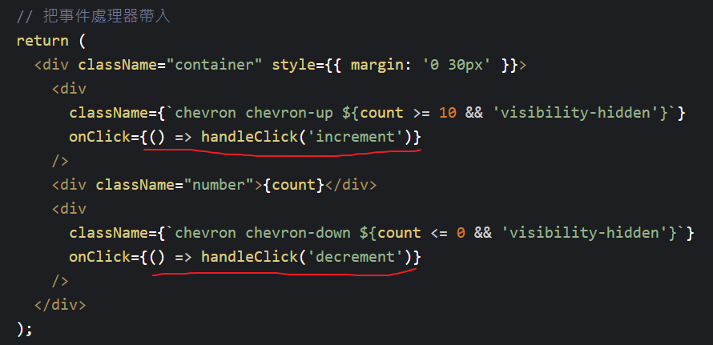

但也可以用其他的寫法來解決這個問題，也就是在 JSX 執行的時候讓 `handleClick` 直接被執行，並把帶入參數 `type`，**但在 `handleClick`
執行後則會回傳另一個函式到 `onClick={}` 的 `{}` 內。這個被回傳的函式一樣會在按鈕的點擊事件被觸發時被呼叫到**，語法如下：

```JSX
// 省略...

const Counter = () => {
  const [ count, setCount ] = useState(5);

  // 讓 handleClick 被執行時，實際上是回傳一個函式
  const handleClick = (type) => {
    return () => {
      setCount(type === 'increment' ? count + 1 : count - 1);
    };
  };

  // 把事件處理器帶入
  return (
    <div className="container" style={{ margin: '0 30px' }}>
      <div
        className={`chevron chevron-up ${count >= 10 && 'visibility-hidden'}`}
        onClick={handleClick('increment')}
      />
      <div className="number">{count}</div>
      <div
        className={`chevron chevron-down ${count <= 0 && 'visibility-hidden'}`}
        onClick={handleClick('decrement')}
      />
    </div>
  );
};

root.render(<Counter />);
```

最後 `handleClick` 這個函式本身又可以做箭頭函式上語法的簡化：

- 先針對 `handleClick` 「裡面」的箭頭函式，可以省略箭頭後面的 `{}`

  ```JSX
  const handleClick = (type) => {
    return () => setCount(type === 'increment' ? count + 1 : count - 1);
  };
  ```

- 接著，針對 `handleClick` 箭頭函式「本身」，也可以省略箭頭後面的 `{}`

  ```JSX
  const handleClick = (type) => () =>
    setCount(type === 'increment' ? count + 1 : count - 1);
  ```

因此，未來如果看到像是 `() => () => {...}` 這樣的語法的話，不用太過驚訝，這不是什麼新的語法，單純只是在**呼叫了一個函式之後會回傳另一個函式的簡化寫法**。

[💻CodePen Demo](https://codepen.io/ypinpin/pen/LYwaaYQ)。

```JSX
// 省略...

const Counter = () => {
  const [ count, setCount ] = useState(5);

  // 讓 handleClick 被執行時，實際上是回傳一個函式
  const handleClick = (type) => () =>
    setCount(type === 'increment' ? count + 1 : count - 1);

  // 把事件處理器帶入
  return (
    <div className="container" style={{ margin: '0 30px' }}>
      <div
        className={`chevron chevron-up ${count >= 10 && 'visibility-hidden'}`}
        onClick={handleClick('increment')}
      />
      <div className="number">{count}</div>
      <div
        className={`chevron chevron-down ${count <= 0 && 'visibility-hidden'}`}
        onClick={handleClick('decrement')}
      />
    </div>
  );
};

root.render(<Counter />);
```

## JSX 中迴圈的使用 (CodePen)

前面介紹過，使用元件的好處在於可以快速地重複使用已經寫好的元件，且每個元件的狀態都是獨立的。

假設今天我們想要在畫面上產生多個計數器，除了可以在 JSX 中直接手動帶入多個元件 `<Counter />` 之外，也可以使用迴圈來重複產生多個計數器。

而和前面[條件轉譯](#條件轉譯的使用conditional-renderingcodepen)中提到的情況一樣，`for` 迴圈本身是個陳述句而非表達式，因此不能直接放到 JSX 中的 `{}` 內去執行。

因此在 React 中，當我們要做重複轉譯多個元件時，**最常使用到的是透過陣列的 `map` 方法**，因為 `map` 這個方法會有回傳值，所以可以直接在 JSX 中使用。

> Tips：由於一個 [JSX 元素**最多只能有一個最外層的元素**](#jsx-元素只能有一個最外層元素-codepen)，因此當我們要轉譯很多的 `<Counter />` 時，為了要讓外層只有一個元素，可以加上一個額外的 `<div>` 把所有 `<Counter />` 包起來。

作法如下：

- 先產生一個帶有多個元素的陣列。

  在 JavaScript 有許多不同的方式都可以產生帶有多個元素的陣列，這裡我們使用 `Array.from({ length: n })` 這個方法來產生帶有 n 個 `undefined` 的陣列。

  ```JSX
  // 先產生一個帶有多個元素的陣列 [undefined, undefined, ..., undefined]
  const counters = Array.from({ length: 8 });
  ```

- 在 JSX 中將這個陣列使用 `map` 方法，並且每次都回傳 `<Counter />` 元素。

  > Tips：map 回傳的內容除了可以是 React 元件外，更常見的會是 DOM 元素，像是透過迴圈重複產生多個 `<li>`。

  ```JSX
  // 在 JSX 中將這個陣列使用 `map` 方法，並且每次都回傳 `<Counter />` 元素
  root.render(
    <div style={{ display: 'flex', justifyContnent: 'space-between' }}>
      {
        counters.map(() => (<Counter />))
      }
    </div>
  );
  ```

  

  這時候可以看到畫面上產生了 5 個計數器，但是打開瀏覽器的 console 視窗，會看到有錯誤提示產生：

  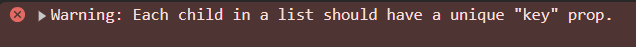

  這是提示我們最好把**每個透過迴圈重複產生的元件加上 `key` 這個屬性**，且每個 `key` 的值都應該**要是唯一不重複的**，這樣 React 才會比較清楚迴圈中有哪些項目是被修改或操作過的，方便進行畫面的更新。

  但因為在我們的計數器中並沒有唯一的 id 存在，在沒有其他選擇的情況下，我們可以把陣列的 `index` 當成 `key` 帶入，這樣錯誤提示就不會出現了。

  [💻CodePen Demo](https://codepen.io/ypinpin/pen/ZEgPPLe)。

  ```JSX
  // 省略...

  // 先產生一個帶有多個元素的陣列 [undefined, undefined, ..., undefined]
  const counters = Array.from({ length: 5 });

  // 在 JSX 中將這個陣列使用 `map` 方法，並且每次都回傳 `<Counter />` 元素
  root.render(
    <div style={{ display: 'flex', justifyContnent: 'space-between' }}>
      {
        counters.map((_, index) => (<Counter key={index} />))
      }
    </div>
  );
  ```

  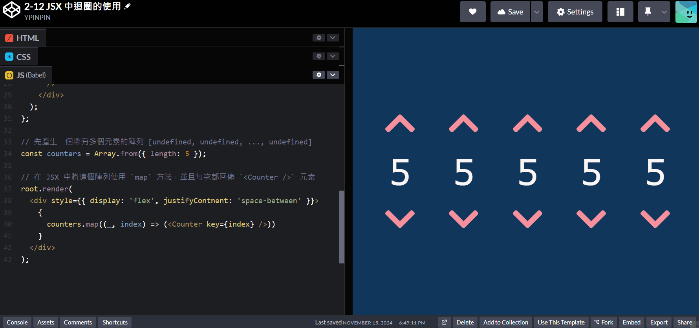

  > Tips：React 並不建議我們直接拿陣列的 `index` 來當作 `key` 的值帶入，特別是在這些元素的順序有可能會有改變的情況下，對於效能會有不好的影響；但這裡因為主要是示範用途，並且只是單純用來呈現資料，沒有要操作或修改這些元素，因此對於效能的影響不大。

## JSX 元素只能有一個最外層元素 (CodePen)

「一個 JSX 元素只能有一個最外層元素」。

以下面的例子來說，在 Counter 這個元件的 JSX 中，只有一個根節點，就是最外層的 `<div className"container">...</div>`：

```JSX
const Counter = () => <div className="container">{/* ... */}</div>;
```

但若我們在這個 JSX 元素中，放入另一個節點的話，是不被允許的：

```JSX
// 這是不被允許的
const Counter = () => (
  <div class="container">
    {/* ... */}
  </div>
  <div class="other-container">
    {/* ... */}
  </div>
);
```

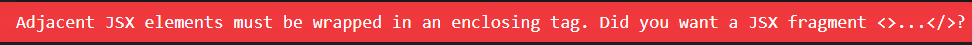

### 正確做法一：外層的包一個 HTML Tag

如果需要的話，外層可以多包一個 HTML 標籤，例如 `<div>`，這樣這個 JSX 元素的最外層仍然只有一個根節點：

```JSX
// 外層多包一個 <div>
const Counter = () => (
  <div>
    <div class="container">{/* ... */}</div>
    <div class="other-container">{/* ... */}</div>
  </div>
);
```

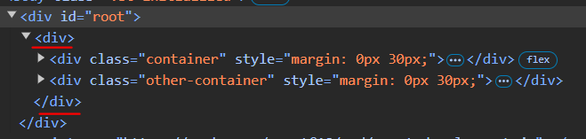

### 正確做法二：使用 React Fragment

[💻CodePen Demo](https://codepen.io/ypinpin/pen/yLmrxrx)。

但有些時候，你不希望這些元素外層還要額外包一個 HTML 標籤，這時 React 提供了一個 `<React.Fragment>` 的標籤，寫法如下：

```JSX
// 使用 React Fragment
const Counter = () => (
  <React.Fragment>
    <div class="container">{/* ... */}</div>
    <div class="other-container">{/* ... */}</div>
  </React.Fragment>
);
```

此時原本的 HTML 元素外層不會再被多包一個 `<div>` 標籤。

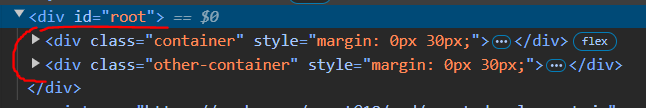

另外 `<React.Fragment>` 還可以縮寫成 `<>`， 因此 `<React.Fragment></React.Fragment>`，也可以簡寫成 `<></>`：

```JSX
// 使用 React Fragment 簡寫 <></>
const Counter = () => (
  <R>
    <div class="container">{/* ... */}</div>
    <div class="other-container">{/* ... */}</div>
  </R>
);
```

## React Hooks 不可這麼用

慣例上所有 React Hooks 的方法都會以 `use` 作為函式名稱的開頭，例如，`useState`、`useEffect`、`useCallback` 等等，而在使用 React Hooks 的方法時有些原則一定要注意。其中最重要的一個原則是：

**不能在條件式（conditions）、迴圈（loops）或嵌套函式（nested functions）中呼叫 Hook 方法**。

以 `useState` 來說，這樣的寫法是正確的：

```JSX
// ✅ 正確使用
const Counter = () => {
  const [count, setCount] = useState();

  return {
    /* ... */
  };
};
```

而如果把 `useState` 放到 `if` 內時則可能會導致嚴重錯誤：

```JSX
// ❌ 錯誤使用，把 React Hooks 放到 if 內
const Counter = () => {
  if (isValidCounter <= 10) {
    const [count, setCount] = useState();
  }

  return {
    /* ... */
  };
};
```

這樣的規定是因 React 元件（例如，`<Counter />`）每次在轉譯或更新畫面時，都會呼叫產生這個元件的函式（`Counter()`），**而在 React Hooks 中會去記錄這些 Hooks 在函式中被呼叫的順序，以確保資料能夠被相互對應**，但若當我們將 Hooks 放到條件式或迴圈內時，就會破壞了這些 Hooks 被呼叫到的順序，如此將會造成錯誤。

雖然 `useSomething` 這類的 React Hooks 不能放在條件式中，但像這裡透過 `useState()` 產出的變數 `count` 和方法 `setCount`，則是可以在判斷式內使用的。例如：

```JSX
const Counter = () => {
  const [count, setCount] = useState();

  // 透過 useState 取出來的方法，是可以放在條件式中使用的
  if (/* 條件判斷 */) {
    setCount(10)
  }

  return {
    /* ... */
  };
};
```

## 使用 Create React App 工具建立專案

使用 React 官方提供的 [Create React App](https://create-react-app.dev/) 這個工具來快速建立專案。

```bash
npx create-react-app internet-speed-converter
cd internet-speed-converter
npm start
```

初始專案啟動後：


### 初始專案結構

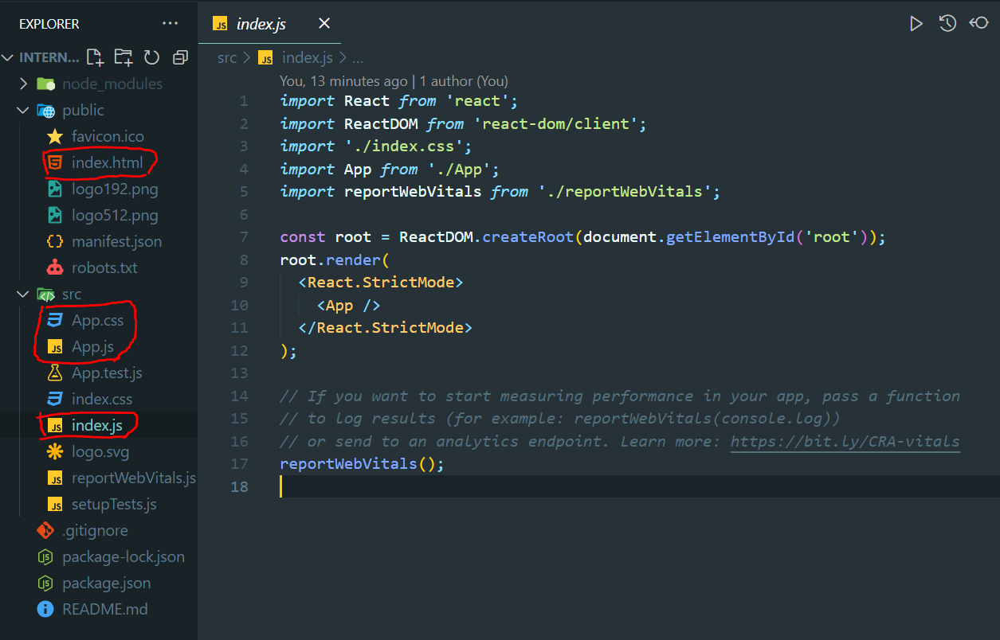

- public/index.html - 應用的入口文件

  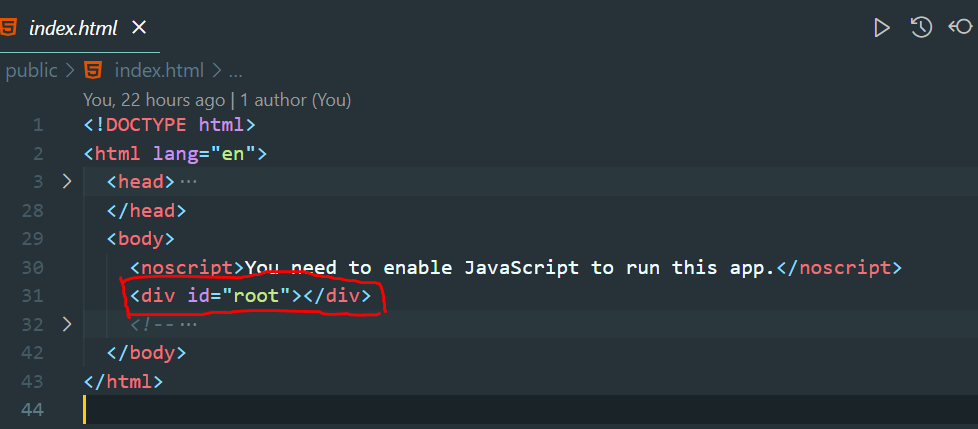

  其中最重要的是這一行：`<div id="root"></div>`，這是應用的容器，React 會將所有內容渲染到這個 `div` 裡面。

  基本上除了引入全局資源外基本不會動它。

- src/index.js - 渲染邏輯的入口點

  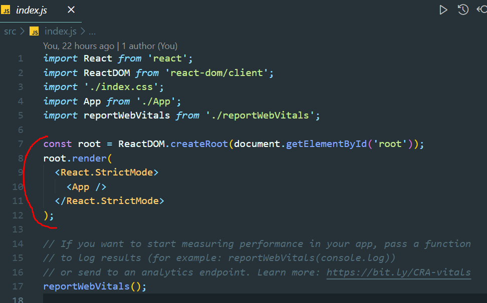

  這裡我們直接使用 `import` 語法把 React 相關的套件載入，而 `App` 這支檔案則是一個 React 元件，它就類似上個單元中我們建立的 `Counter` 元件一樣。

  最後透過 `root.render` 將 React 掛載到 `id` 為 `root` 的 `div` 上。

  > `React.StrictMode` 是 React 提供的一種開發模式包裝，它會在開發過程中幫助檢測潛在問題，只會在開發環境中運行，在生產環境中它並不會啟用。

- src/App.js - 組件

  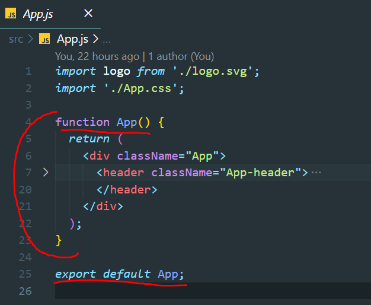

  這是我們主要會編輯的檔案，它就是一個 React 元件，和我們先前寫的 `Counter` 元件很類似，就是**一個會回傳 JSX 的函式**。最後則要**透過 `export` 把元件匯出**。

  > 在這裡，當用戶修改 `App.js` 並保存時，React 應用會自動重新加載頁面，這是 `CRA` 提供的開發便利。

- src/app.css - 組件樣式

  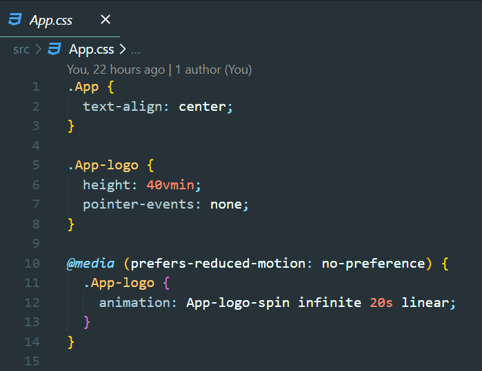

  這裡面會放套用在 `src/App.js` 中的 CSS 樣式，就像我們在 CodePen 時使用的 CSS 區塊，在這支檔案所定義的 `class` 都可以在 `App` 這個元件中使用 `className` 的方式來套用。

## 建立網速單位轉換器的 UI

試著把 [網速單位轉換器 UI 範例](https://codepen.io/PJCHENder/pen/LYGbzxz) 整合到本地專案中的 React Component 內。

以目前的網速轉換器專案來說，我們只需要編輯 `src/App.js` 和 `src/App.css` 這兩支檔案即可。

- 1.將 CSS 的部分複製到 `src/App.css` 這支檔案中。

- 2.將 HTML 的部分複製到 `src/App.js` 中，把 `App` 這個元件變成網速單位換算器。

  HTML 結構：

  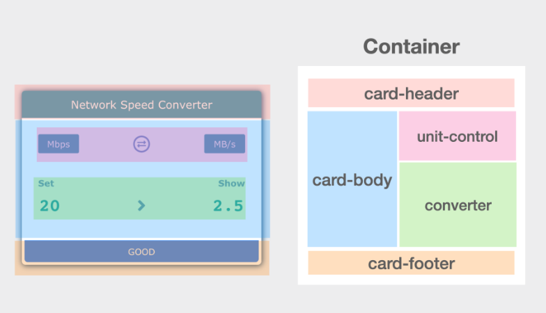

- 3.接著根據 JSX，原本的 CSS `class` 需要全部改用 `className`，而在 HTML 中用到了行內樣式的部分也需要改用 JSX 中行內樣式的寫法，例如：`style={{ marginTop: '30px' }}`。

  ```JSX
  import './App.css';

  function App() {
    return (
      <div className="container">
        <div className="card-header">Network Speed Converter</div>
        <div className="card-body">
          <div className="unit-control">
            <div className="unit">Mbps</div>
            <span className="exchange-icon fa-fw fa-stack">
              <i className="far fa-circle fa-stack-2x"></i>
              <i className="fas fa-exchange-alt fa-stack-1x"></i>
            </span>
            <div className="unit">MB/s</div>
          </div>
          <div className="converter">
            <div className="flex-1">
              <div className="converter-title">Set</div>
              <input type="number" className="input-number" min="0" />
            </div>
            <span className="angle-icon fa-2x" style={{ marginTop: '30px' }}>
              <i className="fas fa-angle-right"></i>
            </span>
            <div className="text-right flex-1">
              <div className="converter-title">Show</div>
              <input
                type="text"
                className="input-number text-right"
                disabled
                value="125"
              />
            </div>
          </div>
        </div>
        <div className="card-footer">FAST</div>
      </div>
    );
  }

  export default App;
  ```

- 4.最後透過 `npm start` 啟動專案。

  

  可以發現頁面上的圖示沒有正常呈現，這是因為這裡我們使用的是一個第三方的圖示工具 `Font Awesome`，因為還未安裝使用，所以圖示還沒辦法正常呈現。

  在介紹更多關於 React 元件的使用方式後，會再來套用這個工具。

## React 中表單的基本應用

使用者可以透過在左邊的 `input` 欄位輸入 Mbps 的數值後，直接在右邊得到轉換後的 MB/s，

首先要在 React 中取得使用者在表單所輸入的資料，並根據資料進行對應的處理來驅動畫面更新。

### 在對應的 `input` 元素上綁定 `onChange` 事件

```JSX
<div className="flex-1">
  <div className="converter-title">Set</div>
  <input
    type="number"
    className="input-number"
    min="0"
    onChange={() => console.log('onChange')}
  />
</div>
```

可以看到當輸入數字時，會觸發`onChange` 事件。

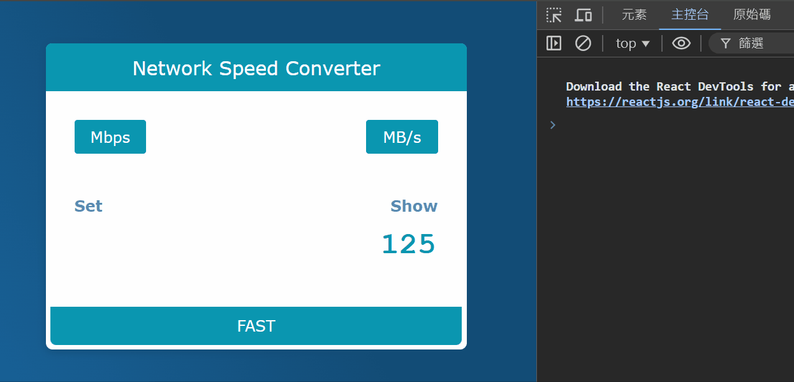

### 透過 useState 讓 React 明白資料的變化

觸發事件之後，我們需要讓 React 知道資料有變化來進行畫面的重新轉譯。

可以使用前面介紹過的 `useState`：

- 1.載入 `useState` 方法。

  與 CodePen 不同，這裡是將 React 套件下載到本機電腦上，因此需要透過 `import` 的方式來載入 `useState` 方法。

  ```JSX
  import { useState } from 'react';
  ```

- 2.使用 `useState` 方法。

  ```JSX
  function App() {
    // 定義 state，取得預設值為 0 的 inputValue 和修改該狀態的 setInputValue 方法
    const [inputValue, setInputValue] = useState(0);

    return {
      /* ...省略... */
    };
  }
  ```

- 3.定義 `onChange` 的事件處理器。

  把使用者輸入的內容先透過 `e.target.value` 的方式取出來，然後透過 `setInputValue` 這個方法，請 React 幫我們更新 `inputValue` 這個 state 的資料。

  ```JSX
  function App() {
    const [inputValue, setInputValue] = useState(0);

    // 定義事件處理器
    const handleInputChange = (e) => {
      const { value } = e.target;
      setInputValue(value);
    };

    return {
      /* ...省略... */
    };
  }
  ```

  > Tips：在 React 中，常使用 `handle` 當作事件處理器命名的開頭，例如 `onClick` 對應到 `handleClick`，`onChange` 對應到 `handleChange`。

- 4.調整對應的 `input` 元素。

  把 `onChange` 事件換成寫好的事件處理器，並把 `inputValue` 帶入到 `<input>` 的 `value` 屬性中。

  ```JSX
  <div className="flex-1">
    <div className="converter-title">Set</div>
    <input
      type="number"
      className="input-number"
      min="0"
      value={inputValue}
      onChange={handleInputChange}
    />
  </div>
  ```

  讓畫面右邊的 input 值也同步更新。

  ```JSX
  <div className="text-right flex-1">
    <div className="converter-title">Show</div>
    <input
      type="text"
      className="input-number text-right"
      disabled
      value={inputValue}
    />
  </div>
  ```

  現在當使用者在左側輸入內容時，右側的數值就會跟著同步變動。

  

- 5.加上單位換算的功能。

  最後加上單位換算的功能就完成了，`1 Mbps = 0.125 MB/s`，也就是 Mbps 的值除以 8 才會是 MB/s。

  只需要修改右側帶入 `<input />` 中的 `value`，讓它是輸入的值除以 8 即可，也就是 `value={inputValue / 8}`。

  ```JSX
  <div className="text-right flex-1">
    <div className="converter-title">Show</div>
    <input
      type="text"
      className="input-number text-right"
      disabled
      value={inputValue / 8}
    />
  </div>
  ```

  

### 畫面更新的邏輯

使用者之所以能夠在畫面的右側看到自己輸入的內容，是因為下面這一連串過程導致畫面重新轉譯後，才把最新的 `inputValue` 顯示在使用者的畫面上：

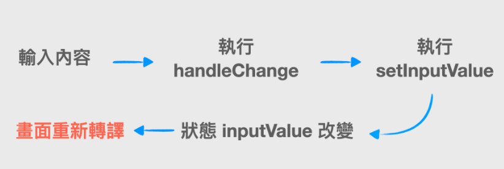

## React 元件的拆分

在 React 中，元件除了能**方便開發者重複使用**外，還有一點是讓開發者去**管理各個「功能獨立」的元素**，並且把每個元件都拆分成獨立的 JS 檔案後，管理上就會方便許多了。

### 拆出 UnitControl 元件

React 元件的拆分非常簡單，只需要透過函式定義一個新的 React 元件 `UnitControl`，同時因為這個元件沒有要做其他處理，所以可以在箭頭函式的 `=>` 後直接回傳 JSX。

接著只需要在要使用它的地方帶入 `<UnitControl />` 即可。

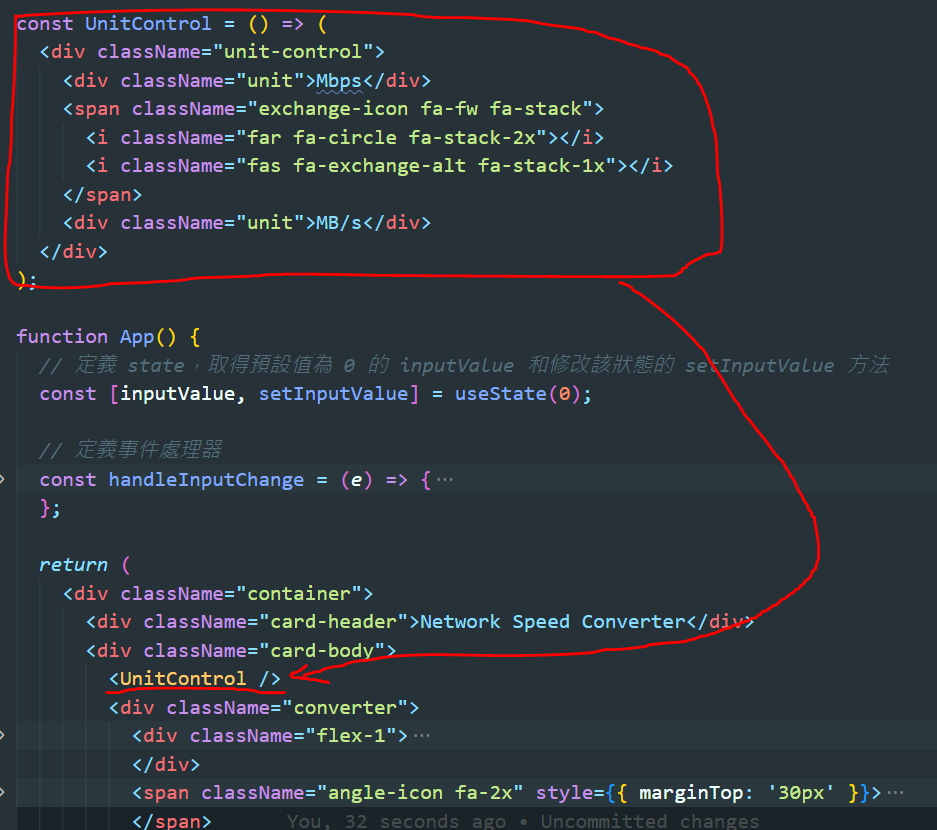

### 拆出 CardFooter 元件

使用一樣的方法可以拆出 `CardFooter` 元件。

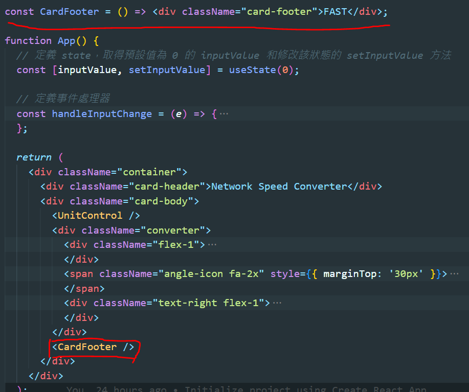

### 檔案拆分

現在會發現在 `App.js` 中就包含了三個 React 元件，而未來如果內容變多或需要在元件中進行邏輯運算時，在同一隻檔案中包含多個元件就不會是太好的做法。

因此可以透過 ES Module 系統，把元件拆分成不同的檔案來管理。

- 1.新增 `components` 資料夾。

  在 `src` 中新增 `components` 資料夾，並分別在裡面新增 `UnitControl.js` 和 `CardFooter.js` 這兩隻檔案。

  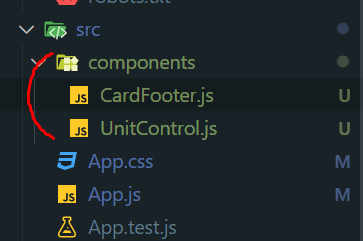

- 2.建立 `UnitControl`、`CardFooter` 檔案。

  接著在 `UnitControl.js`、`CardFooter.js` 中，把原本寫在 `App.js` 中的 `UnitControl`、`CardFooter.` 元件分別剪下放進對應的檔案中，最後使用 `export default` 將其匯出。

  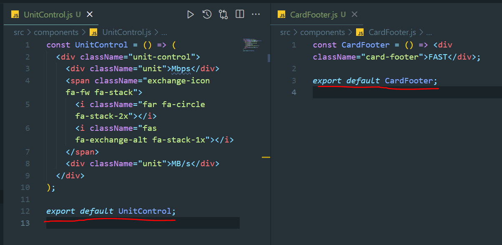

- 3.在 `App.js` 中匯入 Component。

  最後在 `App.js` 中，只需要把剛剛 `export` 的元件匯入（`import`）即可直接使用，程式碼幾乎不用動。

  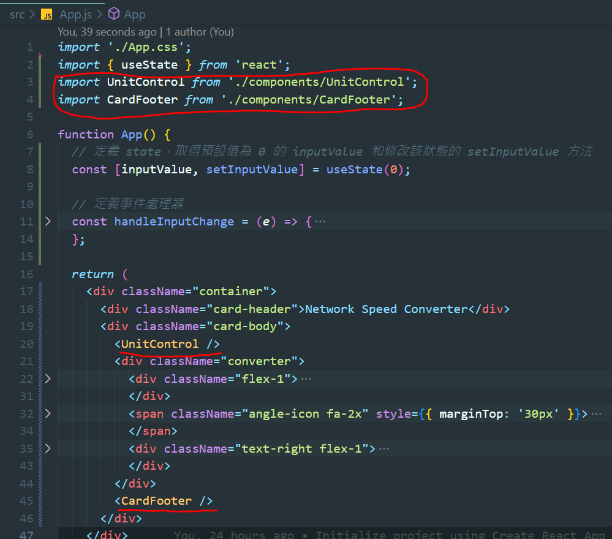

## React 元件間的資料傳遞 - props 的使用

現在我們想要讓 `CardFooter` 元件能夠根據使用者輸入的網速快慢來顯示不同的文字內容和顏色樣式。

只是現在使用者輸入的網速 `inputValue` 這個狀態是保存在 `App` 這個元件中，而 `CardFooter` 並沒有辦法直接知道 `App` 中 `inputValue` 的值是多少，必須要把這個值從 `App` 傳遞到 `CardFooter` 後，`CardFooter` 才會知道 `inputValue` 的值。

因此這裡就需要先來了解如何在 React 各元件之間進行的資料傳遞。

### 透過 `props` 在元件間傳遞資料狀態

在 React 中，子層元件如果想要得到父層元件的資料狀態，只需要透過 `props` 的方式來傳送資料就可以了。

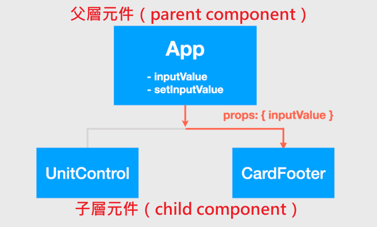

- 1.父層透過 `props` 傳遞資料。

  假設現在我們有名為 `ChildComponent` 的子層元件，想要把父層元件中的 `firstName` 和 `lastName` 這兩個資料傳遞進 `ChildComponent` 中，**只需要透過像是 HTML 屬性的方式傳進去就可以了**。

  ```JSX
  // 父層元件
  // STEP 1: 將資料透過 html 屬性的方式傳入 component 內
  const ParentComponent = () => (
    <ChildComponent firstName="Aaron" lastName="Chen" />
  );
  ```

- 2.子層元件接收 `props` 資料的方式。

  子層元件只需要透過 **「函式參數」** 的方式來接收父層元件傳進來的資料即可。

  透過在函式參數中帶入 `props` 這個參數，即可取得父層傳進來的資料，透過 `props.firstName` 和 `props.lastName` 就可取得對應的值。

  ```JSX
  // 子層元件
  // STEP 2: 在該 component 內可以透過參數 props 取得傳入的資料
  const ChildComponent = (props) => {
    return (
      <h1>
        Hello, {props.firstName} {props.lastName}
      </h1>
    ); // Hello, Aaron Chen
  };
  ```

  > Tips：慣例上會把函式參數的名稱稱作 `props` 但實際上名稱是可以自由命名的。

  在取用 `props` 的時候，會習慣**使用解構賦值直接把需要的變數取出來**。

  ```JSX
  // 透過解構賦值把 props 內需要用到的變數取出
  const ChildComponent = (props) => {
    const { firstName, lastName } = props;
    return (
      <h1>
        Hello, {firstName} {lastName}
      </h1>
    ); // Hello, Aaron Chen
  }
  ```

  或是更精簡到連 `props` 都不命名了，直接在參數中透過解構賦值取出來用。

  ```JSX
  // 透過解構賦值直接在「函式參數的地方」把需要用到的變數取出
  const ChildComponent = ({ firstName, lastName }) => {
    return (
      <h1>
        Hello, {firstName} {lastName}
      </h1>
    ); // Hello, Aaron Chen
  }
  ```

### 將 `inputValue` 傳遞到 `CardFooter` 中使用

只要根據前面介紹的父層透過 `props` 傳遞資料，子層元件接收 `props` 資料的方式即可。

- src/App.js

  ```JSX
  function App() {
    //...

    return (
      <div className="container">
        {/* ... */}
        {/* STEP 1: 把想要傳入 CardFooter 的資料透過 key={value} 的方式傳入 */}
        <CardFooter inputValue={inputValue} />
      </div>
    );
  }
  ```

- components/CardFooter.js

  ```JSX
  // STEP 2：透過 props 取得從父層傳入的資料
  const CardFooter = (props) => {
    const { inputValue } = props;

    // ...
  };
  ```

整個流程會像這樣：

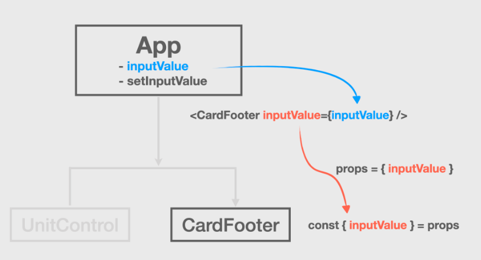

### 根據 `inputValue` 改變 `CardFooter` 的樣式

現在可以根據 `inputValue` 使用條件轉譯和動態 CSS 樣式帶入 JSX 中讓 `CardFooter` 可以動態改變顯示。

條件邏輯：

- 當 `inputValue` 沒有輸入時，會顯示 ---，顏色會是 `#d3d8e2`。

- 當 `inputValue` 小於 15 時，會顯示 SLOW，顏色會是 `#ee362d`。

- 當 `15 <= inputValue < 40`，會顯示 GOOD，顏色會是 `#1b82f1`。

- 當 `inputValue` 大於等於 40 時，會顯示 FAST，顏色會 `#13d569`。

```JSX
const CardFooter = (props) => {
  const { inputValue } = props;
  let footer = {};

  if (!inputValue) {
    footer = {
      title: '---',
      backgroundColor: '#d3d8e2',
    };
  } else if (inputValue < 15) {
    footer = {
      title: 'SLOW',
      backgroundColor: '#ee362d',
    };
  } else if (inputValue < 40) {
    footer = {
      title: 'GOOD',
      backgroundColor: '#1b82f1',
    };
  } else if (inputValue >= 40) {
    footer = {
      title: 'FAST',
      backgroundColor: '#13d569',
    };
  }

  return (
    <div
      className="card-footer"
      style={{ backgroundColor: footer.backgroundColor }}
    >
      {footer.title}
    </div>
  );
};

export default CardFooter;
```


### 子層元件如何修改父層元件的資料狀態

除了前面介紹的將**資料狀態**當成 `props` 傳入子層元件之外，**函式**或用來**改變資料狀態的方法**也可以透過 `props` 傳入。

- 1.UnitConverter 元件的拆分。

  在 `components` 資料夾中新增一支名為 `UnitConverter.js` 的檔案，並將 `<div className="converter">` 的內容放進去。

  ```JSX
  const UnitConverter = () => <div className="converter">{/* ... */}</div>;

  export default UnitConverter;
  ```

  最後在 `App.js` 匯入 ‵`UnitConverter` 元件。

  ```JSX
  import UnitConverter from './components/UnitConverter';
  // ...

  function App() {
    // ...

    return (
      <div className="container">
        <div className="card-header">Network Speed Converter</div>
        <div className="card-body">
          <UnitControl />
          <UnitConverter />
          <CardFooter inputValue={inputValue} />
        </div>
      </div>
    );
  }

  export default App;
  ```

  運行 `npm start` 後會發現提示錯誤：

  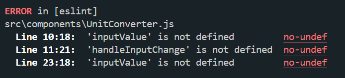

  這是因為在 `UnitConverter` 元件中，找不到 `inputValue` 和 `handleInputChange` 這兩個變數。

- 2.透過 `props` 傳遞需要的資料與函式。

  現在可以使用 `props` 把這兩個變數從 `App` 傳入到 `UnitConverter` 元件中。

  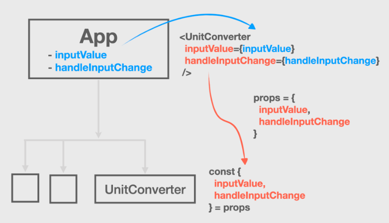

  ```JSX
  import UnitConverter from './components/UnitConverter';
  // ...

  function App() {
    // ...

    return (
      <div className="container">
        <div className="card-header">Network Speed Converter</div>
        <div className="card-body">
          <UnitControl />
          <UnitConverter
            inputValue={inputValue}
            handleInputChange={handleInputChange}
          />
          <CardFooter inputValue={inputValue} />
        </div>
      </div>
    );
  }

  export default App;
  ```

  在 `UnitConverter` 元件中，一樣透過參數的方式取得父層元件 `props` 傳進來的內容，並且解構賦值把需要的資料或函式取出即可。

  ```JSX
  const UnitConverter = (props) => {
    const { inputValue, handleInputChange } = props;

    return /* ... */;
  };

  export default UnitConverter;
  ```

  現在 `UnitConverter` 元件也可以正常運作了。

#### 重要：子層元件不可直接修改父層元件傳入的 `props`

在 React 元件間的資料傳遞中有一個非常重要的概念，就是 **「只有該資料的擁有者可以去修改資料」**、**「`props` 是唯讀且不可變的」**。

以網速單位轉換器的例子來說， `inputValue` 是在 `App` 中被建立，它是該資料的擁有者，雖然透過 `props` 可以把 `inputValue` 的值傳遞到子層元件，但是子層元件只能讀取 `inputValue` 的值，它們是沒有權限去直接修改 `inputValue` 的。

雖然子層不能直接修改父層的 `props`，但是可以請父層幫它完成這個資料修改的動作。

先把修改資料的函式在父層定義好，像是 `App` 元件中的 `handleInputChange` 這個修改 `inputValue` 的方法，並透過 `props` 把這個方法傳到子層內。當子層需要修改父層的資料狀態時，就只需要呼叫 `handleInputChange` 這個方法即可。

> 補充資料：[如何在子 component 裡觸發更新父 component 的資料](https://ithelp.ithome.com.tw/articles/10299348)

## 使用 React FontAwesome

根據 [FontAwesome 官方文件](https://docs.fontawesome.com/web/use-with/react) 的說明，建議我們使用官方的 `react-fontawesome` 元件，讓所有功能都能正常運作。

### 安裝 React FontAwesome

- 1.新增 SVG 核心。

  ```bash
  npm i --save @fortawesome/fontawesome-svg-core
  ```

- 2.新增圖示套件。

  FontAwesome 將所有圖示分成三類，分別是 regular、brands 和 solid 這三類

  ```bash
  npm i --save @fortawesome/free-solid-svg-icons
  npm i --save @fortawesome/free-regular-svg-icons
  npm i --save @fortawesome/free-brands-svg-icons
  ```

- 3.安裝 Font Awesome React 元件

  ```bash
  npm i --save @fortawesome/react-fontawesome@latest
  ```

### React FontAwesome 的使用

- 1.註冊 React FontAwesome 中會用到的圖示。

  這裡使用時會需要在最上層的元件，也就是 `App.js` 這支檔案中註冊 FontAwesome 工具。

  ```JSX
  // App.js
  import { library } from '@fortawesome/fontawesome-svg-core'
  import { fab } from '@fortawesome/free-brands-svg-icons';
  import { fas } from '@fortawesome/free-solid-svg-icons';
  import { far } from '@fortawesome/free-regular-svg-icons';

  library.add(fab, fas, far);
  ```

  > Tips：在這裡我們把 FontAwesome 提供的所有圖示都載入進來，但實際使用時，為了避免載入的檔案太過龐大影響使用者瀏覽的速度，通常只會載入有用到的圖示。

- 2.在需要的地方使用 React FontAwesome 元件。

  首先在想要使用圖示的地方匯入 React FontAwesome 元件。

  ```JSX
  // STEP 1：在想要使用圖示的地方匯入 React FontAwesome
  import { FontAwesomeIcon } from '@fortawesome/react-fontawesome';
  ```

  接著在需要使用圖示的地方，和把 `props` 傳入子層元件的方式一樣，只需要在 `<FontAwesomeIcon />` 這個元件中使用 `icon=` 帶入**字串** 或是使用 `icon={...}` 帶入**一個陣列**就可以了。

  > 圖示對應的名稱，可以到 [FontAwesome 的官方網站](https://fontawesome.com/icons) 檢視。

  ```JSX
  import { FontAwesomeIcon } from '@fortawesome/react-fontawesome';

  export const Gadget = () => (
    <div>
      {/* STEP 2：套用 FontAwesome 提供的 microsoft 圖示} */}
      {/* 使用字串 */}
      <FontAwesomeIcon icon="fa-brands fa-microsoft" />
      {/* 使用陣列 */}
      <FontAwesomeIcon icon={['fab', 'microsoft']} />
    </div>
  );
  ```

### 網速單位轉換器套用 FontAwesome 的圖示

現在網速單位轉換器套用 FontAwesome 的圖示。

- UnitControl 元件。

  ```JSX
  import { FontAwesomeIcon } from '@fortawesome/react-fontawesome';

  const UnitControl = () => (
    {/* ... */}
      <span className="exchange-icon fa-fw fa-stack">
        <FontAwesomeIcon icon="far fa-circle" className="fa-stack-2x" />
        <FontAwesomeIcon icon="fas fa-exchange-alt" className="fa-stack-1x" />
      </span>
    {/* ... */}
  );

  export default UnitControl;
  ```

- UnitConverter 元件。

  ```JSX
  import { FontAwesomeIcon } from '@fortawesome/react-fontawesome';

  const UnitConverter = (props) => {
    {/* ... */}
      <span className="angle-icon fa-2x" style={{ marginTop: 30 }}>
        <FontAwesomeIcon icon="fas fa-angle-right" />
      </span>
    {/* ... */}
  };

  export default UnitConverter;
  ```

現在圖示也可以正常顯示了。


