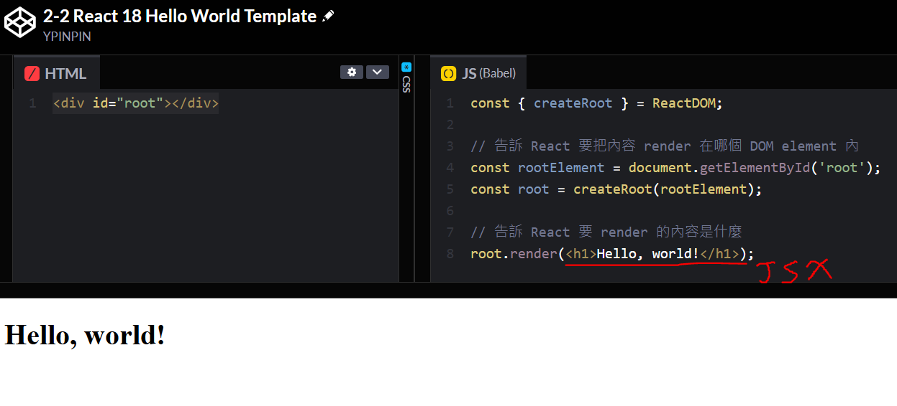
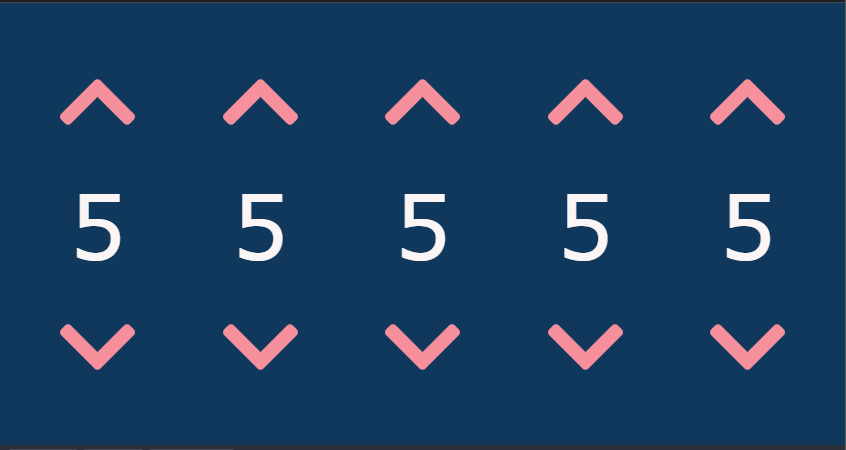
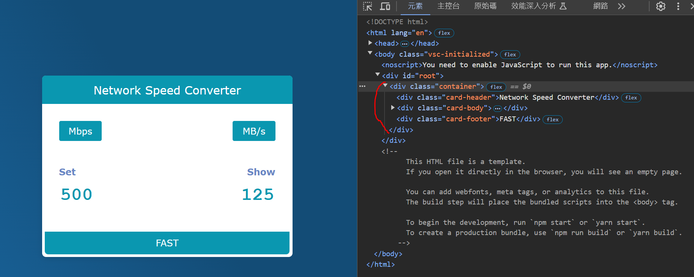
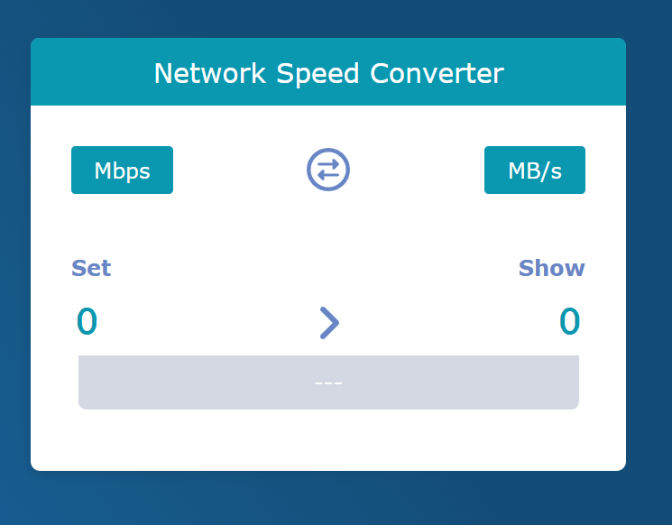
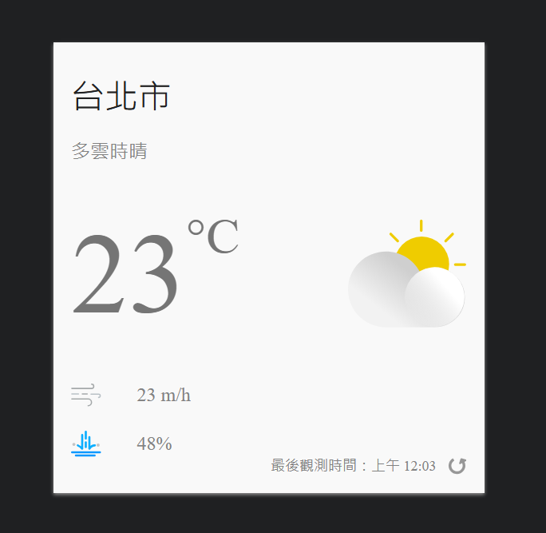
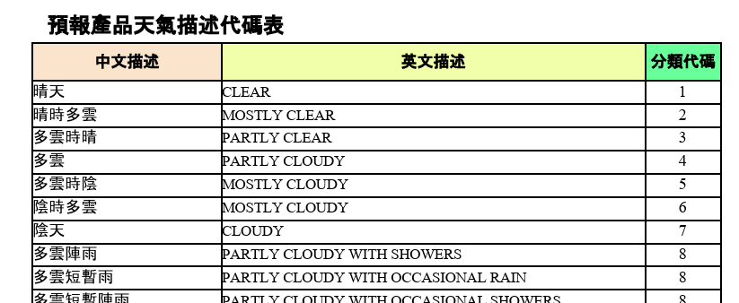
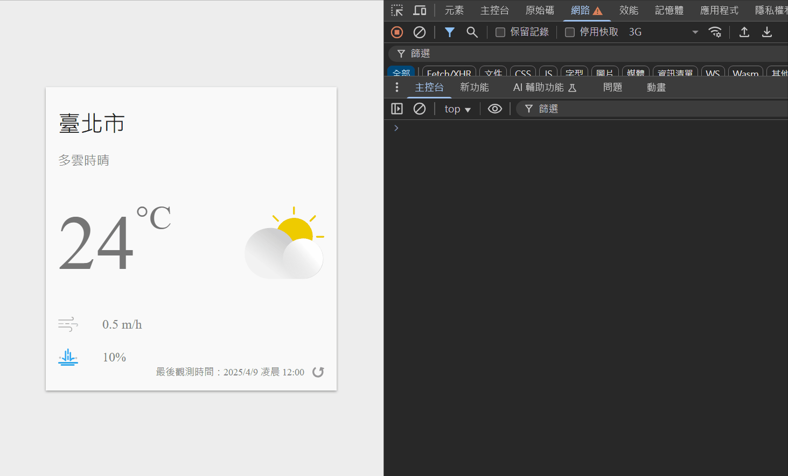
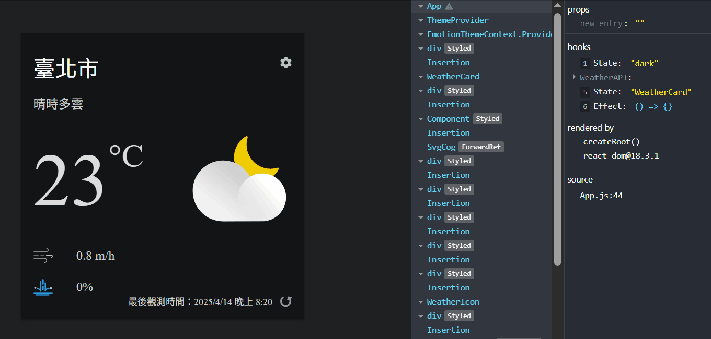
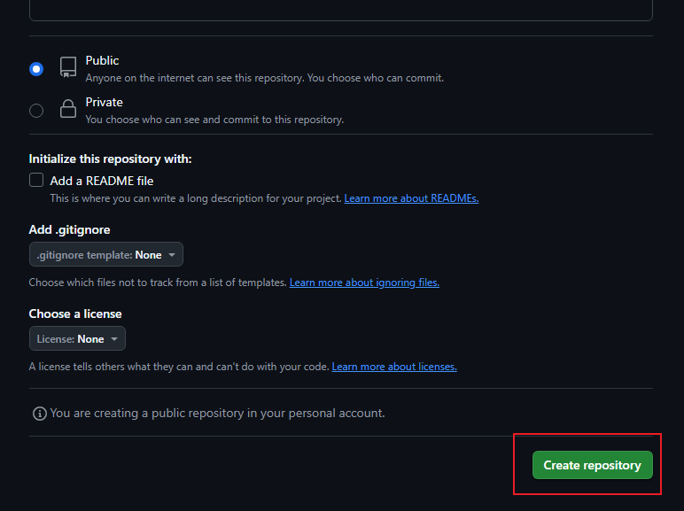

# React 學習筆記

主要根據 [從 Hooks 開始，讓你的網頁 React 起來](https://pjchender.dev/react-bootcamp/) 整理的學習筆記，方便查閱。

> 以下皆使用 React 18 版本實作範例。

## 目錄

- React 基礎

  - [JSX 的使用](#jsx-的使用)

  - [用 JSX 寫 Hello World (CodePen)](#用-jsx-寫-hello-world-codepen)

  - [在 JSX 中帶入變數與表達式 (CodePen)](#在-jsx-中帶入變數與表達式-codepen)

  - [將計數器範例改用 JSX 來寫 (CodePen)](#將計數器範例改用-jsx-來寫-codepen)

  - [在 JSX 中套用 CSS inline-style （行內樣式）(CodePen)](#在-jsx-中套用-css-inline-style-行內樣式codepen)

  - [建立第一個 React 元件 (CodePen)](#建立第一個-react-元件-codepen)

  - [React 元件與 HTML 元素的命名規則與慣例](#react-元件與-html-元素的命名規則與慣例)

  - [React 中的事件處理 (CodePen)](#react-中的事件處理-codepen)

  - [React 元件中的資料狀態 - useState 的使用 (CodePen)](#react-元件中的資料狀態---usestate-的使用-codepen)

  - [條件轉譯的使用（conditional rendering）(CodePen)](#條件轉譯的使用conditional-renderingcodepen)

  - [動態添加 CSS 樣式來隱藏 HTML 元素 (CodePen)](#動態添加-css-樣式來隱藏-html-元素-codepen)

  - [計數器事件處理器的重構 (CodePen)](#計數器事件處理器的重構-codepen)

  - [JSX 中迴圈的使用 (CodePen)](#jsx-中迴圈的使用-codepen)

  - [JSX 元素只能有一個最外層元素 (CodePen)](#jsx-元素只能有一個最外層元素-codepen)

  - [React Hooks 不可這麼用](#react-hooks-不可這麼用)

- React 元件間的資料傳遞：props 的應用

  - [使用 Create React App 工具建立專案](#使用-create-react-app-工具建立專案)

  - [建立網速單位轉換器的 UI](#建立網速單位轉換器的-ui)

  - [React 中表單的基本應用](#react-中表單的基本應用)

  - [React 元件的拆分](#react-元件的拆分)

  - [React 元件間的資料傳遞 - props 的使用](#react-元件間的資料傳遞---props-的使用)

  - [使用 React FontAwesome](#使用-react-fontawesome)

- 臺灣好天氣 App 專案

  - [專案建立、圖示檔案下載](#臺灣好天氣-app-專案建立圖示檔案下載)

  - [CSS in JS 的使用 - emotion](#css-in-js-的使用---emotion)

  - [使用 emotion 完成「臺灣好天氣」 UI](#使用-emotion-完成臺灣好天氣-ui)

  - [使用 emotion 實作深色主題](#使用-emotion-實作深色主題)

  - [申請使用中央氣象署 API](#申請使用中央氣象署-api)

  - [呈現天氣資料於畫面中 - useState 的使用](#呈現天氣資料於畫面中---usestate-的使用)

  - [使用 fetch 拉取天氣資料](#使用-fetch-拉取天氣資料)

  - [頁面載入時就去請求資料 - useEffect 的使用](#頁面載入時就去請求資料---useeffect-的使用)

  - [實作資料載入中的狀態](#實作資料載入中的狀態)

  - [將天氣代碼轉換為天氣圖示](#將天氣代碼轉換為天氣圖示)

  - [根據日出日落時間顯示不同的天氣圖示、主題配色](#根據日出日落時間顯示不同的天氣圖示主題配色)

  - [專案程式碼重構 - WeatherCard 元件](#專案程式碼重構---weathercard-元件)

  - [建立自己的鉤子 - Custom Hooks](#建立自己的鉤子---custom-hooks)

  - [新增選擇縣市查看不同的天氣資料](#新增選擇縣市查看不同的天氣資料)

  - [開啟 React 中提供的 PWA 功能](#開啟-react-中提供的-pwa-功能)

  - [網站部署到 Github Pages ](#網站部署到-github-pages)

## JSX 的使用

> 參考資料：[[Day 05] 建構一切 UI 的最基本單位 — React element](https://ithelp.ithome.com.tw/articles/10294538)、[[Day 06] Render React elements](https://ithelp.ithome.com.tw/articles/10295277)、[[Day 07] JSX 根本就不是在 JavaScript 中寫 HTML](https://ithelp.ithome.com.tw/articles/10296066)

## 用 JSX 寫 Hello World (CodePen)

[💻CodePen Demo](https://codepen.io/ypinpin/pen/MWNLGVR)

- 在 CodePen 上設定使用 Babel 做為 JavaScript 前處理器（Preprocessor），並且載入 React 和 ReactDOM 套件。

  - https://unpkg.com/react@18/umd/react.development.js

  - https://unpkg.com/react-dom@18/umd/react-dom.development.js

  

- 設定 HTML。

  ```html
  <div id="root"></div>
  ```

- 使用 JSX 顯示 Hello world。

  ```jsx
  const { createRoot } = ReactDOM;

  // 告訴 React 要把內容 render 在哪個 DOM element 內
  const rootElement = document.getElementById('root');
  const root = createRoot(rootElement);

  // 告訴 React 要 render 的內容是什麼
  root.render(<h1>Hello, world!</h1>);
  ```

  

## 在 JSX 中帶入變數與表達式 (CodePen)

- 要把 JavaScript 的變數帶入到 JSX 中，只需要在 JSX 中把 **JavaScript 變數**用 `{ }` 大括號包起來就可以了。

  ```jsx
  const { createRoot } = ReactDOM;

  const rootElement = document.getElementById('root');
  const root = createRoot(rootElement);

  // 使用變數
  const word = 'React';

  root.render(<h1>Hello, {word}!</h1>);
  ```

  [💻CodePen Demo](https://codepen.io/ypinpin/pen/eYqxKBJ)。

  

- 除了變數之外，也可以在 JSX 的 `{ }` 中放入 **JavaScript 表達式（expression）**，這個表達式的回傳值就會直接呈現在畫面上。

  > Tips：表達式（expression）指的是輸入之後會得到回傳值的語法；陳述句（statement）則不會有回傳值，像是 `if...else`, `for` 迴圈等等這類。

  ```jsx
  const { createRoot } = ReactDOM;

  const rootElement = document.getElementById('root');
  const root = createRoot(rootElement);

  // 使用變數及表達式
  const deviceName = 'Galaxy S24 Ultra';
  const currentPrice = 43900;
  const salePrice = (currentPrice, discount) => currentPrice * discount;

  root.render(
    <h1>
      現在 {deviceName} 的售價是 ${currentPrice}，特價 $
      {salePrice(currentPrice, 0.85)}
    </h1>
  );
  ```

  [💻CodePen Demo](https://codepen.io/ypinpin/pen/jOgdKxE)。

  

## 將計數器範例改用 JSX 來寫 (CodePen)

將此 [計數器範例](https://codepen.io/PJCHENder/pen/VwevJrz) 改用 JSX 來寫。

- 把 HTML 部分放入 JSX 中。

  ```jsx
  // 省略...

  root.render(
    <div class="container">
      <div class="chevron chevron-up"></div>
      <div class="number">256</div>
      <div class="chevron chevron-down"></div>
    </div>
  );
  ```

- 另外在 JavaScript 中，我們也可以**把寫在 JSX 中 HTML 的部分定義成一個變數，將 JSX 放入 `()` 中**，像是這裡可以把它定義為 `Counter`，然後再把這個變數放到 `root.render()` 中。

  ```jsx
  // 省略...

  // JSX 的內容可以放到 () 內當成變數
  const Counter = (
    <div class="container">
      <div class="chevron chevron-up"></div>
      <div class="number">256</div>
      <div class="chevron chevron-down"></div>
    </div>
  );

  root.render(Counter);
  ```

- 補充：在 JSX 中**當開始和結束的標籤（tag）之間沒有任何內容的時候，就可以把它自己關閉（self closing tag）起來**，也就是在開頭的 HTML 標籤最後加上 `/` 即可，結尾的 HTML 標籤即可移除，舉例來說 `<div></div>`，因為開頭和結尾的 HTML 標籤之間沒有任何內容，因此在 JSX 中會變成 `<div />`。

  ```jsx
  // 省略...

  // JSX 的內容可以放到 () 內當成變數
  const Counter = (
    <div class="container">
      <div class="chevron chevron-up" />
      <div class="number">256</div>
      <div class="chevron chevron-down" />
    </div>
  );

  root.render(Counter);
  ```

- 最後複製 CSS 樣式

  [💻CodePen Demo](https://codepen.io/ypinpin/pen/RwXvJdE)。

  

  現在雖然從 CodePen 看畫面都正常， CSS 樣式也都有顯示，但實際上透過 CodePen 上的 console 視窗，或用瀏覽器內建的開發者工具打開 console 視窗都會看到一個錯誤訊息：

  

  這是因為在 JavaScript 中，`class` 本身就已經是個關鍵字，它主要是用來定義類別用的，因此為了避免踩到 JavaScript 的這個關鍵字，**需要把在 JSX 中會把原本 HTML 中使用的 `class=""` 都改用 `className=""`**，因此程式碼會變成：

  ```jsx
  // 省略...

  // 在 JSX 中使用 CSS class
  // 避免關鍵字衝突，在 JSX 中把原本的 CSS class 都改成用 className
  const Counter = (
    <div className="container">
      <div className="chevron chevron-up" />
      <div className="number">256</div>
      <div className="chevron chevron-down" />
    </div>
  );

  root.render(Counter);
  ```

  [💻CodePen Demo](https://codepen.io/ypinpin/pen/NWQoBwb)。

  

## 在 JSX 中套用 CSS inline-style （行內樣式）(CodePen)

除了前面介紹的使用 `className=""` 的方式設定 CSS class 樣式，如果我們需要在 JSX 中撰寫 CSS inline-style （行內樣式）的話，**可以在 HTML 標籤內的 `style` 屬性中以帶入「物件」的方式來完成**。

在 JSX 中可以使用 `{}` 來帶入變數，因此當我們想要撰寫 inline-style 時，就可以在 `<div style={} >` 的 `{}` 中放入「物件」。

**物件的屬性名稱會是 CSS 的屬性，但會用「小寫駝峰」來表示；屬性值則是 CSS 的值**，具體的寫法會像這樣：

```jsx
// 省略...

// 定義 inline-style 行內樣式
const someStyle = {
  backgroundColor: 'yellow',
  fontSize: '20px', // 也可以寫 20，引號和 px 可以省略
  border: '1px solid white',
  padding: 10, // 省略 px，樣式會自動帶入單位變成 '10px'
};

// 在 style 中帶入物件，即可撰寫出 inline-style
root.render(<div style={someStyle}>Hello, CSS inline-style</div>);
```

這裡我們可以注意到：

- **屬性名稱都會以小寫駝峰命名**，例如 `backgroundColor` 和 `fontSize`。

- 要記得這是 JavaScript 物件，所以想要直接使用顏色時，**要使用字串的方式表示**，所以使用 `'white'` 時有用引號包起來。

- **屬性值預設會以 `px` 為單位**，所以 `padding: 10` 指的就是 `'10px'`；而 `fontSize: '20px'` 可以縮寫成 `fontSize: 20`。

- 而因為這是 JavaScript 物件，**所以每個屬性的最後是使用 `,` 而不是 `;` 來做換行**。

[💻CodePen Demo](https://codepen.io/ypinpin/pen/eYqxjKr)。


現在可以試著在計數器範例中添加 CSS inline-style：

```jsx
// 省略...

// 定義 inline-style 行內樣式
const shadow = {
  boxShadow: 'rgb(20, 76, 128) 0px 0px 10px 10px',
  padding: 20, // 省略 px，樣式會自動帶入單位變成 '20px'
};

const Counter = (
  <div className="container" style={shadow}>
    <div className="chevron chevron-up" />
    <div className="number">256</div>
    <div className="chevron chevron-down" />
  </div>
);

root.render(Counter);
```


而有時候開發者可能不會先定義一個 inline-style 的物件，**而是直接把 inline-style 這個物件寫在 `style={}` 的 `{}` 內**，因此會看到 `style={{...}}` 這樣的寫法，實際上就只是在 `style={}` 的 `{}` 內再放入一個物件而已。

```jsx
// 省略...

// 定義 inline-style 行內樣式
const shadow = {
  boxShadow: 'rgb(20, 76, 128) 0px 0px 10px 10px',
  padding: 20, // 省略 px，樣式會自動帶入單位變成 '20px'
};

// 在 JSX 中使用行內樣式
// 在 style 屬性中直接帶入物件
const Counter = (
  <div className="container" style={shadow}>
    <div className="chevron chevron-up" />
    <div
      className="number"
      style={{
        color: '#DED5D5',
        textShadow: '4px 4px #434a54',
      }}
    >
      256
    </div>
    <div className="chevron chevron-down" />
  </div>
);

root.render(Counter);
```

[💻CodePen Demo](https://codepen.io/ypinpin/pen/NWQJRKg)。


## 建立第一個 React 元件 (CodePen)

在 React 中，除了把 JSX 當成一個 JavaScript 變數直接傳遞之外，更常見的是**把 JSX 的內容包成一個 React 元件**，以下將使用函式來建立 React 元件。

[💻CodePen Demo](https://codepen.io/ypinpin/pen/vYoPXeX)。

- 建立 React Component

  我們可以**建立一個函式把 JSX 的內容回傳出來**。

  ```jsx
  // 建立一個名為 Counter 的 React 元件
  const Counter = () => {
    return (
      <div className="container">
        <div className="chevron chevron-up" />
        <div className="number">256</div>
        <div className="chevron chevron-down" />
      </div>
    );
  };
  ```

  而在箭頭函式（arrow function）中，當該函式只是單純回傳某一值時，可以把要回傳的內容直接放到 `=>` 後面而不用額外再寫 `return`，因此也可以精簡成以下程式碼：

  ```jsx
  // 建立一個名為 Counter 的 React 元件
  const Counter = () => (
    <div className="container">
      <div className="chevron chevron-up" />
      <div className="number">256</div>
      <div className="chevron chevron-down" />
    </div>
  );
  ```

  > Tips：這裡使用函式所建立出的 React 元件，稱作 Function Component，而稍後談到的 React Hooks 也只能在 Function Component 中使用。在還沒有 React Hooks 以前，則常會以 class 的方式來建立元件，稱作 Class Component。

- 使用 React Component

  現在只需把剛剛建立好的 React 元件當成一個 HTML 標籤 `<Counter />`
  放進 `root.render()` 中就可以了。

  ```jsx
  // 省略...

  // 建立一個名為 Counter 的 React 元件
  const Counter = () => (
    <div className="container">
      <div className="chevron chevron-up" />
      <div className="number">256</div>
      <div className="chevron chevron-down" />
    </div>
  );

  // 使用 <Counter /> 來帶入 React 元件
  root.render(<Counter />);
  ```

  可以發現這與原本建立變數並帶入的寫法差別並不大：

  

  而使用元件的好處在於讓開發者可以**輕鬆的重複使用這些元件**。當我們需要三個計數器時，只需要使用三次 `<Counter />` 就可以了，不需要複製同樣的 HTML 到程式碼中，並且因為 `querySelector` 會選到重複的元素，而必須要再去修改程式碼才能讓這三個計數器都擁有正常的功能。

  ```jsx
  // 省略...

  // 建立一個名為 Counter 的 React 元件
  const Counter = () => (
    <div className="container" style={{ margin: '0 30px' }}>
      <div className="chevron chevron-up" />
      <div className="number">256</div>
      <div className="chevron chevron-down" />
    </div>
  );

  // 使用 <Counter /> 來帶入 React 元件
  root.render(
    <div style={{ display: 'flex', justifyContent: 'space-between' }}>
      <Counter />
      <Counter />
      <Counter />
    </div>
  );
  ```

  

  而元件除了可以幫助開發者根據每個元素的功能去做切割分類以提高維護性外，重要的是**元件讓開發者可以建立可被重複使用的 HTML 元素、樣式或操作邏輯**，當未來需要修改的時候，不需要在到每隻檔案中去做修改，只需要修改這個被共用到的元件即可。

## React 元件與 HTML 元素的命名規則與慣例

在 React 中對於元件和 HTML 屬性、CSS 樣式等等有一些命名上的「慣例」。

React 的「元件名稱」會以**大寫駝峰**的方式來命名，也就是首字母大寫，例如， `Counter`，若該名稱由多個單字組成，則把每一單字的第一個字大寫，例如，`AdminHeader`、`PaymentButton`。如果沒這麼做的話，React 會把它當作一般的 HTML 元素處理，並跳出錯誤提示。

其他像是 HTML 中的屬性、CSS 樣式屬性或一般的函式來說，則會遵行 JavaScript 以**小寫駝峰**來命名變數的慣例，例如 `className`、`maxLength`、`backgroundColor` 等等。

舉例來說：

以 `<input type="text" maxlength="10" />` 為例，在 React 的 JSX 中需要把 `maxlength` 改成 `maxLength`，不然一樣會拋出錯誤。

[💻CodePen Demo](https://codepen.io/ypinpin/pen/GRVeNvG)。

```jsx
// 省略..

// 「元件名稱」會以大寫駝峰的方式來命名
// HTML 中的屬性、CSS 樣式屬性或一般的函式來說，則會遵行 JavaScript 以小寫駝峰來命名
const InputText1 = () => <input type="text" maxlength="10" />;
// 正確寫法
const InputText2 = () => <input type="text" maxLength="10" />;

root.render(
  <div style={{ display: 'flex', flexDirection: 'column' }}>
    <InputText1 />
    <InputText2 />
  </div>
);
```


使用慣例的好處是可以從變數的命名了解它可能的類型，當看到以大寫駝峰方式命名的變數時，可以馬上知道這是個 React 元件而非一般的函式。

## React 中的事件處理 (CodePen)

在前面的介紹中，我們已經完成整個計數器的畫面，並且把計數器建立成一個 React 元件。接著要在 React 中進行事件處理來實現計數器的操作，包含在 JSX 中綁定 DOM 事件，以及定義事件處理的方法。

- 在 React 元件中使用變數

  首先將 `<Counter />` 元件中的數字部分改用變數顯示。而因為必須要在函式內加入變數，所以要改回一般箭頭函式的寫法 `() => {}`。

  > Tips：在 JSX 中因為它本質上是 JavaScript，所以如果想在 JSX 內撰寫註解的話，可以把註解寫在 `{}` 裡面，像是這樣 `{/* 這裡是註解 */}`。

  ```jsx
  // 省略...

  // 建立一個名為 Counter 的 React 元件
  const Counter = () => {
    // 定義變數
    const count = 5;

    return (
      <div className="container" style={{ margin: '0 30px' }}>
        <div className="chevron chevron-up" />
        {/* 使用變數 */}
        <div className="number">{count}</div>
        <div className="chevron chevron-down" />
      </div>
    );
  };

  root.render(<Counter />);
  ```

  [💻CodePen Demo](https://codepen.io/ypinpin/pen/WNVmoPe)。

  

- 在 React 元件中綁定事件監聽器

  在這裡我們使用的是點擊事件，使用原生的 JavaScript 時，是使用 `addEventListener('click', ...)` 的方法，而在 React 元件中會透過 `onClick` 直接把事件綁定在 JSX 上面。

  > 但如同 HTML 一樣，我們還可以綁定各種其他的 DOM 事件，只是因為在 JSX 中 HTML 標籤的屬性慣例上是**使用小寫駝峰來命名**，因此可以使用像是鍵盤的 `onKeyPress`、`onKeyUp`；表單的 `onChange`、`onInput`、`onSubmit` 等等。

  在 `onClick={...}` 中 `{...}` 內要放的就是點擊後要做什麼處理，稱作事件處理器（event handlers），它會是一個函式。

  以下我們在「向上箭頭」的按鈕綁定點擊事件：

  ```jsx
  // 省略...

  // 建立一個名為 Counter 的 React 元件
  const Counter = () => {
    // 定義變數
    let count = 5;

    return (
      <div className="container" style={{ margin: '0 30px' }}>
        <div
          className="chevron chevron-up"
          onClick={() => {
            count = count + 1;
            console.log(`current Count is ${count}`);
          }}
        />
        {/* 使用變數 */}
        <div className="number">{count}</div>
        <div className="chevron chevron-down" />
      </div>
    );
  };

  root.render(<Counter />);
  ```

  [💻CodePen Demo](https://codepen.io/ypinpin/pen/WNVmReb)。

  但當我們點擊箭頭測試時會發現，雖然在瀏覽器 console 顯示的 count 數字有持續增加，但是畫面上的數字卻沒有改變。

  

  這是因為雖然 count 的數字更新了，**但 React 並不知道數字有更新**，所以它不會去重新轉譯瀏覽器的畫面。

  我們可以在 JSX 中使用 `{console.log('render')}` 來看看是不是真的因為 React 元件的畫面沒有更新（重新轉譯），只要 React 有需要更新畫面的話，這個 JSX 就會被重新執行。

  ```jsx
  // 省略...

  // 建立一個名為 Counter 的 React 元件
  const Counter = () => {
    // 定義變數
    let count = 5;

    return (
      <div className="container" style={{ margin: '0 30px' }}>
        {/* 只要 React 有更新畫面的話，這個 JSX 就會被重新執行 */}
        {console.log('render')}
        <div
          className="chevron chevron-up"
          onClick={() => {
            count = count + 1;
            console.log(`current Count is ${count}`);
          }}
        />
        {/* 使用變數 */}
        <div className="number">{count}</div>
        <div className="chevron chevron-down" />
      </div>
    );
  };

  root.render(<Counter />);
  ```

  

  可以發現一開始什麼都不做的時候出現了 "render"，而即使之後 count 變數更新了，畫面也沒有跟著更新（重新轉譯）。那麼要怎麼讓 React 知道，我們的數字改變了，並請它幫我們更新畫面呢？

  在下一個部分中我們會使用到第一個 React Hook，讓 React 知道我們的變數更新了，請 React 幫我們更新畫面。

## React 元件中的資料狀態 - useState 的使用 (CodePen)

在上一個部分中，我們發現雖然變數已經更新了，但因為 React 並不知道這件事，所以不知道要更新畫面來顯示最新的資料。

因此 React 提供了方法可以來監控並改變這些資料，就是第一個 React Hooks - `useState`，如果使用這個方法來修改資料， React 一發現到資料內容有變動時，就會自動更新畫面。

- 狀態（state）

  這個方法之所以叫做 `useState` 是因為在 React 元件中，**這些會連動導致畫面改變的「資料（data）」習慣上被稱作「狀態（state）」**，而方法前面之所以會多了個 `use` ，是因為這是在 React Hooks 中的慣例，**只要開頭為 `use` 的函式，就表示它是個 "Hook"**。

現在可以在計數器中使用 `useState` 方法來監控資料：

- 首先從 React 物件中取出 `useState` 方法。

  ```jsx
  const { useState } = React;
  ```

- 呼叫 `useState` 方法後，它實際上會**回傳一個陣列**，這個陣列中的第一個元素會是我們 **「想要監控的資料（count）」**，第二個元素會是 **「修改該資料的方法（setCount）」**，可以透過陣列的解構賦值來直接取得，而 `useState` 方法中的參數則是 count 的 **預設值**，這裡設為 5。

  ```jsx
  const [count, setCount] = useState('<資料預設值>');
  ```

  透過 `useState` 得到的變數和方法名稱是可以自己取的，而慣例上用來「修改該資料的方法」名稱會以 `set` 開頭；預設值也可以不一定要是字串或數值，而是可以帶入物件。

  下面這些例子都是合法的：

  ```jsx
  const [price, setPrice] = useState(1000);
  const [description, setDescription] = useState('This is description');
  const [product, setProduct] = useState({
    name: 'iPhone 11',
    price: 24900,
    os: 'iOS',
  });
  ```

- 最後在點擊按鈕觸發事件使用 `setCount` 來改變 count 的值。

  [💻CodePen Demo](https://codepen.io/ypinpin/pen/gOVEReO)。

  ```jsx
  // 省略...

  // 從 React 物件中取出 useState 方法
  const { useState } = React;

  const Counter = () => {
    // 呼叫 `useState` 方法，取得一個「變數（count）」和「改變該變數的方法（setCount）」
    const [count, setCount] = useState(5);

    // 使用 setCount 方法來改變 count 的值
    return (
      <div className="container" style={{ margin: '0 30px' }}>
        <div
          className="chevron chevron-up"
          onClick={() => setCount(count + 1)}
        />
        <div className="number">{count}</div>
        <div
          className="chevron chevron-down"
          onClick={() => setCount(count - 1)}
        />
      </div>
    );
  };

  root.render(<Counter />);
  ```

  

### React 畫面的重新轉譯

實際上 React 畫面之所以會更新並不是因為 count 的值改變了，而是因為：

- `setCount` 被呼叫到。

- **count 的值確實有改變**。

只有同時滿足上面這兩個條件，畫面才會進行更新，若是未使用 `setCount` 方法或是 count 值沒有變化，都不會進行畫面的更新。

而 React 在更新畫面時，同樣會很聰明的**只去更新有改變的部分**，它並不會把整個 DOM 都換掉，而是只換掉有變化的部分，也因此才能讓網頁運作的效能大大提升。

## 條件轉譯的使用（conditional rendering）(CodePen)

在上一部份中，計數器的基本功能已經完成，現在我們可以為計數器設定最大值及最小值，並根據條件來隱藏對應的箭頭按鈕。

```jsx
const Counter = () => {
  const [ count, setCount ] = useState(5);

  // 錯誤寫法
  return (
    <div className="container" style={{ margin: '0 30px' }}>
      if (count < 10) {
        <div className="chevron chevron-up" onClick={() => setCount(count + 1)} />
      }
      <div className="number">{count}</div>
      if (count > 0) {
        <div className="chevron chevron-down" onClick={() => setCount(count - 1)} />
      }
    </div>
  );
};
```

而由於先前提過的在 JSX 中的 `{}` 只能帶入表達式，而 `if...else...` 語法則是屬於陳述句。

**因此在 React 中很常會使用到邏輯運算子（ `||` , `&&` ）的語法**。

- `||`

  「或（or）」的意思，當 `||` 前面的值為 `false` （假） 時，就取後面的那個當值。

  ```JavaScript
  const a = 0 || 'iPhone';           // 因為 0 被轉型後為 false，所以 a 會是 'iPhone'

  const b = 26900 || 24900;          // 因為 26900 會轉型為 true，所以 b 會是 26900

  const c = true || '不會輪到我';     // 因為 true 為真，所以 c 是 true

  const d = false || '會輪到我'；     // 因為 false 為假，所以 d 是 '會輪到我'
  ```

- `&&`

  「與（and）」的意思，當 `&&` 前面的值為 `true` （真） 時，就取後面的那個當值。

  ```JavaScript
  const a = 0 && 'iPhone';          // 因為 0 被轉型後為 false，所以 a 會是 0

  const b = 26900 && 24900;         // 因為 26900 轉型為 true，所以 b 會是 24900

  const c = true && '會輪到我';     // 因為 true 為真，所以 c 是'會輪到我'

  const d = false && '不會輪到我'；     // 因為 false 為假，所以 d 是 false
  ```

### 透過邏輯運算子達到條件轉譯

現在我們可以透過使用 `&&` 邏輯運算子來實現 `if` 語法的功能，當 `&&` 前面的值為 `true` （真） 時，就取後面的那個當值。

當使用這種做法時，當條件不符合的時候，**這個按鍵的元素會從 DOM 中完全移除**。

[💻CodePen Demo](https://codepen.io/ypinpin/pen/MWNxZJX)。

```jsx
// 省略...

const Counter = () => {
  const [count, setCount] = useState(5);

  // 使用邏輯運算子 && 來實現條件轉譯
  return (
    <div className="container" style={{ margin: '0 30px' }}>
      {count < 10 && (
        <div
          className="chevron chevron-up"
          onClick={() => setCount(count + 1)}
        />
      )}
      <div className="number">{count}</div>
      {count > 0 && (
        <div
          className="chevron chevron-down"
          onClick={() => setCount(count - 1)}
        />
      )}
    </div>
  );
};

root.render(<Counter />);
```


## 動態添加 CSS 樣式來隱藏 HTML 元素 (CodePen)

除了使用邏輯運算子來判斷該 HTML 區塊要不要呈現之外，另一個常用的方式是**使用 CSS 樣式，像是 `display: none;` 和 `visibility: hidden;`**，不論是哪一種，這個 HTML 元素仍然可以在開發者工具的 Elements 頁籤中被看到，只是透過 CSS 把它隱藏起來而已。

而 `display: none;` 和 `visibility: hidden;` 的差別在於 `display: none;` 在把該元素隱藏的情況下，**同時會移除該元素原本佔據在網頁上的空間**，因此畫面排版會因為該元素不見而導致「跳一下」。 `visibility: hidden;` 同樣會把該元素給隱藏起來，**但是原本該元素所佔據的空間還是會保留在那裡**，因此不會有因為東西被移除後而畫面排版「跳一下」的情況。

這裡為了避免畫面排版改變，因此修改為使用 CSS 樣式 `visibility: hidden;`。要做到動態變更套用的 CSS 樣式，則一樣會用到前面所提到的**邏輯運算子搭配行內樣式（inline-style）或是 CSS class**。

### 使用動態的行內樣式

在 `style={}` 屬性後的 `{}` 中帶入**帶有樣式的物件**即可。

[💻CodePen Demo](https://codepen.io/ypinpin/pen/wvVORxP)。

```jsx
// 省略...

const Counter = () => {
  const [count, setCount] = useState(5);

  // 使用動態的行內樣式來隱藏 HTML 元素
  return (
    <div className="container" style={{ margin: '0 30px' }}>
      <div
        className="chevron chevron-up"
        style={{ visibility: count >= 10 && 'hidden' }}
        onClick={() => setCount(count + 1)}
      />
      <div className="number">{count}</div>
      <div
        className="chevron chevron-down"
        style={{ visibility: count <= 0 && 'hidden' }}
        onClick={() => setCount(count - 1)}
      />
    </div>
  );
};

root.render(<Counter />);
```


### 使用動態的 CSS class

也可以透過動態的 CSS class 來實現效果。

先在 CSS 的區塊中添加一個名為 `.visibility-hidden` 的樣式：

```css
.visibility-hidden {
  visibility: hidden;
}
```

原本的 `className` 是直接帶入字串，現在希望能夠動態改變後面帶入的 class，因此要改成用 `{}` 來帶入變數，這個變數會搭配「樣板字面值」的用法來讓它動態改變。

[💻CodePen Demo](https://codepen.io/ypinpin/pen/vYoPvMg)。

```jsx
// 省略...

const Counter = () => {
  const [count, setCount] = useState(5);

  // 使用動態的 CSS class樣式來隱藏 HTML 元素
  return (
    <div className="container" style={{ margin: '0 30px' }}>
      <div
        className={`chevron chevron-up ${count >= 10 && 'visibility-hidden'}`}
        onClick={() => setCount(count + 1)}
      />
      <div className="number">{count}</div>
      <div
        className={`chevron chevron-down ${count <= 0 && 'visibility-hidden'}`}
        onClick={() => setCount(count - 1)}
      />
    </div>
  );
};

root.render(<Counter />);
```


## 計數器事件處理器的重構 (CodePen)

一般在開發程式的過程中，有時候會先專注於功能的實作，等到功能實作出來，可以正常運作後，會再把整個程式碼做整理，這個動作一般我們稱作重構（refactoring）。

### 將事件處理的邏輯從 JSX 中抽離


若 `onClick` 以後需要做更多的事情時，直接把事件處理器寫在 JSX 的行內可能就會變得比較難管理。

因此，為了程式碼管理上的方便，**可以把事件處理器先定義成一個函式，在 `onClick` 後去呼叫這個函式即可，如此可以達到畫面和邏輯的分離**。

把 `onClick` 裡面的函式拉出來，分別取名為 `handleIncrement` 和 `handleDecrement`：

```jsx
// 省略...

const Counter = () => {
  const [count, setCount] = useState(5);

  // 將事件處理器獨立成 handleIncrement 和 handleDecrement
  const handleIncrement = () => setCount(count + 1);
  const handleDecrement = () => setCount(count - 1);

  // 把事件處理器帶入
  return (
    <div className="container" style={{ margin: '0 30px' }}>
      <div
        className={`chevron chevron-up ${count >= 10 && 'visibility-hidden'}`}
        onClick={handleIncrement}
      />
      <div className="number">{count}</div>
      <div
        className={`chevron chevron-down ${count <= 0 && 'visibility-hidden'}`}
        onClick={handleDecrement}
      />
    </div>
  );
};

root.render(<Counter />);
```

### 同樣邏輯的程式碼不必重複

`handleIncrement` 和 `handleDecrement` 做的事差不多，因此也可以將其簡化成一個 `handleClick` 的函式，並帶入一個名為 `type` 的參數來處理不同的操作。

```jsx
// 簡化成一個名為 handleClick 的方法
const handleClick = (type) => {
  if (type == 'increment') {
    setCount(count + 1);
  }
  if (type == 'decrement') {
    setCount(count - 1);
  }
};
```

但這裡有一個 JavaScript 的概念要特別留意，現在 `handleClick` 本身是一個函式，如果我們在 JSX 中直接把 `type` 當成參數帶進去函式，像這樣的話：

```jsx
// 這是錯誤的寫法，請不要照做
// 向上點擊的箭頭
<div
  className={`chevron chevron-up ${count >= 10 && 'visibility-hidden'}`}
  onClick={handleClick('increment')}
/>
```

我們預期的是點擊按鈕時，會去執行 `handleClick('increment')` 這個方法，但實際上，因為 `handleClick` 後面直接加上了小括號 `('increment')`，**因此當 JavaScript 執行到這裡的時候，這個 `handleClick` 函式就已經被執行了**。


所以實際上畫面在轉譯（render）的時候，就執行了 `handleClick` 這個函式，這時候就呼叫到了 `setCount();`當 `setCount` 被呼叫到時，React 發現就會去檢查 count 的值，發現 count 不一樣之後，又會去更新畫面，於是就進入了無限迴圈 ...，並且顯示錯誤訊息。


要解決這個問題只需要**把 `handleClick()` 包在一個函式中**，這樣的話，畫面轉譯的時候 `handleClick` 就不會馬上被執行，而是在使用者點擊按鈕的時候才會去執行 `() => handleClick('increment')` 這個函式。

```jsx
// 省略...

const Counter = () => {
  const [count, setCount] = useState(5);

  // 簡化成一個名為 handleClick 的方法
  const handleClick = (type) => {
    if (type == 'increment') {
      setCount(count + 1);
    }
    if (type == 'decrement') {
      setCount(count - 1);
    }
  };

  // 把事件處理器帶入
  return (
    <div className="container" style={{ margin: '0 30px' }}>
      <div
        className={`chevron chevron-up ${count >= 10 && 'visibility-hidden'}`}
        onClick={() => handleClick('increment')}
      />
      <div className="number">{count}</div>
      <div
        className={`chevron chevron-down ${count <= 0 && 'visibility-hidden'}`}
        onClick={() => handleClick('decrement')}
      />
    </div>
  );
};

root.render(<Counter />);
```

### 使用三元判斷式（ternary operator）簡化語法

最後 `handleClick` 的方法也可以使用三元判斷式來進行 `if` 語法的簡化。

[💻CodePen Demo](https://codepen.io/ypinpin/pen/XWvGOKJ)。

```jsx
// 省略...

const Counter = () => {
  const [count, setCount] = useState(5);

  // 簡化成一個名為 handleClick 的方法
  const handleClick = (type) => {
    // 使用三元判斷式簡化語法
    setCount(type === 'increment' ? count + 1 : count - 1);
  };

  // 把事件處理器帶入
  return (
    <div className="container" style={{ margin: '0 30px' }}>
      <div
        className={`chevron chevron-up ${count >= 10 && 'visibility-hidden'}`}
        onClick={() => handleClick('increment')}
      />
      <div className="number">{count}</div>
      <div
        className={`chevron chevron-down ${count <= 0 && 'visibility-hidden'}`}
        onClick={() => handleClick('decrement')}
      />
    </div>
  );
};

root.render(<Counter />);
```

### 進階寫法：讓函式執行後回傳另一個函式

在上面的程式碼中，會發現雖然把事件處理器抽成了獨立的 `handleClick` 函式，但因為需要在這個函式中帶入參數，而為了避免函式直接在 JSX 中被執行，變成在 `onClick` 的時候又要多包一層函式：


但也可以用其他的寫法來解決這個問題，也就是在 JSX 執行的時候讓 `handleClick` 直接被執行，並且帶入參數 `type`，**但在 `handleClick`
執行後則會回傳另一個函式到 `onClick={}` 的 `{}` 內。這個被回傳的函式一樣會在按鈕的點擊事件被觸發時被呼叫到**，語法如下：

```jsx
// 省略...

const Counter = () => {
  const [count, setCount] = useState(5);

  // 讓 handleClick 被執行時，實際上是回傳一個函式
  const handleClick = (type) => {
    return () => {
      setCount(type === 'increment' ? count + 1 : count - 1);
    };
  };

  // 把事件處理器帶入
  return (
    <div className="container" style={{ margin: '0 30px' }}>
      <div
        className={`chevron chevron-up ${count >= 10 && 'visibility-hidden'}`}
        onClick={handleClick('increment')}
      />
      <div className="number">{count}</div>
      <div
        className={`chevron chevron-down ${count <= 0 && 'visibility-hidden'}`}
        onClick={handleClick('decrement')}
      />
    </div>
  );
};

root.render(<Counter />);
```

最後 `handleClick` 這個函式本身又可以做箭頭函式上語法的簡化：

- 先針對 `handleClick` 「裡面」的箭頭函式，可以省略箭頭後面的 `{}`

  ```jsx
  const handleClick = (type) => {
    return () => setCount(type === 'increment' ? count + 1 : count - 1);
  };
  ```

- 接著，針對 `handleClick` 箭頭函式「本身」，也可以省略箭頭後面的 `{}`

  ```jsx
  const handleClick = (type) => () =>
    setCount(type === 'increment' ? count + 1 : count - 1);
  ```

因此，未來如果看到像是 `() => () => {...}` 這樣的語法的話，不用太過驚訝，這不是什麼新的語法，單純只是在**呼叫了一個函式之後會回傳另一個函式的簡化寫法**。

[💻CodePen Demo](https://codepen.io/ypinpin/pen/LYwaaYQ)。

```jsx
// 省略...

const Counter = () => {
  const [count, setCount] = useState(5);

  // 讓 handleClick 被執行時，實際上是回傳一個函式
  const handleClick = (type) => () =>
    setCount(type === 'increment' ? count + 1 : count - 1);

  // 把事件處理器帶入
  return (
    <div className="container" style={{ margin: '0 30px' }}>
      <div
        className={`chevron chevron-up ${count >= 10 && 'visibility-hidden'}`}
        onClick={handleClick('increment')}
      />
      <div className="number">{count}</div>
      <div
        className={`chevron chevron-down ${count <= 0 && 'visibility-hidden'}`}
        onClick={handleClick('decrement')}
      />
    </div>
  );
};

root.render(<Counter />);
```

## JSX 中迴圈的使用 (CodePen)

前面介紹過，使用元件的好處在於可以快速地重複使用已經寫好的元件，且每個元件的狀態都是獨立的。

假設今天我們想要在畫面上產生多個計數器，除了可以在 JSX 中直接手動帶入多個元件 `<Counter />` 之外，也可以使用迴圈來重複產生多個計數器。

而和前面[條件轉譯](#條件轉譯的使用conditional-renderingcodepen)中提到的情況一樣，`for` 迴圈本身是個陳述句而非表達式，因此不能直接放到 JSX 中的 `{}` 內去執行。

因此在 React 中，當我們要做重複轉譯多個元件時，**最常使用到的是透過陣列的 `map` 方法**，因為 `map` 這個方法會有回傳值，所以可以直接在 JSX 中使用。

> Tips：由於一個 [JSX 元素**最多只能有一個最外層的元素**](#jsx-元素只能有一個最外層元素-codepen)，因此當我們要轉譯很多的 `<Counter />` 時，為了要讓外層只有一個元素，可以加上一個額外的 `<div>` 把所有 `<Counter />` 包起來。

作法如下：

- 先產生一個帶有多個元素的陣列。

  在 JavaScript 有許多不同的方式都可以產生帶有多個元素的陣列，這裡我們使用 `Array.from({ length: n })` 這個方法來產生帶有 n 個 `undefined` 的陣列。

  ```jsx
  // 先產生一個帶有多個元素的陣列 [undefined, undefined, ..., undefined]
  const counters = Array.from({ length: 8 });
  ```

- 在 JSX 中將這個陣列使用 `map` 方法，並且每次都回傳 `<Counter />` 元素。

  > Tips：map 回傳的內容除了可以是 React 元件外，更常見的會是 DOM 元素，像是透過迴圈重複產生多個 `<li>`。

  ```jsx
  // 在 JSX 中將這個陣列使用 `map` 方法，並且每次都回傳 `<Counter />` 元素
  root.render(
    <div style={{ display: 'flex', justifyContnent: 'space-between' }}>
      {counters.map(() => (
        <Counter />
      ))}
    </div>
  );
  ```

  

  這時候可以看到畫面上產生了 5 個計數器，但是打開瀏覽器的 console 視窗，會看到有錯誤提示產生：

  

  這是提示我們最好把**每個透過迴圈重複產生的元件加上 `key` 這個屬性**，且每個 `key` 的值都應該**要是唯一不重複的**，這樣 React 才會比較清楚迴圈中有哪些項目是被修改或操作過的，方便進行畫面的更新。

  但因為在我們的計數器中並沒有唯一的 id 存在，在沒有其他選擇的情況下，我們可以把陣列的 `index` 當成 `key` 帶入，這樣錯誤提示就不會出現了。

  [💻CodePen Demo](https://codepen.io/ypinpin/pen/ZEgPPLe)。

  ```jsx
  // 省略...

  // 先產生一個帶有多個元素的陣列 [undefined, undefined, ..., undefined]
  const counters = Array.from({ length: 5 });

  // 在 JSX 中將這個陣列使用 `map` 方法，並且每次都回傳 `<Counter />` 元素
  root.render(
    <div style={{ display: 'flex', justifyContnent: 'space-between' }}>
      {counters.map((_, index) => (
        <Counter key={index} />
      ))}
    </div>
  );
  ```

  

  > Tips：React 並不建議我們直接拿陣列的 `index` 來當作 `key` 的值帶入，特別是在這些元素的順序有可能會有改變的情況下，對於效能會有不好的影響；但這裡因為主要是示範用途，並且只是單純用來呈現資料，沒有要操作或修改這些元素，因此對於效能的影響不大。

## JSX 元素只能有一個最外層元素 (CodePen)

「一個 JSX 元素只能有一個最外層元素」。

以下面的例子來說，在 Counter 這個元件的 JSX 中，只有一個根節點，就是最外層的 `<div className"container">...</div>`：

```jsx
const Counter = () => <div className="container">{/* ... */}</div>;
```

但若我們在這個 JSX 元素中，放入另一個節點的話，是不被允許的：

```jsx
// 這是不被允許的
const Counter = () => (
  <div class="container">
    {/* ... */}
  </div>
  <div class="other-container">
    {/* ... */}
  </div>
);
```


### 正確做法一：外層的包一個 HTML Tag

如果需要的話，外層可以多包一個 HTML 標籤，例如 `<div>`，這樣這個 JSX 元素的最外層仍然只有一個根節點：

```jsx
// 外層多包一個 <div>
const Counter = () => (
  <div>
    <div class="container">{/* ... */}</div>
    <div class="other-container">{/* ... */}</div>
  </div>
);
```


### 正確做法二：使用 React Fragment

[💻CodePen Demo](https://codepen.io/ypinpin/pen/yLmrxrx)。

但有些時候，你不希望這些元素外層還要額外包一個 HTML 標籤，這時 React 提供了一個 `<React.Fragment>` 的標籤，寫法如下：

```jsx
// 使用 React Fragment
const Counter = () => (
  <React.Fragment>
    <div class="container">{/* ... */}</div>
    <div class="other-container">{/* ... */}</div>
  </React.Fragment>
);
```

此時原本的 HTML 元素外層不會再被多包一個 `<div>` 標籤。


另外 `<React.Fragment>` 還可以縮寫成 `<>`， 因此 `<React.Fragment></React.Fragment>`，也可以簡寫成 `<></>`：

```jsx
// 使用 React Fragment 簡寫 <></>
const Counter = () => (
  <>
    <div class="container">{/* ... */}</div>
    <div class="other-container">{/* ... */}</div>
  </>
);
```

## React Hooks 不可這麼用

慣例上所有 React Hooks 的方法都會以 `use` 作為函式名稱的開頭，例如，`useState`、`useEffect`、`useCallback` 等等，而在使用 React Hooks 的方法時有些原則一定要注意。其中最重要的一個原則是：

**不能在條件式（conditions）、迴圈（loops）或嵌套函式（nested functions）中呼叫 Hook 方法**。

以 `useState` 來說，這樣的寫法是正確的：

```jsx
// ✅ 正確使用
const Counter = () => {
  const [count, setCount] = useState();

  return {
    /* ... */
  };
};
```

而如果把 `useState` 放到 `if` 內時則可能會導致嚴重錯誤：

```jsx
// ❌ 錯誤使用，把 React Hooks 放到 if 內
const Counter = () => {
  if (isValidCounter <= 10) {
    const [count, setCount] = useState();
  }

  return {
    /* ... */
  };
};
```

這樣的規定是因 React 元件（例如，`<Counter />`）每次在轉譯或更新畫面時，都會呼叫產生這個元件的函式（`Counter()`），**而在 React Hooks 中會去記錄這些 Hooks 在函式中被呼叫的順序，以確保資料能夠被相互對應**，但若當我們將 Hooks 放到條件式或迴圈內時，就會破壞了這些 Hooks 被呼叫到的順序，如此將會造成錯誤。

雖然 `useSomething` 這類的 React Hooks 不能放在條件式中，但像這裡透過 `useState()` 產出的變數 `count` 和方法 `setCount`，則是可以在判斷式內使用的。例如：

```jsx
const Counter = () => {
  const [count, setCount] = useState();

  // 透過 useState 取出來的方法，是可以放在條件式中使用的
  if (/* 條件判斷 */) {
    setCount(10)
  }

  return {
    /* ... */
  };
};
```

## 使用 Create React App 工具建立專案

> [!CAUTION]
>
> ## Deprecated
>
> Today(February 14, 2025), we’re deprecating [Create React App](https://create-react-app.dev/) for new apps, and encouraging existing apps to migrate to a [framework](https://react.dev/learn/creating-a-react-app). We’re also providing docs for when a framework isn’t a good fit for your project, or you prefer to start by [building a framework](https://react.dev/learn/building-a-react-framework). —— [Sunsetting Create React App](https://react.dev/blog/2025/02/14/sunsetting-create-react-app)

使用 React 官方提供的 [Create React App](https://create-react-app.dev/) 這個工具來快速建立專案。

```bash
npx create-react-app internet-speed-converter
cd internet-speed-converter
npm start
```

初始專案啟動後：


### 初始專案結構


- public/index.html - 應用的入口文件

  

  其中最重要的是這一行：`<div id="root"></div>`，這是應用的容器，React 會將所有內容渲染到這個 `div` 裡面。

  基本上除了引入全局資源外基本不會動它。

- src/index.js - 渲染邏輯的入口點

  

  這裡我們直接使用 `import` 語法把 React 相關的套件載入，而 `App` 這支檔案則是一個 React 元件，它就類似上個單元中我們建立的 `Counter` 元件一樣。

  最後透過 `root.render` 將 React 掛載到 `id` 為 `root` 的 `div` 上。

  > `React.StrictMode` 是 React 提供的一種開發模式包裝，它會在開發過程中幫助檢測潛在問題，只會在開發環境中運行，在生產環境中它並不會啟用。

- src/App.js - 組件

  

  這是我們主要會編輯的檔案，它就是一個 React 元件，和我們先前寫的 `Counter` 元件很類似，就是**一個會回傳 JSX 的函式**。最後則要**透過 `export` 把元件匯出**。

  > 在這裡，當用戶修改 `App.js` 並保存時，React 應用會自動重新加載頁面，這是 `CRA` 提供的開發便利。

- src/app.css - 組件樣式

  

  這裡面會放套用在 `src/App.js` 中的 CSS 樣式，就像我們在 CodePen 時使用的 CSS 區塊，在這支檔案所定義的 `class` 都可以在 `App` 這個元件中使用 `className` 的方式來套用。

## 建立網速單位轉換器的 UI

試著把 [網速單位轉換器 UI 範例](https://codepen.io/PJCHENder/pen/LYGbzxz) 整合到本地專案中的 React Component 內。

以目前的網速轉換器專案來說，我們只需要編輯 `src/App.js` 和 `src/App.css` 這兩支檔案即可。

- 1.將 CSS 的部分複製到 `src/App.css` 這支檔案中。

- 2.將 HTML 的部分複製到 `src/App.js` 中，把 `App` 這個元件變成網速單位換算器。

  HTML 結構：

  

- 3.接著根據 JSX，原本的 CSS `class` 需要全部改用 `className`，而在 HTML 中用到了行內樣式的部分也需要改用 JSX 中行內樣式的寫法，例如：`style={{ marginTop: '30px' }}`。

  ```jsx
  import './App.css';

  function App() {
    return (
      <div className="container">
        <div className="card-header">Network Speed Converter</div>
        <div className="card-body">
          <div className="unit-control">
            <div className="unit">Mbps</div>
            <span className="exchange-icon fa-fw fa-stack">
              <i className="far fa-circle fa-stack-2x"></i>
              <i className="fas fa-exchange-alt fa-stack-1x"></i>
            </span>
            <div className="unit">MB/s</div>
          </div>
          <div className="converter">
            <div className="flex-1">
              <div className="converter-title">Set</div>
              <input type="number" className="input-number" min="0" />
            </div>
            <span className="angle-icon fa-2x" style={{ marginTop: '30px' }}>
              <i className="fas fa-angle-right"></i>
            </span>
            <div className="text-right flex-1">
              <div className="converter-title">Show</div>
              <input
                type="text"
                className="input-number text-right"
                disabled
                value="125"
              />
            </div>
          </div>
        </div>
        <div className="card-footer">FAST</div>
      </div>
    );
  }

  export default App;
  ```

- 4.最後透過 `npm start` 啟動專案。

  

  可以發現頁面上的圖示沒有正常呈現，這是因為這裡我們使用的是一個第三方的圖示工具 `Font Awesome`，因為還未安裝使用，所以圖示還沒辦法正常呈現。

  在介紹更多關於 React 元件的使用方式後，會再來套用這個工具。

## React 中表單的基本應用

使用者可以透過在左邊的 `input` 欄位輸入 Mbps 的數值後，直接在右邊得到轉換後的 MB/s，

首先要在 React 中取得使用者在表單所輸入的資料，並根據資料進行對應的處理來驅動畫面更新。

### 在對應的 `input` 元素上綁定 `onChange` 事件

```jsx
<div className="flex-1">
  <div className="converter-title">Set</div>
  <input
    type="number"
    className="input-number"
    min="0"
    onChange={() => console.log('onChange')}
  />
</div>
```

可以看到當輸入數字時，會觸發`onChange` 事件。


### 透過 useState 讓 React 明白資料的變化

觸發事件之後，我們需要讓 React 知道資料有變化來進行畫面的重新轉譯。

可以使用前面介紹過的 `useState`：

- 1.載入 `useState` 方法。

  與 CodePen 不同，這裡是將 React 套件下載到本機電腦上，因此需要透過 `import` 的方式來載入 `useState` 方法。

  ```jsx
  import { useState } from 'react';
  ```

- 2.使用 `useState` 方法。

  ```jsx
  function App() {
    // 定義 state，取得預設值為 0 的 inputValue 和修改該狀態的 setInputValue 方法
    const [inputValue, setInputValue] = useState(0);

    return {
      /* ...省略... */
    };
  }
  ```

- 3.定義 `onChange` 的事件處理器。

  把使用者輸入的內容先透過 `e.target.value` 的方式取出來，然後透過 `setInputValue` 這個方法，請 React 幫我們更新 `inputValue` 這個 state 的資料。

  ```jsx
  function App() {
    const [inputValue, setInputValue] = useState(0);

    // 定義事件處理器
    const handleInputChange = (e) => {
      const { value } = e.target;
      setInputValue(value);
    };

    return {
      /* ...省略... */
    };
  }
  ```

  > Tips：在 React 中，常使用 `handle` 當作事件處理器命名的開頭，例如 `onClick` 對應到 `handleClick`，`onChange` 對應到 `handleChange`。

- 4.調整對應的 `input` 元素。

  把 `onChange` 事件換成寫好的事件處理器，並把 `inputValue` 帶入到 `<input>` 的 `value` 屬性中。

  ```jsx
  <div className="flex-1">
    <div className="converter-title">Set</div>
    <input
      type="number"
      className="input-number"
      min="0"
      value={inputValue}
      onChange={handleInputChange}
    />
  </div>
  ```

  讓畫面右邊的 input 值也同步更新。

  ```jsx
  <div className="text-right flex-1">
    <div className="converter-title">Show</div>
    <input
      type="text"
      className="input-number text-right"
      disabled
      value={inputValue}
    />
  </div>
  ```

  現在當使用者在左側輸入內容時，右側的數值就會跟著同步變動。

  

- 5.加上單位換算的功能。

  最後加上單位換算的功能就完成了，`1 Mbps = 0.125 MB/s`，也就是 Mbps 的值除以 8 才會是 MB/s。

  只需要修改右側帶入 `<input />` 中的 `value`，讓它是輸入的值除以 8 即可，也就是 `value={inputValue / 8}`。

  ```jsx
  <div className="text-right flex-1">
    <div className="converter-title">Show</div>
    <input
      type="text"
      className="input-number text-right"
      disabled
      value={inputValue / 8}
    />
  </div>
  ```

  

### 畫面更新的邏輯

使用者之所以能夠在畫面的右側看到自己輸入的內容，是因為下面這一連串過程導致畫面重新轉譯後，才把最新的 `inputValue` 顯示在使用者的畫面上：


## React 元件的拆分

在 React 中，元件除了能**方便開發者重複使用**外，還有一點是讓開發者去**管理各個「功能獨立」的元素**，並且把每個元件都拆分成獨立的 JS 檔案後，管理上就會方便許多了。

### 拆出 UnitControl 元件

React 元件的拆分非常簡單，只需要透過函式定義一個新的 React 元件 `UnitControl`，同時因為這個元件沒有要做其他處理，所以可以在箭頭函式的 `=>` 後直接回傳 JSX。

接著只需要在要使用它的地方帶入 `<UnitControl />` 即可。


### 拆出 CardFooter 元件

使用一樣的方法可以拆出 `CardFooter` 元件。


### 檔案拆分

現在會發現在 `App.js` 中就包含了三個 React 元件，而未來如果內容變多或需要在元件中進行邏輯運算時，在同一隻檔案中包含多個元件就不會是太好的做法。

因此可以透過 ES Module 系統，把元件拆分成不同的檔案來管理。

- 1.新增 `components` 資料夾。

  在 `src` 中新增 `components` 資料夾，並分別在裡面新增 `UnitControl.js` 和 `CardFooter.js` 這兩隻檔案。

  

- 2.建立 `UnitControl`、`CardFooter` 檔案。

  接著在 `UnitControl.js`、`CardFooter.js` 中，把原本寫在 `App.js` 中的 `UnitControl`、`CardFooter.` 元件分別剪下放進對應的檔案中，最後使用 `export default` 將其匯出。

  

- 3.在 `App.js` 中匯入 Component。

  最後在 `App.js` 中，只需要把剛剛 `export` 的元件匯入（`import`）即可直接使用，程式碼幾乎不用動。

  

## React 元件間的資料傳遞 - props 的使用

現在我們想要讓 `CardFooter` 元件能夠根據使用者輸入的網速快慢來顯示不同的文字內容和顏色樣式。

只是現在使用者輸入的網速 `inputValue` 這個狀態是保存在 `App` 這個元件中，而 `CardFooter` 並沒有辦法直接知道 `App` 中 `inputValue` 的值是多少，必須要把這個值從 `App` 傳遞到 `CardFooter` 後，`CardFooter` 才會知道 `inputValue` 的值。

因此這裡就需要先來了解如何在 React 各元件之間進行的資料傳遞。

### 透過 `props` 在元件間傳遞資料狀態

在 React 中，子層元件如果想要得到父層元件的資料狀態，只需要透過 `props` 的方式來傳送資料就可以了。


- 1.父層透過 `props` 傳遞資料。

  假設現在我們有名為 `ChildComponent` 的子層元件，想要把父層元件中的 `firstName` 和 `lastName` 這兩個資料傳遞進 `ChildComponent` 中，**只需要透過像是 HTML 屬性的方式傳進去就可以了**。

  ```jsx
  // 父層元件
  // STEP 1: 將資料透過 html 屬性的方式傳入 component 內
  const ParentComponent = () => (
    <ChildComponent firstName="Aaron" lastName="Chen" />
  );
  ```

- 2.子層元件接收 `props` 資料的方式。

  子層元件只需要透過 **「函式參數」** 的方式來接收父層元件傳進來的資料即可。

  透過在函式參數中帶入 `props` 這個參數，即可取得父層傳進來的資料，透過 `props.firstName` 和 `props.lastName` 就可取得對應的值。

  ```jsx
  // 子層元件
  // STEP 2: 在該 component 內可以透過參數 props 取得傳入的資料
  const ChildComponent = (props) => {
    return (
      <h1>
        Hello, {props.firstName} {props.lastName}
      </h1>
    ); // Hello, Aaron Chen
  };
  ```

  > Tips：慣例上會把函式參數的名稱稱作 `props` 但實際上名稱是可以自由命名的。

  在取用 `props` 的時候，會習慣**使用解構賦值直接把需要的變數取出來**。

  ```jsx
  // 透過解構賦值把 props 內需要用到的變數取出
  const ChildComponent = (props) => {
    const { firstName, lastName } = props;
    return (
      <h1>
        Hello, {firstName} {lastName}
      </h1>
    ); // Hello, Aaron Chen
  };
  ```

  或是更精簡到連 `props` 都不命名了，直接在參數中透過解構賦值取出來用。

  ```jsx
  // 透過解構賦值直接在「函式參數的地方」把需要用到的變數取出
  const ChildComponent = ({ firstName, lastName }) => {
    return (
      <h1>
        Hello, {firstName} {lastName}
      </h1>
    ); // Hello, Aaron Chen
  };
  ```

### 將 `inputValue` 傳遞到 `CardFooter` 中使用

只要根據前面介紹的父層透過 `props` 傳遞資料，子層元件接收 `props` 資料的方式即可。

- src/App.js

  ```jsx
  function App() {
    //...

    return (
      <div className="container">
        {/* ... */}
        {/* STEP 1: 把想要傳入 CardFooter 的資料透過 key={value} 的方式傳入 */}
        <CardFooter inputValue={inputValue} />
      </div>
    );
  }
  ```

- components/CardFooter.js

  ```jsx
  // STEP 2：透過 props 取得從父層傳入的資料
  const CardFooter = (props) => {
    const { inputValue } = props;

    // ...
  };
  ```

整個流程會像這樣：


### 根據 `inputValue` 改變 `CardFooter` 的樣式

現在可以根據 `inputValue` 使用條件轉譯和動態 CSS 樣式帶入 JSX 中讓 `CardFooter` 可以動態改變顯示。

條件邏輯：

- 當 `inputValue` 沒有輸入時，會顯示 ---，顏色會是 `#d3d8e2`。

- 當 `inputValue` 小於 15 時，會顯示 SLOW，顏色會是 `#ee362d`。

- 當 `15 <= inputValue < 40`，會顯示 GOOD，顏色會是 `#1b82f1`。

- 當 `inputValue` 大於等於 40 時，會顯示 FAST，顏色會 `#13d569`。

```jsx
const CardFooter = (props) => {
  const { inputValue } = props;
  let footer = {};

  if (!inputValue) {
    footer = {
      title: '---',
      backgroundColor: '#d3d8e2',
    };
  } else if (inputValue < 15) {
    footer = {
      title: 'SLOW',
      backgroundColor: '#ee362d',
    };
  } else if (inputValue < 40) {
    footer = {
      title: 'GOOD',
      backgroundColor: '#1b82f1',
    };
  } else if (inputValue >= 40) {
    footer = {
      title: 'FAST',
      backgroundColor: '#13d569',
    };
  }

  return (
    <div
      className="card-footer"
      style={{ backgroundColor: footer.backgroundColor }}
    >
      {footer.title}
    </div>
  );
};

export default CardFooter;
```


### 子層元件如何修改父層元件的資料狀態

除了前面介紹的將**資料狀態**當成 `props` 傳入子層元件之外，**函式**或用來**改變資料狀態的方法**也可以透過 `props` 傳入。

- 1.UnitConverter 元件的拆分。

  在 `components` 資料夾中新增一支名為 `UnitConverter.js` 的檔案，並將 `<div className="converter">` 的內容放進去。

  ```jsx
  const UnitConverter = () => <div className="converter">{/* ... */}</div>;

  export default UnitConverter;
  ```

  最後在 `App.js` 匯入 ‵`UnitConverter` 元件。

  ```jsx
  import UnitConverter from './components/UnitConverter';
  // ...

  function App() {
    // ...

    return (
      <div className="container">
        <div className="card-header">Network Speed Converter</div>
        <div className="card-body">
          <UnitControl />
          <UnitConverter />
          <CardFooter inputValue={inputValue} />
        </div>
      </div>
    );
  }

  export default App;
  ```

  運行 `npm start` 後會發現提示錯誤：

  

  這是因為在 `UnitConverter` 元件中，找不到 `inputValue` 和 `handleInputChange` 這兩個變數。

- 2.透過 `props` 傳遞需要的資料與函式。

  現在可以使用 `props` 把這兩個變數從 `App` 傳入到 `UnitConverter` 元件中。

  

  ```jsx
  import UnitConverter from './components/UnitConverter';
  // ...

  function App() {
    // ...

    return (
      <div className="container">
        <div className="card-header">Network Speed Converter</div>
        <div className="card-body">
          <UnitControl />
          <UnitConverter
            inputValue={inputValue}
            handleInputChange={handleInputChange}
          />
          <CardFooter inputValue={inputValue} />
        </div>
      </div>
    );
  }

  export default App;
  ```

  在 `UnitConverter` 元件中，一樣透過參數的方式取得父層元件 `props` 傳進來的內容，並且解構賦值把需要的資料或函式取出即可。

  ```jsx
  const UnitConverter = (props) => {
    const { inputValue, handleInputChange } = props;

    return /* ... */;
  };

  export default UnitConverter;
  ```

  現在 `UnitConverter` 元件也可以正常運作了。

#### 重要：子層元件不可直接修改父層元件傳入的 `props`

在 React 元件間的資料傳遞中有一個非常重要的概念，就是 **「只有該資料的擁有者可以去修改資料」**、**「`props` 是唯讀且不可變的」**。

以網速單位轉換器的例子來說， `inputValue` 是在 `App` 中被建立，它是該資料的擁有者，雖然透過 `props` 可以把 `inputValue` 的值傳遞到子層元件，但是子層元件只能讀取 `inputValue` 的值，它們是沒有權限去直接修改 `inputValue` 的。

雖然子層不能直接修改父層的 `props`，但是可以請父層幫它完成這個資料修改的動作。

先把修改資料的函式在父層定義好，像是 `App` 元件中的 `handleInputChange` 這個修改 `inputValue` 的方法，並透過 `props` 把這個方法傳到子層內。當子層需要修改父層的資料狀態時，就只需要呼叫 `handleInputChange` 這個方法即可。

> 補充資料：[如何在子 component 裡觸發更新父 component 的資料](https://ithelp.ithome.com.tw/articles/10299348)

## 使用 React FontAwesome

根據 [FontAwesome 官方文件](https://docs.fontawesome.com/web/use-with/react) 的說明，建議我們使用官方的 `react-fontawesome` 元件，讓所有功能都能正常運作。

### 安裝 React FontAwesome

- 1.新增 SVG 核心。

  ```bash
  npm i --save @fortawesome/fontawesome-svg-core
  ```

- 2.新增圖示套件。

  FontAwesome 將所有圖示分成三類，分別是 regular、brands 和 solid 這三類

  ```bash
  npm i --save @fortawesome/free-solid-svg-icons
  npm i --save @fortawesome/free-regular-svg-icons
  npm i --save @fortawesome/free-brands-svg-icons
  ```

- 3.安裝 Font Awesome React 元件

  ```bash
  npm i --save @fortawesome/react-fontawesome@latest
  ```

### React FontAwesome 的使用

- 1.註冊 React FontAwesome 中會用到的圖示。

  這裡使用時會需要在最上層的元件，也就是 `App.js` 這支檔案中註冊 FontAwesome 工具。

  ```jsx
  // App.js
  import { library } from '@fortawesome/fontawesome-svg-core';
  import { fab } from '@fortawesome/free-brands-svg-icons';
  import { fas } from '@fortawesome/free-solid-svg-icons';
  import { far } from '@fortawesome/free-regular-svg-icons';

  library.add(fab, fas, far);
  ```

  > Tips：在這裡我們把 FontAwesome 提供的所有圖示都載入進來，但實際使用時，為了避免載入的檔案太過龐大影響使用者瀏覽的速度，通常只會載入有用到的圖示。

- 2.在需要的地方使用 React FontAwesome 元件。

  首先在想要使用圖示的地方匯入 React FontAwesome 元件。

  ```jsx
  // STEP 1：在想要使用圖示的地方匯入 React FontAwesome
  import { FontAwesomeIcon } from '@fortawesome/react-fontawesome';
  ```

  接著在需要使用圖示的地方，和把 `props` 傳入子層元件的方式一樣，只需要在 `<FontAwesomeIcon />` 這個元件中使用 `icon=` 帶入**字串** 或是使用 `icon={...}` 帶入**一個陣列**就可以了。

  > 圖示對應的名稱，可以到 [FontAwesome 的官方網站](https://fontawesome.com/icons) 檢視。

  ```jsx
  import { FontAwesomeIcon } from '@fortawesome/react-fontawesome';

  export const Gadget = () => (
    <div>
      {/* STEP 2：套用 FontAwesome 提供的 microsoft 圖示} */}
      {/* 使用字串 */}
      <FontAwesomeIcon icon="fa-brands fa-microsoft" />
      {/* 使用陣列 */}
      <FontAwesomeIcon icon={['fab', 'microsoft']} />
    </div>
  );
  ```

### 網速單位轉換器套用 FontAwesome 的圖示

現在網速單位轉換器套用 FontAwesome 的圖示。

- UnitControl 元件。

  ```jsx
  import { FontAwesomeIcon } from '@fortawesome/react-fontawesome';

  const UnitControl = () => (
    {/* ... */}
      <span className="exchange-icon fa-fw fa-stack">
        <FontAwesomeIcon icon="far fa-circle" className="fa-stack-2x" />
        <FontAwesomeIcon icon="fas fa-exchange-alt" className="fa-stack-1x" />
      </span>
    {/* ... */}
  );

  export default UnitControl;
  ```

- UnitConverter 元件。

  ```jsx
  import { FontAwesomeIcon } from '@fortawesome/react-fontawesome';

  const UnitConverter = (props) => {
    {
      /* ... */
    }
    <span className="angle-icon fa-2x" style={{ marginTop: 30 }}>
      <FontAwesomeIcon icon="fas fa-angle-right" />
    </span>;
    {
      /* ... */
    }
  };

  export default UnitConverter;
  ```

現在圖示也可以正常顯示了。

[💻Demo](https://ypinpin.github.io/internet-speed-converter/)



---

## 臺灣好天氣 App 專案建立、圖示檔案下載

### 專案建立

因後續會開啟 React 中提供的 PWA 功能，因此使用 CRA 建立專案時需要額外指定模板才會有帶有 PWA 的功能。

```bash
npx create-react-app realtime-weather-test --template cra-template-pwa
```

> 參考資料：[Making a Progressive Web App](https://create-react-app.dev/docs/making-a-progressive-web-app/)

需要注意由於 React 19 的推出，會出現以下的依賴錯誤：


需要在專案中依照以下步驟降級為 React 18，並繼續安裝所需要的插件。

STEP 1：

```bash
npm uninstall react react-dom
```

STEP 2：

```bash
npm install react@18 react-dom@18
```

STEP 3：

```bash
npm install --no-audit --save @testing-library/jest-dom@^5.16.1 @testing-library/react@^13.0.0 @testing-library/user-event@^13.5.0 web-vitals@^2.1.4 workbox-background-sync@^6.4.2 workbox-broadcast-update@^6.4.2 workbox-cacheable-response@^6.4.2 workbox-core@^6.4.2 workbox-expiration@^6.4.2 workbox-google-analytics@^6.4.2 workbox-navigation-preload@^6.4.2 workbox-precaching@^6.4.2 workbox-range-requests@^6.4.2 workbox-routing@^6.4.2 workbox-strategies@^6.4.2 workbox-streams@^6.4.2
```

可以執行 `npm run start` 來運行專案確定可以正常執行。

> 參考資料：[Error in creating new React app using create-react-app appname](https://stackoverflow.com/a/79296249)

### 修改全域用的 CSS 樣式及 App 元件

- 安裝 normalize.css

  由於不同瀏覽器預設的樣式會有些不同，因此開發者常會先定義一些樣式，目的是把瀏覽器預設的樣式加以覆蓋和重設，讓各瀏覽器的表現盡量一致，而 [normalize.css](https://necolas.github.io/normalize.css/) 就是由眾多開發者共同整理讓瀏覽器能一致的樣式。

  ```bash
  npm i normalize.css
  ```

  > 補充資料：[Reset CSS 與 Normalize.css 差異](https://israynotarray.com/css/20210807/3641451940/)

- 修改 index.js，在最上方 import normalize.css

  ```js
  import 'normalize.css';
  // ....
  ```

- 修改 index.css

  接著針對全域環境下的 CSS 樣式進行調整，目的是要讓我們後續完成的元件可以撐滿整個畫面。

  ```css
  html,
  body {
    margin: 0;
    padding: 0;
    height: 100%;
    width: 100%;
  }

  #root {
    height: 100%;
    width: 100%;
  }
  ```

- 修改 App.css

  ```css
  .container {
    background-color: #ededed;
    height: 100%;
    display: flex;
    align-items: center;
    justify-content: center;
  }

  .weather-card {
    min-width: 360px;
    box-shadow: 0 1px 3px 0 #999999;
    background-color: #f9f9f9;
  }
  ```

- 修改 App.js

  ```jsx
  import React from 'react';
  import './App.css';

  function App() {
    return (
      <div className="container">
        <div className="weather-card">
          <h1>Weather</h1>
        </div>
      </div>
    );
  }

  export default App;
  ```

現在可以執行 `npm run start` 來運行專案確定可以正常執行：


### 圖示檔案下載

- 天氣圖示

  可以到下方 Github 連接中找到 Download 的按鈕後進行下載：

  https://github.com/pjchender/learn-react-from-hook-realtime-weather-app/blob/master/public/weather-icons.zip

  下載解壓縮後，在 src 資料夾中，新增一個名為 images 的資料夾，並把這些圖檔放到這個資料夾中：

  

- 「臺灣好天氣」 App 圖示

  由於最後會將這個 Web 網頁包裝成可以在手機上開啟的 App，而 App 一定會有對應的圖示，因此可以到下方 Github 連接中找到 Download 的按鈕後進行下載：

  https://github.com/pjchender/learn-react-from-hook-realtime-weather-app/blob/master/public/app-icons.zip

  下載解壓縮後，這些 App 圖示放到專案的 public 資料夾內：

  

## CSS in JS 的使用 - emotion

### 為什麼要把 CSS 寫在 JS 中（CSS-in-JS）

傳統的網頁開發上，會把所有的 CSS 樣式寫在一支或多支的 CSS 檔內，接著在讓整個網站都能夠套用到這支 CSS 所撰寫的樣式。而此種方式常會發生不小心命名了同樣的 class 名稱，導致樣式相互影響或彼此覆蓋，或某些樣式權重不夠等等而發生難以調整樣式的情況。

因此就像我們可以將不同功能的元件給拆分開來一樣，CSS 的樣式也可以有元件的概念存在，**在各個元件內所撰寫的樣式，在最後編譯後這些樣式都只會作用在該元件內，即使擁有相同的 class 命名，也不會干擾到外層或其他元件的樣式。**

這類把樣式連同元件寫在一起寫法稱作 `CSS-in-JS`，當我們要撰寫 `CSS-in-JS` 的寫法時，**就不再需要使用 className 的方式來套用樣式，也不需要再載入額外的 App.css ，而是會把樣式和元件結合在一起**。而如同把 HTML 寫在 JS 檔中的 JSX 一樣，**這些 CSS 的樣式也將適用 JS 的語法。**

### 使用 emotion 套件的 Styled Components

React 中要讓每個元件帶有獨立樣式的做法很多，這裡使用 emotion 套件。

- 安裝 [emotion](https://emotion.sh/docs/introduction#react) 套件

  ```bash
  npm i @emotion/styled @emotion/react
  ```

- 載入 emotion 套件並撰寫 styled components

  接著修改 `App.js` 把原本載入的 `App.css` 移除，改成載入 `@emotion/styled` 這個套件。並把原本定義在 `App.css` 中 CSS 樣式的內容，改成帶有樣式的元件，這種帶有樣式的元件稱作 styled component，這裡分別建立兩個名稱為 `Container` 和 `WeatherCard` 的 Styled Component。

  要建立一個帶有樣式的 `<div>` 標籤時，只需要使用 `styled.div`；如果要建立的是 `<button>` 則是使用 `styled.button` 其他則以此類推。

  接著在 `styled.div` 後面加上兩個反引號（` `` `），在反引號之間就可以直接撰寫 CSS 。實際上這裡的 `styled.div` 是一個函式，而在函式後面直接加上反引號一樣屬於 `樣板字面值（Template literals）`的一種用法，只是比較少情況會這樣使用。

  寫好的 styled components 本質上就是 React 元件，因此可以直接把它放到 JSX 中使用：

  ```jsx
  import React from 'react';
  import styled from '@emotion/styled';

  const Container = styled.div`
    background-color: #ededed;
    height: 100%;
    display: flex;
    align-items: center;
    justify-content: center;
  `;

  const WeatherCard = styled.div`
    position: relative;
    min-width: 360px;
    box-shadow: 0 1px 3px 0 #999999;
    background-color: #f9f9f9;
    box-sizing: border-box;
    padding: 30px 15px;
  `;

  function App() {
    return (
      <Container>
        <WeatherCard>
          <h1>Weather</h1>
        </WeatherCard>
      </Container>
    );
  }

  export default App;
  ```

  > 補充資料：[`@emotion/styled` documentation](https://emotion.sh/docs/styled)、[樣板字面值（Template literals）](https://developer.mozilla.org/zh-TW/docs/Web/JavaScript/Reference/Template_literals)

  現在可以執行 `npm run start` 來運行專案，會看到一樣的畫面，而透開發者工具則可以看到，這些帶有樣式的元件最後都會帶上特殊的 class 名稱，並且套用上所撰寫的 CSS 樣式，這也就是為什麼不同元件之間的 CSS 樣式不會相互干擾的原因：

  

- 移除專案中用不到的檔案

  最後可以移除用不到的檔案（`App.css`, `App.test.js`, `logo.svg`）。

## 使用 emotion 完成「臺灣好天氣」 UI

> 「臺灣好天氣」的設計畫面主要是參考 imgur 上的圖片 (https://imgur.com/ZLgiOyj)，另外天氣圖示則使用 IconFinder 上 [The Weather is Nice Today](https://www.iconfinder.com/iconsets/the-weather-is-nice-today) 所提供的圖示來完成。

這裡將根據下圖拆分成不同的 HTML 區塊：


### Location 元件

以 Location 這個區塊為例，預計它會是個 `div` 元素，因此要建立帶有樣式的元件，只需要在 `App.js` 中新增：

```jsx
// ...

const Location = styled.div`
  font-size: 28px;
  color: #212121;
  margin-bottom: 20px;
`;

function App() {
  return (
    <Container>
      <WeatherCard>
        <Location>台北市</Location>
      </WeatherCard>
    </Container>
  );
}

// ...
```

它最後在 HTML 中呈現出來就會是帶有一個特殊 class name （即下圖中的 `css-a7vwns`） 的 `<div>`，並且會對應到剛剛針對 `<Location>` 所撰寫的 CSS 樣式：


### 完成其他區塊的 Styled Components

接著可以繼續根據最上方的架構，參考下方的連結將其他的 styled components 完成：

https://github.com/pjchender/learn-react-from-hook-realtime-weather-app/blob/create-ui/public/create-ui-styled-components.js

```jsx
// ...

const Description = styled.div`
  font-size: 16px;
  color: #828282;
  margin-bottom: 30px;
`;

const CurrentWeather = styled.div`
  display: flex;
  justify-content: space-between;
  align-items: center;
  margin-bottom: 30px;
`;

const Temperature = styled.div`
  color: #757575;
  font-size: 96px;
  font-weight: 300;
  display: flex;
`;

const Celsius = styled.div`
  font-weight: normal;
  font-size: 42px;
`;

const AirFlow = styled.div`
  display: flex;
  align-items: center;
  font-size: 16x;
  font-weight: 300;
  color: #828282;
  margin-bottom: 20px;
`;

const Rain = styled.div`
  display: flex;
  align-items: center;
  font-size: 16x;
  font-weight: 300;
  color: #828282;
`;

const Refresh = styled.div`
  position: absolute;
  right: 15px;
  bottom: 15px;
  font-size: 12px;
  display: inline-flex;
  align-items: flex-end;
  color: #828282;
`;

// ...
```

建立好帶有樣式的元件後，就可以依序把這些元件放入 App 元件的 JSX 中：

```jsx
// ...

function App() {
  return (
    <Container>
      <WeatherCard>
        <Location>台北市</Location>
        <Description>多雲時晴</Description>
        <CurrentWeather>
          <Temperature>
            23 <Celsius>°C</Celsius>
          </Temperature>
        </CurrentWeather>
        <AirFlow> 23 m/h </AirFlow>
        <Rain> 48% </Rain>
        <Refresh> 最後觀測時間：上午 12:03 </Refresh>
      </WeatherCard>
    </Container>
  );
}

// ...
```

現在可以看到如下的畫面 (尚未載入圖示)：


### 在 React 中載入 SVG 圖示的方法

現在需要顯示天氣圖示，由於這裡是使用 CRA 這個工具建立的 React 開發環境，多數的設定 CRA 都已經幫開發者設定好，所以這裡只需要使用 CRA 提供的 `ReactComponent` 這個元件即可。

這裡以白天多雲的圖示（day-cloudy.svg）為例：

- 透過 `import {...} from ...` 將 `./images/day-cloudy.svg` 匯入 `App.js`

- 並在 `{}` 中使用 CRA 提供的元件 `ReactComponent` 透過 `as` 將這個元件名稱修改成 `DayCloudyIcon`

- 最後把載入的 SVG 圖示當成 React 元件（ `<DayCloudyIcon />`）在 JSX 中使用

#### 將需要使用的圖示載入

```jsx
// ...
import { ReactComponent as DayCloudyIcon } from './images/day-cloudy.svg';
import { ReactComponent as AirFlowIcon } from './images/airFlow.svg';
import { ReactComponent as RainIcon } from './images/rain.svg';
import { ReactComponent as RefreshIcon } from './images/refresh.svg';

// ...

function App() {
  return (
    <Container>
      <WeatherCard>
        <Location>台北市</Location>
        <Description>多雲時晴</Description>
        <CurrentWeather>
          <Temperature>
            23 <Celsius>°C</Celsius>
          </Temperature>
          <DayCloudyIcon />
        </CurrentWeather>
        <AirFlow>
          <AirFlowIcon /> 23 m/h
        </AirFlow>
        <Rain>
          <RainIcon /> 48%
        </Rain>
        <Refresh>
          最後觀測時間：上午 12:03 <RefreshIcon />
        </Refresh>
      </WeatherCard>
    </Container>
  );
}

export default App;
```

現在可以看到如下的畫面：


#### 調整 SVG 圖示的樣式

- 直接使用 CSS 選擇器來調整樣式

  這些 SVG 的元件最後轉譯到網頁的時候其實就是把 SVG 的程式碼放入 HTML 內，因此一樣可以**透過 CSS 選擇器去選到對應的 SVG 標籤進行樣式的調整**。

  這裡先在定義 `<AirFlow />` 、 `<Rain />` 和 `<Refresh >` styled components 的地方去添加 CSS 修改 SVG 的樣式：

  ```jsx
  // ...

  const AirFlow = styled.div`
    /* ... */
    svg {
      width: 25px;
      height: auto;
      margin-right: 30px;
    }
  `;

  const Rain = styled.div`
    /* ... */
    svg {
      width: 25px;
      height: auto;
      margin-right: 30px;
    }
  `;

  const Refresh = styled.div`
    /* ... */
    svg {
      margin-left: 10px;
      width: 15px;
      height: 15px;
      cursor: pointer;
    }
  `;

  // ...
  ```

  現在可以看到在風速、雨量和重新整理的部分大小都調整好了：

  

- 根據某一元件進行樣式調整

  最後可以調整一下天氣圖示（白天多雲）的部分，因為不同的天氣圖示可能寬高會不一樣，可以限制一下天氣圖示的寬度，以因應不同的氣候狀況。

  前面的方法是在 emotion 定義的帶有樣式的 styled components 裡透過 CSS 選擇器選到 SVG 標籤後進行調整，但 emotion 不僅可以定義帶有樣式的元件，**還可以將「原本就存在」的元件添加樣式**。

  剛剛透過 import 載入的 SVG 是一個 React 元件 `<DayCloudyIcon />`，因此可以使用 `const 新元件 = styled(<原有元件>)` 這樣的寫法來修改該元件的樣式、並在 JSX 中放入 新元件：

  ```jsx
  // ...

  const DayCloudy = styled(DayCloudyIcon)`
    flex-basis: 30%;
  `;

  function App() {
    return (
      <Container>
        <WeatherCard>
          <Location>台北市</Location>
          <Description>多雲時晴</Description>
          <CurrentWeather>
            <Temperature>
              23 <Celsius>°C</Celsius>
            </Temperature>
            <DayCloudy />
          </CurrentWeather>
          <AirFlow>
            <AirFlowIcon /> 23 m/h
          </AirFlow>
          <Rain>
            <RainIcon /> 48%
          </Rain>
          <Refresh>
            最後觀測時間：上午 12:03 <RefreshIcon />
          </Refresh>
        </WeatherCard>
      </Container>
    );
  }

  export default App;
  ```

  現在可以看到天氣圖示（白天多雲）調整好了：

  

## 使用 emotion 實作深色主題

### 透過 props 將資料帶入 Styled Components 內

使用 emotion 產生的帶有樣式的元件就是 React 元件，因此也可以使用 `props` 的方式將資料帶入 styled components 內。

舉例來說，將 `theme` 當成一個 `props` 傳入 `Location` 這個 styled component 中：

```jsx
function App() {
  return (
    <>
      <Location theme="dark">台北市</Location>
    </>
  );
}
```

這時我們可以在 emotion 定義 `Location` 這個 styled component 的地方透過 `props` 取得傳入的資料：

```jsx
const Location = styled.div`
  ${(props) => console.log(props)}
  font-size: 28px;
  color: #212121;
  margin-bottom: 20px;
`;
```

props 會是 `{children: "台北市", theme: "dark"}`：


因此就可以根據這個資料來決定要呈現的 CSS 樣式，當 `theme` 為 `dark` 時就把文字顏色改成 `#DADADA`，否則顯示 `#212121`，透過這樣的方式，只需要修改 `theme` 這個 `props` 傳入的值，就可以快速地切換許多元件的 CSS 樣式：

```jsx
const Location = styled.div`
  font-size: 28px;
  color: ${(props) => (props.theme === 'dark' ? '#DADADA' : '#212121')};
  margin-bottom: 20px;
`;

function App() {
  return (
    <>
      <Location theme="dark">台北市</Location>
      <Location theme="light">台北市</Location>
    </>
  );
}
```


### 實做亮／暗色主題

- 定義亮／暗色主題的配色

  在 `App.js` 中定義一個 `theme` 物件，裡面則根據亮色（`light`）或暗色（`dark`）主題進行配色的分類，：

  ```jsx
  // ...

  const theme = {
    light: {
      backgroundColor: '#ededed',
      foregroundColor: '#f9f9f9',
      boxShadow: '0 1px 3px 0 #999999',
      titleColor: '#212121',
      temperatureColor: '#757575',
      textColor: '#828282',
    },
    dark: {
      backgroundColor: '#1F2022',
      foregroundColor: '#121416',
      boxShadow:
        '0 1px 4px 0 rgba(12, 12, 13, 0.2), 0 0 0 1px rgba(0, 0, 0, 0.15)',
      titleColor: '#f9f9fa',
      temperatureColor: '#dddddd',
      textColor: '#cccccc',
    },
  };

  // ...
  ```

- 將配色當作 `props` 傳入各個 styled components 內

  假如我們想要在 `<Container>` 這個元件套用顏色的話，有以下兩種方法：

  - 一般可以這麼做：

    - 1.在 `<Container>` 中透過 `props` 將 `theme={theme.dark}` 的配色傳入

      ```jsx
      // ...

      function App() {
        return (
          <Container theme={theme.dark}>
            <WeatherCard>{/* ... */}</WeatherCard>
          </Container>
        );
      }

      // ...
      ```

    - 2.在定義 `Container` 的 styled component 的地方，將傳入的 `props` 使用解構賦值取出 `theme` 物件

      ```jsx
      // ...

      const Container = styled.div`
        background-color: ${({ theme }) => theme.backgroundColor};
        height: 100%;
        display: flex;
        align-items: center;
        justify-content: center;
      `;

      // ...
      ```

    現在可以看到背景現在變成黑色的了：

    

    但這種做法馬上會發現一個麻煩的地方，如果想要改變所有元件的顏色，那就要在每個元件上都透過 `props` 把色彩傳進去各個元件。

  - 使用 emotion 提供的 `<ThemeProvider>` 元件：

    在 emotion 中提供了一個稱作 `<ThemeProvider>` 的元件，只要把所有 App 中需要套用到主題配色透過 `props` 傳入這個 `<ThemeProvider>` 元件中，所有被它包含在內的 styled Component 就都可以直接取用這個 `props`，如此就不用像上面的做法那樣每個元件都要各自透過 `theme={theme.dark}` 的寫法來傳入主題配色。

    > 補充資料：[emotion Theming documentation](https://emotion.sh/docs/theming)

    - 1.`App.js` 中載入並使用 `<ThemeProvider>` 元件

      從 `@emotion/react` 中載入 `<ThemeProvider>` 元件：

      ```jsx
      // ...

      import { ThemeProvider } from '@emotion/react';

      // ...
      ```

      將深色主題透過 `props` 傳入 `<ThemeProvider>` 內，並將所有需要使用到此主題配色的其他元件都包在 `<ThemeProvider>` 元件內：

      ```jsx
      // ...

      function App() {
        return (
          <ThemeProvider theme={theme.dark}>
            <Container>
              <WeatherCard>{/* ... */}</WeatherCard>
            </Container>
          </ThemeProvider>
        );
      }

      // ...
      ```

    - 2.在定義 `Container` 的 styled component 的地方，使用解構賦值取出 `theme` 物件

      ```jsx
      // ...

      const Container = styled.div`
        background-color: ${({ theme }) => theme.backgroundColor};
        height: 100%;
        display: flex;
        align-items: center;
        justify-content: center;
      `;

      // ...
      ```

    現在可以看到背景和上面的做法一樣變成黑色的了：

    

    差別在於，現在我們已經沒有在 `<Container>` 的地方透過 `props` 把 `theme` 傳入，但在定義 `Container` 樣式的地方，依然可以透過 `props` 取得 `theme` 中的顏色。

- 把主題的色彩套用進其他的 styled components

  接著可以參考下方的連結將其他的 styled components 對應的主題色彩套用完成：

  https://github.com/pjchender/learn-react-from-hook-realtime-weather-app/tree/support-dark-theme

  ```jsx
  // ...

  const Container = styled.div`
    background-color: ${({ theme }) => theme.backgroundColor};
    height: 100%;
    display: flex;
    align-items: center;
    justify-content: center;
  `;

  const WeatherCard = styled.div`
    position: relative;
    min-width: 360px;
    box-shadow: ${({ theme }) => theme.boxShadow};
    background-color: ${({ theme }) => theme.foregroundColor};
    box-sizing: border-box;
    padding: 30px 15px;
  `;

  const Location = styled.div`
    font-size: 28px;
    color: ${({ theme }) => theme.titleColor};
    margin-bottom: 20px;
  `;

  const Description = styled.div`
    font-size: 16px;
    color: ${({ theme }) => theme.textColor};
    margin-bottom: 30px;
  `;

  const CurrentWeather = styled.div`
    display: flex;
    justify-content: space-between;
    align-items: center;
    margin-bottom: 30px;
  `;

  const Temperature = styled.div`
    color: ${({ theme }) => theme.temperatureColor};
    font-size: 96px;
    font-weight: 300;
    display: flex;
  `;

  const Celsius = styled.div`
    font-weight: normal;
    font-size: 42px;
  `;

  const AirFlow = styled.div`
    display: flex;
    align-items: center;
    font-size: 16x;
    font-weight: 300;
    color: ${({ theme }) => theme.textColor};
    margin-bottom: 20px;

    svg {
      width: 25px;
      height: auto;
      margin-right: 30px;
    }
  `;

  const Rain = styled.div`
    display: flex;
    align-items: center;
    font-size: 16x;
    font-weight: 300;
    color: ${({ theme }) => theme.textColor};

    svg {
      width: 25px;
      height: auto;
      margin-right: 30px;
    }
  `;

  const Refresh = styled.div`
    position: absolute;
    right: 15px;
    bottom: 15px;
    font-size: 12px;
    display: inline-flex;
    align-items: flex-end;
    color: ${({ theme }) => theme.textColor};

    svg {
      margin-left: 10px;
      width: 15px;
      height: 15px;
      cursor: pointer;
    }
  `;

  const DayCloudy = styled(DayCloudyIcon)`
    flex-basis: 30%;
  `;

  // ...
  ```

  現在可以看到帶有深色主題的即時天氣 App 了：

  

- 切換套用的主題樣式

  在 `App.js` 中使用 `useState` 來定義一個 `currentTheme` 的 `state`，並將其傳入 `<ThemeProvider>` 元件中來實現根據資料狀態在亮色和暗色主題之間切換。

  ```jsx
  import React, { useState } from 'react';
  // ...

  function App() {
    const [currentTheme, setCurrentTheme] = useState('light');

    return (
      <ThemeProvider theme={theme[currentTheme]}>
        <Container>
          <WeatherCard>{/* ... */}</WeatherCard>
        </Container>
      </ThemeProvider>
    );
  }

  // ...
  ```

  現在可以透過 [React Developer Tools](https://react.dev/learn/react-developer-tools) 檢視並修改 `currentTheme` 的資料狀態切換主題顏色：

  

## 申請使用中央氣象署 API

### 登入／註冊會員

首先打開[中央氣象署-開放資料平臺](https://opendata.cwa.gov.tw/index)，點選右上方的「登入／註冊」：


並且登入註冊的帳號：


### 取得授權碼

登入之後只需要點擊 **「取得授權碼」** 之後，你就會得到一組專屬於你的授權碼，接下來透過 API 向中央氣象署請求天氣資訊的時候，都會需要使用到這把金鑰：


### API 的使用


在中央氣象署的網站中可以點選 **「開發指南」**，查看裡面的 **「使用說明」**，也可以查看 **[資料擷取 API 線上說明文件](https://opendata.cwa.gov.tw/dist/opendata-swagger.html)**，在網站上直接嘗試使用這些 API：


使用時只需要點擊右側的 **「Try it out」**，並且填入 **「授權碼」**：


最後設定完要獲取的資料選項後，點擊下方的 **「Execute」** 即可以獲得資料及當前請求的 URL：


> 補充資料：[氣象領域資料標準說明](https://opendata.cwa.gov.tw/opendatadoc/insrtuction/CWA_Data_Standard.pdf)

## 呈現天氣資料於畫面中 - useState 的使用

現在我們可以根據畫面需要的顯示使用 `useState` 定義天氣資料狀態，並且將資料狀態帶入 JSX 中。


在這邊我們分別優化了溫度及最後觀測時間的顯示：

- 溫度

  由於資料可能會有小數點，因此使用 `Math.round()` 做四捨五入。

- 最後觀測時間

  使用瀏覽器原生的 [Internationalization API](https://developer.mozilla.org/zh-CN/docs/Web/JavaScript/Reference/Global_Objects/Intl)，它可以針對日期、時間、數字（貨幣）等資料進行多語系的呈現處理。

  這邊使用 [Intl.DateTimeFormat](https://developer.mozilla.org/zh-CN/docs/Web/JavaScript/Reference/Global_Objects/Intl/DateTimeFormat) 來處理顯示，詳細使用方式也可以參考 [Intl API 筆記 - @Noiecat](https://hackmd.io/@Noiecat/S1qUN9eqi#IntlDateTimeFormat-%E6%97%A5%E6%9C%9F%E6%99%82%E9%96%93%E6%A0%BC%E5%BC%8F%E5%8C%96)。

```jsx
import React, { useState } from 'react';
// ...

function App() {
  const [currentTheme, setCurrentTheme] = useState('light');
  // 定義會使用到的天氣資料狀態
  const [weatherElement, setWeatherElement] = useState({
    locationName: '臺北市',
    description: '晴時多雲',
    airTemperature: 22.5,
    windSpeed: 23,
    pop: 10,
    obsTime: '2025-04-02T21:10:00+08:00',
  });

  return (
    <ThemeProvider theme={theme[currentTheme]}>
      <Container>
        <WeatherCard>
          <Location>{weatherElement.locationName}</Location>
          <Description>{weatherElement.description}</Description>
          <CurrentWeather>
            <Temperature>
              {Math.round(weatherElement.airTemperature)} <Celsius>°C</Celsius>
            </Temperature>
            <DayCloudy />
          </CurrentWeather>
          <AirFlow>
            <AirFlowIcon /> {weatherElement.windSpeed} m/h
          </AirFlow>
          <Rain>
            <RainIcon /> {weatherElement.pop}%
          </Rain>
          <Refresh>
            最後觀測時間：
            {new Intl.DateTimeFormat('zh-TW', {
              year: 'numeric',
              month: 'numeric',
              day: 'numeric',
              hour: 'numeric',
              minute: 'numeric',
            }).format(new Date(weatherElement.obsTime))}
            <RefreshIcon />
          </Refresh>
        </WeatherCard>
      </Container>
    </ThemeProvider>
  );
}

// ...
```

現在可以看到畫面顯示我們預設的天氣資料：


### 補充：使用 dayjs 處理跨瀏覽器時間問題

由於在 Safari 中使用 `new Date()` 轉換時間為 JavaScript 日期物件時可能會因為傳入的時間格式不完整導致錯誤，詳細可以參考 [在 SAFARI 瀏覽器使用 NEW DATE()出現 RANGEERROR INVALID DATE VALUE](https://surferintaiwan.github.io/invalid-date-value-in-safari/)、[date() function returning Invalid Date in Safari and Firefox](https://stackoverflow.com/questions/16616950/date-function-returning-invalid-date-in-safari-and-firefox)。

因此我們可以使用一個輕量的時間處理工具 [dayjs](https://day.js.org/zh-CN/) 來解決這個問題：

- 安裝

  ```bash
  npm i dayjs
  ```

- `App.js` 引入 dayjs，並使用 `dayjs()` 取代 `new Date()`

  ```jsx
  import dayjs from 'dayjs';
  // ...

  function App() {
    // ...
    return (
      <ThemeProvider theme={theme[currentTheme]}>
        <Container>
          <WeatherCard>
            {/* ... */}
            <Refresh>
              最後觀測時間：
              {new Intl.DateTimeFormat('zh-TW', {
                year: 'numeric',
                month: 'numeric',
                day: 'numeric',
                hour: 'numeric',
                minute: 'numeric',
              }).format(dayjs(weatherElement.obsTime))}
              <RefreshIcon />
            </Refresh>
          </WeatherCard>
        </Container>
      </ThemeProvider>
    );
  }

  // ...
  ```

此外 dayjs 也提供了很多時間相關的 [格式化顯示](https://day.js.org/docs/zh-CN/display/format) 及 [多語系顯示](https://day.js.org/docs/zh-CN/i18n/loading-into-nodejs)。

因此也可以使用 dayjs 取代 `Intl.DateTimeFormat`，配置如下：

```jsx
import dayjs from 'dayjs';
import 'dayjs/locale/zh-tw';
// ...

function App() {
  // ...
  return (
    <ThemeProvider theme={theme[currentTheme]}>
      <Container>
        <WeatherCard>
          {/* ... */}
          <Refresh>
            最後觀測時間：
            {dayjs(weatherElement.obsTime)
              .locale('zh-tw')
              .format('YYYY/M/D A h:mm')}
            <RefreshIcon />
          </Refresh>
        </WeatherCard>
      </Container>
    </ThemeProvider>
  );
}

// ...
```

現在可以看到畫面正常顯示：


## 使用 fetch 拉取天氣資料

現在我們可以透過瀏覽器提供的 `fetch API` 來實際發送請求。

一般使用 `fetch` 發送 GET 請求時，只需要在 `fetch(<requestURL>)` 的方法中帶入 `requestURL` 作為參數，接著就可以透過 `.then` 串連伺服器回傳的資料：

```js
fetch('<requestURL>') // 向 requestURL 發送請求
  .then((response) => response.json()) // 取得伺服器回傳的資料並以 JSON 解析
  .then((data) => console.log(data)); // 取得解析後的 JSON 資料
```

### 天氣觀測資料 API

首先需要的是 **[O-A0003-001 現在天氣觀測報告-現在天氣觀測報告](https://opendata.cwa.gov.tw/dist/opendata-swagger.html#/%E8%A7%80%E6%B8%AC/get_v1_rest_datastore_O_A0003_001)** API，回傳的資料結構會如下：


最主要的天氣資料會在 `WeatherElement` 欄位中，更詳細的欄位資料則可以參考：[中央氣象署開放資料平臺資料標準說明文件](https://opendata.cwa.gov.tw/opendatadoc/Observation/O-A0003-001.pdf)。

接著可以依照下列步驟透過 API 獲取資料並更新畫面顯示：

- STEP 1：新增 .env 檔並定義 `REACT_APP_AUTHORIZATION_KEY`

  

- STEP 2：透過 `process.env` 取得 `REACT_APP_AUTHORIZATION_KEY`

- STEP 3：定義 `stationName` (測站)，可以參考 [縣市測站列表](https://www.cwa.gov.tw/V8/C/W/OBS_County.html?ID=63)

- STEP 4：將 `AUTHORIZATION_KEY` 和 `stationName` 帶入 API 請求中，並指定獲取資料欄位 `QUERY`，`fetch` 獲取資料並更新 `weatherElement` (透過帶入函式來取得原有的資料狀態 `prevState`)

- STEP 5：定義 `handleClick` 執行函式

- STEP 6：`Refresh` 元件綁定 `onClick` 時會呼叫`handleClick` 方法

  ```jsx
  import dayjs from 'dayjs';
  import 'dayjs/locale/zh-tw';
  // ...

  // STEP 2：透過 process.env 取得 REACT_APP_AUTHORIZATION_KEY
  const AUTHORIZATION_KEY = process.env.REACT_APP_AUTHORIZATION_KEY;

  function App() {
    // ...

    // STEP 3：定義 stationName (測站)
    const stationName = '臺北';
    // STEP 4：將 AUTHORIZATION_KEY 和 stationName 帶入 API 請求中，並指定獲取資料欄位 QUERY
    const URL = `https://opendata.cwa.gov.tw/api/v1/rest/datastore/O-A0003-001?Authorization=${AUTHORIZATION_KEY}&StationName=${stationName}`;
    const QUERY = '&WeatherElement=WindSpeed,AirTemperature&GeoInfo=CountyName';
    // fetch 獲取資料並更新 currentWeather
    const fetchCurrentWeather = () => {
      fetch(URL + QUERY)
        .then((response) => response.json())
        .then((data) => {
          console.log('data', data);
          const stationData = data.records.Station[0];
          setWeatherElement((prevState) => ({
            ...prevState,
            locationName: stationData.GeoInfo.CountyName,
            airTemperature: stationData.WeatherElement.AirTemperature,
            windSpeed: stationData.WeatherElement.WindSpeed,
            obsTime: stationData.ObsTime.DateTime,
          }));
        });
    };

    // STEP 5：定義 handleClick 執行函式
    const handleClick = () => {
      fetchCurrentWeather();
    };

    return (
      <ThemeProvider theme={theme[currentTheme]}>
        <Container>
          <WeatherCard>
            {/* ... */}
            {/* STEP 6：綁定 onClick 時會呼叫 handleClick 方法 */}
            <Refresh onClick={handleClick}>
              最後觀測時間：
              {dayjs(weatherElement.obsTime)
                .locale('zh-tw')
                .format('YYYY/M/D A h:mm')}
              <RefreshIcon />
            </Refresh>
          </WeatherCard>
        </Container>
      </ThemeProvider>
    );
  }

  // ...
  ```

現在可以透過 `Refresh` 元件來取得指定的天氣觀測資料：


### 天氣預報資料 API

接著我們還需要「降雨機率」與「天氣現象」的資料，使用的是 **[F-C0032-001 一般天氣預報-今明 36 小時天氣預報](https://opendata.cwa.gov.tw/dist/opendata-swagger.html#/%E9%A0%90%E5%A0%B1/get_v1_rest_datastore_F_C0032_001)** API，回傳的資料結構會如下：


詳細的欄位資料說明可以參考：[預報 XML 產品預報因子欄位中文說明表](https://opendata.cwa.gov.tw/opendatadoc/MFC/A0012-001.pdf)，如下：


天氣描述代碼會在後續處理天氣圖示時使用：



接著可以依照下列步驟透過 API 獲取資料並更新畫面顯示：

- STEP 1：定義 `locationName` (縣市)，可以參考 [政府資料開放平臺 - 代碼服務－縣市清單](https://data.gov.tw/dataset/101905)

- STEP 2：將 `AUTHORIZATION_KEY` 和 `locationName` 帶入 API 請求中，並指定獲取資料欄位 `QUERY_FORECAST`，`fetch` 獲取資料並更新 `weatherElement` (透過帶入函式來取得原有的資料狀態 `prevState`)

  這支 API 會回傳未來 36 小時的資料，這裡只需要取出最近 12 小時的資料，因此使用 `item.time[0]`

- STEP 3：在 `handleClick` 中新增執行函式

  ```jsx
  // ...

  function App() {
    // ...

    // STEP 1：定義 locationName (縣市)
    const locationName = '臺北市';
    // STEP 2：將 AUTHORIZATION_KEY 和 locationName 帶入 API 請求中，並指定獲取資料欄位 QUERY_FORECAST
    const URL_FORECAST = `https://opendata.cwa.gov.tw/api/v1/rest/datastore/F-C0032-001?Authorization=${AUTHORIZATION_KEY}&locationName=${locationName}`;
    const QUERY_FORECAST = '&elementName=Wx,PoP';
    // fetch 獲取資料並更新 weatherElement
    const fetchWeatherForecast = () => {
      fetch(URL_FORECAST + QUERY_FORECAST)
        .then((response) => response.json())
        .then((data) => {
          console.log('forecast data', data);
          const weatherData = data.records.location[0].weatherElement.reduce(
            (elements, item) => {
              // 這支 API 會回傳未來 36 小時的資料，這裡只需要取出最近 12 小時的資料，因此使用 item.time[0]
              elements[item.elementName] = item.time[0].parameter;
              return elements;
            },
            {}
          );
          setWeatherElement((prevState) => ({
            ...prevState,
            description: weatherData.Wx.parameterName,
            weatherCode: weatherData.Wx.parameterValue,
            pop: weatherData.PoP.parameterName,
          }));
        });
    };
    // STEP 3：在 handleClick 中新增執行函式
    const handleClick = () => {
      fetchCurrentWeather();
      fetchWeatherForecast();
    };

    // ...
  }

  // ...
  ```

現在一樣可以透過 `Refresh` 元件來取得指定的天氣預測資料：


## 頁面載入時就去請求資料 - useEffect 的使用

現在為了在頁面載入時就去獲取天氣資料來顯示，可以使用另一個 React Hooks - `useEffect`。

### useEffect 的基本使用

- STEP 1：先從 `react` 中載入 `useEffect`

- STEP 2：在元件中使用 `useEffect`，`useEffect` 的參數中需要帶入**一個函式**，而這個函式會在 **「畫面轉譯完成」** 後被呼叫

- STEP 3：在三個不同的位置使用 `console.log()` 來看執行的時間點

  ```jsx
  import React, { useState, useEffect } from 'react';
  // ...

  function App() {
    console.log('invoke function component');
    // ...

    // 加入 useEffect 方法，參數需要放入一個函式
    useEffect(() => {
      console.log('execute function in useEffect');
    });

    return (
      <ThemeProvider theme={theme[currentTheme]}>
        <Container>
          {console.log('render')}
          {/* ... */}
        </Container>
      </ThemeProvider>
    );
  }

  // ...
  ```

執行後可以看到 `useEffect` 內的 function 會在**第一次載入網頁元件轉譯完後**被呼叫：


而如果我們透過 `Refresh` 元件來觸發元件更新，`useEffect` 內的 function 一樣會在**元件轉譯完後**被呼叫：


### useEffect 的第二個參數 dependencies

現在若是我們在 `useEffect` 中直接呼叫 `handleClick()` 來獲取天氣資料，會發現進入了無限迴圈：

```jsx
// 加入 useEffect 方法，參數是需要放入函式
useEffect(() => {
  console.log('execute function in useEffect');
  handleClick();
});
```


這是因為在第一次載入網頁時，元件轉譯完成後會呼叫 `useEffect` 內 function，而我們在 function 中執行了更新天氣資料的函式，導致元件再次更新轉譯，因此又再次呼叫 `useEffect` 內 function：


而為了讓 `useEffect` 有條件的不被呼叫，則需要使用第二個參數 `dependencies`，它是一個陣列，**只要每次重新轉譯後 `dependencies` 內的元素沒有改變，任何 `useEffect` 裡面的函式就不會被執行**：

```jsx
useEffect(<didUpdate>, [dependencies])
```

因此 `useEffect` 的運作條件則為：**「元件轉譯完後，如果 `dependencies` 內的元素有改變，才會呼叫 useEffect 內的 function」**。

現在為了避免無線迴圈，我們可以在 `useEffect` 中帶入第二個參數為一個空陣列 `[]`。而帶入空陣列時，因為空陣列中沒有元素，永遠都不會改變，因此等同於只有在頁面載入時會執行 `useEffect` 中函式的內容：

```jsx
useEffect(() => {
  console.log('execute function in useEffect');
  handleClick();
}, []);
```


因此可以把 `dependencies` 陣列中放入的元素當作是 **「被觀察」** 的變數，根據需要放入不同元素，來設置當 **「被觀察」** 的變數改變 (可以想成是用 `===` 來比較) 時要執行的函式 (副作用)。

### 優化：透過 async 和 Promise 拉取並等待資料回應

現在可以發現天氣資料是分開獲取的，因此畫面也會分別進行更新，這邊可以透過 `async` 和 `Promise` 來等待接收到所有 API 資料後再進行 `setWeatherElement`。

#### STEP 1：修改 API 函式讓其回傳帶有資料的 Promise

回傳透過 API 取得的資料，而不在函式內呼叫 `setWeatherElement`，由於 `fetch` 方法本身即會回傳 `Promise`，因此這裡可以直接 `return fetch()`。

fetchCurrentWeather：

```jsx
const fetchCurrentWeather = () => {
  return fetch(URL + QUERY)
    .then((response) => response.json())
    .then((data) => {
      console.log('data', data);
      const stationData = data.records.Station[0];
      // 將取得的資料回傳出去
      return {
        locationName: stationData.GeoInfo.CountyName,
        airTemperature: stationData.WeatherElement.AirTemperature,
        windSpeed: stationData.WeatherElement.WindSpeed,
        obsTime: stationData.ObsTime.DateTime,
      };
    });
};
```

fetchWeatherForecast：

```jsx
const fetchWeatherForecast = () => {
  return fetch(URL_FORECAST + QUERY_FORECAST)
    .then((response) => response.json())
    .then((data) => {
      console.log('forecast data', data);
      const weatherData = data.records.location[0].weatherElement.reduce(
        (elements, item) => {
          elements[item.elementName] = item.time[0].parameter;
          return elements;
        },
        {}
      );
      // 將取得的資料回傳出去
      return {
        description: weatherData.Wx.parameterName,
        weatherCode: weatherData.Wx.parameterValue,
        pop: weatherData.PoP.parameterName,
      };
    });
};
```

#### STEP 2：useEffect 中呼叫 async function 來等待資料回應進行元件資料狀態更新

修改 `handleClick` 為 async function `fetchData`，並在函式中使用`await` 語法搭配 `Promise.all` 等待 fetch API 的資料。

由於 `Promise.all` 回傳的資料會是**陣列**，而陣列中的元素依序就會是 `Promise.all([])` 中各個 `Promise` 回傳的內容，透過陣列的解構賦值可以取出所回傳的資料，並放入 `setWeatherElement` 中來更新元件的資料狀態。


```jsx
const fetchData = async () => {
  // 使用 Promise.all 搭配 await 等待兩個 API 都取得回應
  const data = await Promise.all([
    fetchCurrentWeather(),
    fetchWeatherForecast(),
  ]);
  // 檢視取得的資料
  console.log(data);
  // 將資料解構賦值
  const [currentWeather, weatherForecast] = data;
  // 更新 state
  setWeatherElement({
    ...currentWeather,
    ...weatherForecast,
  });
};

useEffect(() => {
  console.log('execute function in useEffect');
  fetchData();
}, []);
```

#### STEP 3：將 fetch API 函式定義在 React 元件外

現在由於我們已經將 fetch API 的函式與元件的資料狀態解耦，也就是說該函式中未使用到 `useState` 回傳的 `state` 或 `setSomething`，或者是父層元件傳入的 `props`。

如此 fetch API 的函式就可以定義在 React 元件外面，未來更方便將程式碼做拆檔與管理：

```jsx
// ...

const AUTHORIZATION_KEY = process.env.REACT_APP_AUTHORIZATION_KEY;

const stationName = '臺北';
const URL = `https://opendata.cwa.gov.tw/api/v1/rest/datastore/O-A0003-001?Authorization=${AUTHORIZATION_KEY}&StationName=${stationName}`;
const QUERY = '&WeatherElement=WindSpeed,AirTemperature&GeoInfo=CountyName';

const fetchCurrentWeather = () => {
  return fetch(URL + QUERY)
    .then((response) => response.json())
    .then((data) => {
      console.log('data', data);
      const stationData = data.records.Station[0];
      // 將取得的資料回傳出去
      return {
        locationName: stationData.GeoInfo.CountyName,
        airTemperature: stationData.WeatherElement.AirTemperature,
        windSpeed: stationData.WeatherElement.WindSpeed,
        obsTime: stationData.ObsTime.DateTime,
      };
    });
};

const locationName = '臺北市';
const URL_FORECAST = `https://opendata.cwa.gov.tw/api/v1/rest/datastore/F-C0032-001?Authorization=${AUTHORIZATION_KEY}&locationName=${locationName}`;
const QUERY_FORECAST = '&elementName=Wx,PoP';

const fetchWeatherForecast = () => {
  return fetch(URL_FORECAST + QUERY_FORECAST)
    .then((response) => response.json())
    .then((data) => {
      console.log('forecast data', data);
      const weatherData = data.records.location[0].weatherElement.reduce(
        (elements, item) => {
          elements[item.elementName] = item.time[0].parameter;
          return elements;
        },
        {}
      );
      // 將取得的資料回傳出去
      return {
        description: weatherData.Wx.parameterName,
        weatherCode: weatherData.Wx.parameterValue,
        pop: weatherData.PoP.parameterName,
      };
    });
};

function App() {
  // ...
}

// ...
```

#### STEP 4：修改 Refresh 元件的 onClick 呼叫 fetchData

```jsx
// ...

function App() {
  // ...

  return (
    <ThemeProvider theme={theme[currentTheme]}>
      <Container>
        <WeatherCard>
          {/* ... */}
          <Refresh onClick={fetchData}>
            最後觀測時間：
            {dayjs(weatherElement.obsTime)
              .locale('zh-tw')
              .format('YYYY/M/D A h:mm')}
            <RefreshIcon />
          </Refresh>
        </WeatherCard>
      </Container>
    </ThemeProvider>
  );
}

// ...
```

現在可以看到畫面會在全部資料取得時才進行更新：


### 補充：useCallback 的使用

現在可以發現雖然可以正常執行功能，但是會出現以下的 ESLint 提示訊息：


這是因為 `fetchData` 定義在 `useEffect` 外，因此 ESLint 不確定 `fetchData` 中是否有使用到 React 內部的相依資料狀態（state 或 props）。若沒把相依的資料放入 `dependencies` 陣列時，就可能使得 `fetchData` 沒辦法適時的被重新呼叫而產生問題，因此才會建議我們把 `fetchData` 放到 `dependencies` 中。

但若是我們直接將 `fetchData` 放到 `dependencies` 中，會發現由於 Functional Component 每次重新執行後，會重新定義 `fetchData` 函式，而導致進入無限迴圈，因此這裡需要使用到 React Hook - `useCallback`。

> 詳細說明可以參考：[在 useEffect 中使用呼叫需被覆用的函式 - useCallback 的使用](https://ithelp.ithome.com.tw/articles/10225504)。

`useCallback` 的用法和 `useEffect` 幾乎一樣，同樣可以帶入兩個參數，第一個參數是一個函式，第二個參數一樣是 `dependencies` 陣列。

不同的地方是 `useCallback` 回傳的是**一個函式，只有當 `dependencies` 有改變時，`useCallback` 才會回傳一個新的函式**：

```jsx
const memoizedFunction = useCallback(() => {
  doSomething(a, b);
}, [a, b]);
```

因此透過 `useCallback` 就可以避免 Functional Component 每次重新執行後，函式內容明明相同，但卻會重新定義新函式的情況。

現在可以使用 `useCallback` 來確保 `fetchData` 不會重新定義：

```jsx
// ...

function App() {
  // ...

  // 使用 useCallback 避免重新定義新函式
  const fetchData = useCallback(async () => {
    const data = await Promise.all([
      fetchCurrentWeather(),
      fetchWeatherForecast(),
    ]);
    // 將資料解構賦值
    const [currentWeather, weatherForecast] = data;
    // 更新 state
    setWeatherElement({
      ...currentWeather,
      ...weatherForecast,
    });
  }, []);

  // dependencies 添加 fetchData
  useEffect(() => {
    fetchData();
  }, [fetchData]);

  return (
    // ...
  );
}

// ...
```

## 實作資料載入中的狀態

現在當頁面一載入，或當使用者點擊了 Refresh 的按鈕時，就會透過中 API 重新拉取最新的資料更新畫面內容，但如果使用者再點一次，而因為畫面上沒有任何資料有變動，為了不要讓使用者不清楚發生了什麼事，許多網站都會實作「資料載入中」的畫面。

- STEP 1：定義「載入中」的資料狀態

  在 `weatherElement` 的中添加 `isLoading` 資料狀態

- STEP 2：`fetchData` 時將 `isLoading` 改為 `true`

- STEP 3：資料取得後修改 `isLoading` 的狀態為 `false`

- STEP 4：撰寫載入中要顯示的樣式

  當資料在載入中的時候，右下角的「Refresh 按鈕」就改成顯示「載入中」的圖示，並搭配旋轉的動畫效果。

  - 從 `./src/images` 資料夾中載入 `loading` 圖示，並取名為 `LoadingIcon`

  - 使用三元判斷式，當 `isLoading` 為 `true` 時顯示 `LoadingIcon` 否則顯示 `RefreshIcon`

  - 增加圖示旋轉的效果，使用 `@keyframes` 定義旋轉的動畫效果取名為 `rotate`，並針對 `svg` 圖示透過 `animation` 屬性套用 `rotate` 動畫效果

  - 把 `isLoading` 資料透過 `props` 傳入 `Refresh` 的 styled component 內，判斷只有載入中時執行 `rotate` 動畫

  ```jsx
  // ...
  import { ReactComponent as LoadingIcon } from './images/loading.svg';

  // ...

  const Refresh = styled.div`
    /* ... */

    svg {
      margin-left: 10px;
      width: 15px;
      height: 15px;
      cursor: pointer;
      /* 使用 rotate 動畫效果在 svg 圖示上 */
      animation: rotate infinite 1.5s linear;
      /* isLoading 的時候才套用旋轉的效果 */
      animation-duration: ${({ isLoading }) => (isLoading ? '1.5s' : '0s')};
    }

    /* 定義旋轉的動畫效果，並取名為 rotate */
    @keyframes rotate {
      from {
        transform: rotate(360deg);
      }
      to {
        transform: rotate(0deg);
      }
    }
  `;

  // ...

  function App() {
    const [currentTheme, setCurrentTheme] = useState('light');
    const [weatherElement, setWeatherElement] = useState({
      locationName: '臺北市',
      description: '晴時多雲',
      airTemperature: 22.5,
      windSpeed: 23,
      pop: 10,
      obsTime: '2025-04-02T21:10:00+08:00',
      isLoading: true,
    });

    const fetchData = useCallback(async () => {
      setWeatherElement((prevState) => ({
        ...prevState,
        isLoading: true,
      }));

      const data = await Promise.all([
        fetchCurrentWeather(),
        fetchWeatherForecast(),
      ]);
      const [currentWeather, weatherForecast] = data;

      setWeatherElement({
        ...currentWeather,
        ...weatherForecast,
        isLoading: false,
      });
    }, []);

    useEffect(() => {
      fetchData();
    }, [fetchData]);

    return (
      <ThemeProvider theme={theme[currentTheme]}>
        <Container>
          <WeatherCard>
            {/* ... */}
            <Refresh onClick={fetchData} isLoading={weatherElement.isLoading}>
              最後觀測時間：
              {dayjs(weatherElement.obsTime)
                .locale('zh-tw')
                .format('YYYY/M/D A h:mm')}
              {weatherElement.isLoading ? <LoadingIcon /> : <RefreshIcon />}
            </Refresh>
          </WeatherCard>
        </Container>
      </ThemeProvider>
    );
  }

  // ...
  ```

現在可以看到右下角載入中的狀態：



## 將天氣代碼轉換為天氣圖示

### 建立並使用 WeatherIcon 元件

在 `src` 資料夾中，新增一個名為 `components` 的資料夾，新增 `WeatherIcon.js`。

接著把原本在 `App.js` 中的 `<DayCloudy />` 的部分拆到 `WeatherIcon` 元件中：

```jsx
import styled from '@emotion/styled';
import { ReactComponent as DayCloudy } from '../images/day-cloudy.svg';

// 外圍先包一層 div
const IconContainer = styled.div`
  flex-basis: 30%;

  /* 為 SVG 限制高度 */
  svg {
    max-height: 110px;
  }
`;

const WeatherIcon = () => {
  return (
    <IconContainer>
      <DayCloudy />
    </IconContainer>
  );
};

export default WeatherIcon;
```

把 `WeatherIcon` 元件給載入 `App.js`：

```jsx
// ...
import WeatherIcon from './components/WeatherIcon';

function App() {
  // ...
  return (
    <ThemeProvider theme={theme[currentTheme]}>
      <Container>
        <WeatherCard>
          {/* ... */}
          <CurrentWeather>
            <Temperature>
              {Math.round(weatherElement.airTemperature)} <Celsius>°C</Celsius>
            </Temperature>
            <WeatherIcon />
          </CurrentWeather>
          {/* ... */}
        </WeatherCard>
      </Container>
    </ThemeProvider>
  );
}

// ...
```

現在將天氣圖示拆成一個獨立的元件了，畫面也不會有任何變動：


### 載入所有天氣圖示

所有的天氣圖示一共分成兩類，以 `day-` 作為前綴的是白天用的，以 `night-` 為前綴的則是晚上用的，一共有 14 張和天氣有關的圖示：


> 這些天氣圖示取自 IconFinder 上 [The Weather is Nice Today](https://www.iconfinder.com/iconsets/the-weather-is-nice-today)。

接著一樣在 `WeatherIcon` 元件中載入所有的天氣圖示：

```jsx
import styled from '@emotion/styled';
import { ReactComponent as DayThunderstorm } from '../images/day-thunderstorm.svg';
import { ReactComponent as DayClear } from '../images/day-clear.svg';
import { ReactComponent as DayCloudyFog } from '../images/day-cloudy-fog.svg';
import { ReactComponent as DayCloudy } from '../images/day-cloudy.svg';
import { ReactComponent as DayFog } from '../images/day-fog.svg';
import { ReactComponent as DayPartiallyClearWithRain } from '../images/day-partially-clear-with-rain.svg';
import { ReactComponent as DaySnowing } from '../images/day-snowing.svg';
import { ReactComponent as NightThunderstorm } from '../images/night-thunderstorm.svg';
import { ReactComponent as NightClear } from '../images/night-clear.svg';
import { ReactComponent as NightCloudyFog } from '../images/night-cloudy-fog.svg';
import { ReactComponent as NightCloudy } from '../images/night-cloudy.svg';
import { ReactComponent as NightFog } from '../images/night-fog.svg';
import { ReactComponent as NightPartiallyClearWithRain } from '../images/night-partially-clear-with-rain.svg';
import { ReactComponent as NightSnowing } from '../images/night-snowing.svg';

// ...
```

### 定義天氣代碼要對應到的天氣圖示

這邊需要使用到透過 `fetchWeatherForecast` 取得的天氣描述代碼 `weatherCode`，代碼分類可以參考：[預報 XML 產品預報因子欄位中文說明表](https://opendata.cwa.gov.tw/opendatadoc/MFC/A0012-001.pdf) 的代碼，如下：


所以把它們整理並對照我們所擁有的 Icon 如下：

```jsx
// WeatherIcon.js
// ...
const weatherTypes = {
  isThunderstorm: [15, 16, 17, 18, 21, 22, 33, 34, 35, 36, 41],
  isClear: [1],
  isCloudyFog: [25, 26, 27, 28],
  isCloudy: [2, 3, 4, 5, 6, 7],
  isFog: [24],
  isPartiallyClearWithRain: [
    8, 9, 10, 11, 12, 13, 14, 19, 20, 29, 30, 31, 32, 38, 39,
  ],
  isSnowing: [23, 37, 42],
};

const weatherIcons = {
  day: {
    isThunderstorm: <DayThunderstorm />,
    isClear: <DayClear />,
    isCloudyFog: <DayCloudyFog />,
    isCloudy: <DayCloudy />,
    isFog: <DayFog />,
    isPartiallyClearWithRain: <DayPartiallyClearWithRain />,
    isSnowing: <DaySnowing />,
  },
  night: {
    isThunderstorm: <NightThunderstorm />,
    isClear: <NightClear />,
    isCloudyFog: <NightCloudyFog />,
    isCloudy: <NightCloudy />,
    isFog: <NightFog />,
    isPartiallyClearWithRain: <NightPartiallyClearWithRain />,
    isSnowing: <NightSnowing />,
  },
};

// ...
```

`weatherCode`、`weatherTypes` 與 `weatherIcons` 間的對應關係如下：


接著根據此關係新增 `weatherCode2Type` 函式來取得天氣代碼要對應到的天氣型態：

```jsx
// 使用迴圈來找出該天氣代碼對應到的天氣型態
const weatherCode2Type = (weatherCode) => {
  const [weatherType] =
    Object.entries(weatherTypes).find(([weatherType, weatherCodes]) =>
      weatherCodes.includes(Number(weatherCode))
    ) || [];

  return weatherType;
};
```

### 將天氣代碼的資料傳入 WeatherIcon 元件

接著我們只需要將從 API 取得的 `weatherCode` 傳入 `WeatherIcon` 元件，取得對應到的天氣型態，再從 `weatherIcons` 中找出對應的天氣圖示即可：

- App.js

  天氣圖示共分成白天和晚上兩種，因為目前還未取得日出日落的資料，因此這裡先使用 `moment` 這個變數並設定為晚上 (night)。

  接著透過 `props` 方式，把 `weatherCode` 和 `moment` 傳入元件中：

  ```jsx
  // ...

  function App() {
    // ...
    return (
      <ThemeProvider theme={theme[currentTheme]}>
        <Container>
          <WeatherCard>
            {/* ... */}
            <CurrentWeather>
              {/* ... */}
              <WeatherIcon
                weatherCode={weatherElement.weatherCode}
                moment="night"
              />
            </CurrentWeather>
            {/* ... */}
          </WeatherCard>
        </Container>
      </ThemeProvider>
    );
  }

  // ...
  ```

- WeatherIcon.js

  在 `WeatherIcon` 元件中，可以取得傳進來的 `weatherCode` 和 `moment`，並取得對應的天氣圖示來顯示：

  ```jsx
  // ...

  const WeatherIcon = ({ weatherCode, moment }) => {
    // 將 weatherCode 轉成 weatherType
    const weatherType = weatherCode2Type(weatherCode);
    // 根據 weatherType 和 moment 取得對應的圖示
    const weatherIcon = weatherIcons[moment][weatherType];

    return <IconContainer>{weatherIcon}</IconContainer>;
  };

  export default WeatherIcon;
  ```

現在可以看到對應的天氣圖示顯示：


### 優化：useMemo 的使用

在上面的做法中，會發現只要元件一更新，就需要透過 `weatherCode2Type` 這個方法重新取得 `weatherCode`，但若是 `moment` 或其他資料改變導致的畫面更新，明明 `weatherCode` 沒變，卻還要重新使用 `weatherCode2Type` 取得完全相同的結果，就顯得有些多餘。

因此可以使用 React Hook - `useMemo` 來避免不必要的重複運算。

#### useMemo 的基本使用

`useMemo` 的第一個參數同樣是一個函式，而在這個函式中可以進行一些複雜的運算，例如專案中的 `weatherCode2Type` 這類的方法，而在函式的最後，只需要**把經過複雜運算的「值」回傳出來**即可。

而第二個參數 `dependencies` 陣列，只要 `dependencies` 陣列中的變數沒有任何改變，`useMemo` 中的函式內容就不會執行，而會**直接取得上次運算得到的結果**，如此來達到效能的提升。

寫法如下：

```jsx
const memoizedValue = useMemo(() => {
  const result = computeExpensiveValue(a, b);
  return result;
}, [a, b]);
```

`useMemo` 先前提到的 `useCallback` 非常類似，主要目的都是效能優化的方法之一，而兩者的差別主要在於 `useCallback` 回傳的是**一個函式**，而 `useMemo` 回傳的是**一個計算好的值**。

#### 修改將 weatherCode2Type 的運算結果保存下來

```jsx
import { useMemo } from 'react';
// ...

const WeatherIcon = ({ weatherCode, moment }) => {
  // 使用 useMemo，將 weatherCode 放入 dependencies 陣列
  // 當 weatherCode 的值有變化的時候，useMemo 就會重新計算取值
  const weatherType = useMemo(
    () => weatherCode2Type(weatherCode),
    [weatherCode]
  );
  // 根據 weatherType 和 moment 取得對應的圖示
  const weatherIcon = weatherIcons[moment][weatherType];

  return <IconContainer>{weatherIcon}</IconContainer>;
};

export default WeatherIcon;
```

現在可以看到只有 `weatherCode` 的值有變化的時候，`weatherCode2Type` 才會被執行：


## 根據日出日落時間顯示不同的天氣圖示、主題配色

這邊可以使用 **[A-B0062-001 日出日沒時刻-全臺各縣市年度逐日日出日沒時刻資料](https://opendata.cwa.gov.tw/dist/opendata-swagger.html#/%E5%A4%A9%E6%96%87/get_v1_rest_datastore_A_B0062_001)** API，回傳的資料結構如下：


> 欄位資料說明參考：[日出日沒時刻資料集說明檔 ](https://opendata.cwa.gov.tw/opendatadoc/Astronomy/A-B0062-001.pdf)

接著可以依照下列步驟透過 API 獲取資料並更新畫面顯示：

- STEP 1：定義 `countryName` (縣市)，可以參考 [政府資料開放平臺 - 代碼服務－縣市清單](https://data.gov.tw/dataset/101905)

- STEP 2：定義 API URL

- STEP 3：定義 `fetchSunRise`、`getMoment` 函式，fetch API 獲取資料，並返回對應 `moment`

  這邊將第一次獲取時的日期及日出日落資料使用 `localstorage` 保存，判斷當日期不同時，才會再次呼叫 API 取得日出日落資料

- STEP 4：在 `weatherElement` 新增 `moment` 資料

- STEP 5：在 `fetchData` 新增呼叫 `fetchSunRise`

- STEP 6：修改傳入 `WeatherIcon` 元件的 `moment`

- STEP 7：根據 `moment` 決定要使用亮色或暗色主題

  ```jsx
  // ...

  // STEP 1：定義 `countryName` (縣市)
  const countryName = '臺北市';
  // STEP 2：定義 API URL
  const URL_SUNRISE = `https://opendata.cwa.gov.tw/api/v1/rest/datastore/A-B0062-001?Authorization=${AUTHORIZATION_KEY}&CountyName=${countryName}`;
  const QUERY_SUNRISE = '&parameter=SunRiseTime,SunSetTime';

  // STEP 3：定義 fetchSunRise、getMoment 函式，fetch API 獲取資料，並返回對應 moment
  const getMoment = (now, sunriseTimestamp, sunsetTimestamp) => {
    const nowTimeStamp = now.unix();

    // 判斷當前的 moment 並返回
    return sunriseTimestamp <= nowTimeStamp && nowTimeStamp <= sunsetTimestamp
      ? 'day'
      : 'night';
  };

  const fetchSunRise = () => {
    const now = dayjs();
    const date = now.format('YYYY-MM-DD');
    // 取得紀錄的 localstorage 判斷是否需要呼叫 API
    const country = localStorage.getItem('country');
    const sunriseDate = localStorage.getItem('sunriseDate');
    const srT = localStorage.getItem('sunriseTimestamp');
    const ssT = localStorage.getItem('sunsetTimestamp');
    if (
      country &&
      country === countryName &&
      sunriseDate &&
      sunriseDate === date &&
      srT &&
      ssT
    ) {
      // 根據當前儲存資料返回 moment
      return getMoment(now, srT, ssT);
    } else {
      // 獲取的地區、日期儲存 localstorage
      localStorage.setItem('country', countryName);
      localStorage.setItem('sunriseDate', date);
      return fetch(URL_SUNRISE + QUERY_SUNRISE + `&Date=${date}`)
        .then((response) => response.json())
        .then((data) => {
          console.log('sunrise data', data);
          const { Date, SunRiseTime, SunSetTime } =
            data.records.locations.location[0].time[0];

          const sunriseTimestamp = dayjs(`${Date} ${SunRiseTime}`).unix();
          const sunsetTimestamp = dayjs(`${Date} ${SunSetTime}`).unix();
          // 日出日落資料儲存 localstorage
          localStorage.setItem('sunriseTimestamp', sunriseTimestamp);
          localStorage.setItem('sunsetTimestamp', sunsetTimestamp);

          // 返回 moment
          return getMoment(now, sunriseTimestamp, sunsetTimestamp);
        });
    }
  };

  function App() {
    // ...
    const [currentTheme, setCurrentTheme] = useState('light');
    // STEP 4：在 `weatherElement` 新增 `moment` 資料
    const [weatherElement, setWeatherElement] = useState({
      locationName: '臺北市',
      description: '晴時多雲',
      airTemperature: 22.5,
      windSpeed: 23,
      pop: 10,
      obsTime: '2025-04-02T21:10:00+08:00',
      // 新增 moment 資料
      moment: 'day',
      isLoading: true,
    });

    // STEP 5：在 `fetchData` 新增呼叫 `fetchSunRise`
    const fetchData = useCallback(async () => {
      setWeatherElement((prevState) => ({
        ...prevState,
        isLoading: true,
      }));

      const data = await Promise.all([
        fetchCurrentWeather(),
        fetchWeatherForecast(),
        fetchSunRise(),
      ]);
      const [currentWeather, weatherForecast, moment] = data;

      setWeatherElement({
        ...currentWeather,
        ...weatherForecast,
        moment: moment,
        isLoading: false,
      });
    }, []);

    // ...

    // STEP 7：根據 moment 決定要使用亮色或暗色主題
    useEffect(() => {
      setCurrentTheme(weatherElement.moment === 'day' ? 'light' : 'dark');
    }, [weatherElement.moment]); // 記得把 moment 放入 dependencies 中

    return (
      <ThemeProvider theme={theme[currentTheme]}>
        <Container>
          <WeatherCard>
            {/* ... */}
            <CurrentWeather>
              {/* ... */}
              {/* STEP 6：修改傳入 WeatherIcon 元件的 moment */}
              <WeatherIcon
                weatherCode={weatherElement.weatherCode}
                moment={weatherElement.moment}
              />
            </CurrentWeather>
            {/* ... */}
          </WeatherCard>
        </Container>
      </ThemeProvider>
    );
  }

  // ...
  ```

現在可以看到會根據日出日落時間顯示不同的天氣圖示、主題配色：


## 專案程式碼重構 - WeatherCard 元件

整理 `App.js`，將 `WeatherCard` 部分獨立為一個元件。

### 拆分 WeatherCard 元件

- 在 `src` 資料夾內新增 `views` 資料夾，並建立 `WeatherCard.js`

- 將原本的 `<WeatherCard>...</WeatherCard>` 及對應的 styled components 全部搬移

- 並修改原本的外層容器 `WeatherCard` styled component 為 `WeatherCardWrapper`

- 設置 `WeatherCard` 元件接收應傳入的 `props` (`weatherElement`、`fetchData`)

  ```jsx
  import dayjs from 'dayjs';
  import 'dayjs/locale/zh-tw';
  import styled from '@emotion/styled';
  import { ReactComponent as AirFlowIcon } from '../images/airFlow.svg';
  import { ReactComponent as RainIcon } from '../images/rain.svg';
  import { ReactComponent as RefreshIcon } from '../images/refresh.svg';
  import { ReactComponent as LoadingIcon } from '../images/loading.svg';
  import WeatherIcon from '../components/WeatherIcon';

  const WeatherCardWrapper = styled.div`
    position: relative;
    min-width: 360px;
    box-shadow: ${({ theme }) => theme.boxShadow};
    background-color: ${({ theme }) => theme.foregroundColor};
    box-sizing: border-box;
    padding: 30px 15px;
  `;

  const Location = styled.div`
    font-size: 28px;
    color: ${({ theme }) => theme.titleColor};
    margin-bottom: 20px;
  `;

  const Description = styled.div`
    font-size: 16px;
    color: ${({ theme }) => theme.textColor};
    margin-bottom: 30px;
  `;

  const CurrentWeather = styled.div`
    display: flex;
    justify-content: space-between;
    align-items: center;
    margin-bottom: 30px;
  `;

  const Temperature = styled.div`
    color: ${({ theme }) => theme.temperatureColor};
    font-size: 96px;
    font-weight: 300;
    display: flex;
  `;

  const Celsius = styled.div`
    font-weight: normal;
    font-size: 42px;
  `;

  const AirFlow = styled.div`
    display: flex;
    align-items: center;
    font-size: 16x;
    font-weight: 300;
    color: ${({ theme }) => theme.textColor};
    margin-bottom: 20px;

    svg {
      width: 25px;
      height: auto;
      margin-right: 30px;
    }
  `;

  const Rain = styled.div`
    display: flex;
    align-items: center;
    font-size: 16x;
    font-weight: 300;
    color: ${({ theme }) => theme.textColor};

    svg {
      width: 25px;
      height: auto;
      margin-right: 30px;
    }
  `;

  const Refresh = styled.div`
    position: absolute;
    right: 15px;
    bottom: 15px;
    font-size: 12px;
    display: inline-flex;
    align-items: flex-end;
    color: ${({ theme }) => theme.textColor};

    svg {
      margin-left: 10px;
      width: 15px;
      height: 15px;
      cursor: pointer;
      /* 使用 rotate 動畫效果在 svg 圖示上 */
      animation: rotate infinite 1.5s linear;
      /* isLoading 的時候才套用旋轉的效果 */
      animation-duration: ${({ isLoading }) => (isLoading ? '1.5s' : '0s')};
    }

    /* 定義旋轉的動畫效果，並取名為 rotate */
    @keyframes rotate {
      from {
        transform: rotate(360deg);
      }
      to {
        transform: rotate(0deg);
      }
    }
  `;

  const WeatherCard = ({ weatherElement, fetchData }) => {
    return (
      <WeatherCardWrapper>
        <Location>{weatherElement.locationName}</Location>
        <Description>{weatherElement.description}</Description>
        <CurrentWeather>
          <Temperature>
            {Math.round(weatherElement.airTemperature)} <Celsius>°C</Celsius>
          </Temperature>
          <WeatherIcon
            weatherCode={weatherElement.weatherCode}
            moment={weatherElement.moment}
          />
        </CurrentWeather>
        <AirFlow>
          <AirFlowIcon /> {weatherElement.windSpeed} m/h
        </AirFlow>
        <Rain>
          <RainIcon /> {weatherElement.pop}%
        </Rain>
        <Refresh onClick={fetchData} isLoading={weatherElement.isLoading}>
          最後觀測時間：
          {dayjs(weatherElement.obsTime)
            .locale('zh-tw')
            .format('YYYY/M/D A h:mm')}
          {weatherElement.isLoading ? <LoadingIcon /> : <RefreshIcon />}
        </Refresh>
      </WeatherCardWrapper>
    );
  };

  export default WeatherCard;
  ```

### 在 App 元件中匯入並使用 WeatherCard 元件

- 匯入並使用 `WeatherCard` 元件

- 在 `WeatherCard` 元件上傳入所需要的 `props`

  ```jsx
  // ...
  import WeatherCard from './views/WeatherCard';

  // ...

  function App() {
    // ...

    return (
      <ThemeProvider theme={theme[currentTheme]}>
        <Container>
          <WeatherCard weatherElement={weatherElement} fetchData={fetchData} />
        </Container>
      </ThemeProvider>
    );
  }

  export default App;
  ```

專案運行後可以正常執行功能：


## 建立自己的鉤子 - Custom Hooks

除了使用 React 預先定義好的 Hooks - `useState`、`useEffect`、`useMemo` 這些之外，也可以自訂 Hook 把較複雜的程式邏輯抽出來，並且除了可以在多個元件內重複使用外，也可以打包起來，放到開源社群分享給有同樣需求的人使用。

### Custom Hook 的概念

自訂 Hook（Custom Hook）其實就是一個 JavaScript 的函式，**只是在 Hook 中最後回傳的是一些資料或改變資料的方法**，並且會遵循慣例使用 `use` 開頭來為該函式命名。

### 新增 useWeatherAPI 的 Hook

將我們向中央氣象署發送 API 請求的功能包裝成一個名為 `useWeatherAPI` 的 Hook，並且回傳取得的資料。

首先在 `src` 資料夾中建立一個 `hooks` 資料夾，並新增 `useWeatherAPI.js`，在裡面定義一個名為 `useWeatherAPI` 的函式，並透過 `export` 匯出。


### 定義 Custom Hook 內的功能

- 將 `App.js` 中所有向中央氣象署發送 API 請求的相關函式搬移到 `useWeatherAPI.js` 檔案中

- 將 `App` 元件中定義的 `weatherElement` 資料狀態以及 `fetchData` 函式、`useEffect` 呼叫 `fetchData` 的部分皆搬移至 `useWeatherAPI` 元件中

- 最後將要讓其他 React 元件使用的資料 ( `weatherElement` ) 或方法 (`fetchData`) 回傳出去，就像呼叫 `useState` 會得到一個資料狀態和用來改變資料狀態的方法一樣。

- 讓 Hook 可以接收需要的參數

  各個 API 所需的 `stationName`、`locationName`、`countryName` 原本是放在 App 元件中，為了要讓 `useWeatherAPI` 也能取得這些資料，可以透過函式的參數把資料帶進來，並且帶入對應的 fetch API 函式中。

  並且要記得把變數放入 `dependencies` 陣列中，確保這些資料改變時，能夠得到最新的 `fetchData` 方法。

  ```jsx
  import dayjs from 'dayjs';
  import 'dayjs/locale/zh-tw';
  import { useState, useEffect, useCallback } from 'react';

  const AUTHORIZATION_KEY = process.env.REACT_APP_AUTHORIZATION_KEY;

  const fetchCurrentWeather = (stationName) => {
    const URL = `https://opendata.cwa.gov.tw/api/v1/rest/datastore/O-A0003-001?Authorization=${AUTHORIZATION_KEY}&StationName=${stationName}`;
    const QUERY = '&WeatherElement=WindSpeed,AirTemperature&GeoInfo=CountyName';

    return fetch(URL + QUERY)
      .then((response) => response.json())
      .then((data) => {
        console.log('data', data);
        const stationData = data.records.Station[0];
        // 將取得的資料回傳出去
        return {
          locationName: stationData.GeoInfo.CountyName,
          airTemperature: stationData.WeatherElement.AirTemperature,
          windSpeed: stationData.WeatherElement.WindSpeed,
          obsTime: stationData.ObsTime.DateTime,
        };
      });
  };

  const fetchWeatherForecast = (locationName) => {
    const URL_FORECAST = `https://opendata.cwa.gov.tw/api/v1/rest/datastore/F-C0032-001?Authorization=${AUTHORIZATION_KEY}&locationName=${locationName}`;
    const QUERY_FORECAST = '&elementName=Wx,PoP';

    return fetch(URL_FORECAST + QUERY_FORECAST)
      .then((response) => response.json())
      .then((data) => {
        console.log('forecast data', data);
        const weatherData = data.records.location[0].weatherElement.reduce(
          (elements, item) => {
            elements[item.elementName] = item.time[0].parameter;
            return elements;
          },
          {}
        );
        // 將取得的資料回傳出去
        return {
          description: weatherData.Wx.parameterName,
          weatherCode: weatherData.Wx.parameterValue,
          pop: weatherData.PoP.parameterName,
        };
      });
  };

  const getMoment = (now, sunriseTimestamp, sunsetTimestamp) => {
    const nowTimeStamp = now.unix();

    // 判斷當前的 moment 並返回
    return sunriseTimestamp <= nowTimeStamp && nowTimeStamp <= sunsetTimestamp
      ? 'day'
      : 'night';
  };

  const fetchSunRise = (countryName) => {
    const now = dayjs();
    const date = now.format('YYYY-MM-DD');
    // 取得紀錄的 localstorage 判斷是否需要呼叫 API
    const country = localStorage.getItem('country');
    const sunriseDate = localStorage.getItem('sunriseDate');
    const srT = localStorage.getItem('sunriseTimestamp');
    const ssT = localStorage.getItem('sunsetTimestamp');
    if (
      country &&
      country === countryName &&
      sunriseDate &&
      sunriseDate === date &&
      srT &&
      ssT
    ) {
      // 根據當前儲存資料返回 moment
      return getMoment(now, srT, ssT);
    } else {
      const URL_SUNRISE = `https://opendata.cwa.gov.tw/api/v1/rest/datastore/A-B0062-001?Authorization=${AUTHORIZATION_KEY}&CountyName=${countryName}`;
      const QUERY_SUNRISE = '&parameter=SunRiseTime,SunSetTime';

      // 獲取的地區、日期儲存 localstorage
      localStorage.setItem('country', countryName);
      localStorage.setItem('sunriseDate', date);
      return fetch(URL_SUNRISE + QUERY_SUNRISE + `&Date=${date}`)
        .then((response) => response.json())
        .then((data) => {
          console.log('sunrise data', data);
          const { Date, SunRiseTime, SunSetTime } =
            data.records.locations.location[0].time[0];

          const sunriseTimestamp = dayjs(`${Date} ${SunRiseTime}`).unix();
          const sunsetTimestamp = dayjs(`${Date} ${SunSetTime}`).unix();
          // 日出日落資料儲存 localstorage
          localStorage.setItem('sunriseTimestamp', sunriseTimestamp);
          localStorage.setItem('sunsetTimestamp', sunsetTimestamp);

          // 返回 moment
          return getMoment(now, sunriseTimestamp, sunsetTimestamp);
        });
    }
  };

  const useWeatherAPI = ({ stationName, locationName, countryName }) => {
    const [weatherElement, setWeatherElement] = useState({
      locationName: '臺北市',
      description: '晴時多雲',
      airTemperature: 22.5,
      windSpeed: 23,
      pop: 10,
      obsTime: '2025-04-02T21:10:00+08:00',
      moment: 'day',
      isLoading: true,
    });

    const fetchData = useCallback(async () => {
      setWeatherElement((prevState) => ({
        ...prevState,
        isLoading: true,
      }));

      const data = await Promise.all([
        fetchCurrentWeather(stationName),
        fetchWeatherForecast(locationName),
        fetchSunRise(countryName),
      ]);
      const [currentWeather, weatherForecast, moment] = data;

      setWeatherElement({
        ...currentWeather,
        ...weatherForecast,
        moment: moment,
        isLoading: false,
      });
    }, [stationName, locationName, countryName]);

    useEffect(() => {
      fetchData();
    }, [fetchData]);

    return [weatherElement, fetchData];
  };

  export default useWeatherAPI;
  ```

### 使用 Custom Hook

現在可在 `App` 元件中使用定義好的 Hook，使用方式非常簡單，就和使用其他的 React Hooks 一樣。

- 透過 `import` 載入 `useWeatherAPI` 這個 Custom Hook

- 直接呼叫 `useWeatherAPI` 函式，並且把它所需的參數 `stationName`、`locationName`、`countryName` 傳入，接著就能取得 Hook 回傳的 `weatherElement` 和 `fetchData` 方法

  ```jsx
  // ...
  import useWeatherAPI from './hooks/useWeatherAPI';
  // ...

  // currentWeather API
  const stationName = '臺北';
  // weatherForecast API
  const locationName = '臺北市';
  // SunRise API
  const countryName = '臺北市';

  function App() {
    const [currentTheme, setCurrentTheme] = useState('light');
    // Custom Hook
    const [weatherElement, fetchData] = useWeatherAPI({
      stationName,
      locationName,
      countryName,
    });

    useEffect(() => {
      setCurrentTheme(weatherElement.moment === 'day' ? 'light' : 'dark');
    }, [weatherElement.moment]); // 記得把 moment 放入 dependencies 中

    return (
      // ...
    );
  }

  export default App;
  ```

現在可以看到功能都正常顯示：


## 新增選擇縣市查看不同的天氣資料

現在我們要讓使用者可以選擇查看不同的天氣資訊，可以新增一個設定頁面讓使用者切換縣市，並將選擇的縣市地區資料傳給 API 以獲取不同的天氣資料。

### 建立不同 API 的地區名稱對應表、取得地區對應名稱的函式

由於使用到的 API 所帶入的地區名稱不一定相同，因此可以新增 `src/utils/helper.js` 檔案定義一個名為 `availableLocations` 的物件，把所有可查詢到的縣市地區對應的 API 各自所需的地區、測站名稱都放在內：

```js
// src/utils/helper.js
export const availableLocations = [
  {
    locationName: '臺北市',
    stationName: '臺北',
    countryName: '臺北市',
  },
  {
    locationName: '臺中市',
    stationName: '臺中',
    countryName: '臺中市',
  },
  {
    locationName: '基隆市',
    stationName: '基隆',
    countryName: '基隆市',
  },
  {
    locationName: '臺南市',
    stationName: '臺南',
    countryName: '臺南市',
  },
  {
    locationName: '高雄市',
    stationName: '高雄',
    countryName: '高雄市',
  },
  {
    locationName: '新北市',
    stationName: '新北',
    countryName: '新北市',
  },
  {
    locationName: '宜蘭縣',
    stationName: '宜蘭',
    countryName: '宜蘭縣',
  },
  {
    locationName: '桃園市',
    stationName: '新屋',
    countryName: '桃園市',
  },
  {
    locationName: '嘉義市',
    stationName: '嘉義',
    countryName: '嘉義市',
  },
  {
    locationName: '新竹縣',
    stationName: '新竹',
    countryName: '新竹縣',
  },
  {
    locationName: '苗栗縣',
    stationName: '後龍',
    countryName: '苗栗縣',
  },
  {
    locationName: '南投縣',
    stationName: '日月潭',
    countryName: '南投縣',
  },
  {
    locationName: '彰化縣',
    stationName: '彰師大',
    countryName: '彰化縣',
  },
  {
    locationName: '新竹市',
    stationName: '國三S103K',
    countryName: '新竹市',
  },
  {
    locationName: '雲林縣',
    stationName: '古坑',
    countryName: '雲林縣',
  },
  {
    locationName: '嘉義縣',
    stationName: '朴子農改',
    countryName: '嘉義縣',
  },
  {
    locationName: '屏東縣',
    stationName: '恆春',
    countryName: '屏東縣',
  },
  {
    locationName: '花蓮縣',
    stationName: '花蓮',
    countryName: '花蓮縣',
  },
  {
    locationName: '臺東縣',
    stationName: '臺東',
    countryName: '臺東縣',
  },
  {
    locationName: '金門縣',
    stationName: '金門',
    countryName: '金門縣',
  },
  {
    locationName: '澎湖縣',
    stationName: '澎湖',
    countryName: '澎湖縣',
  },
  {
    locationName: '連江縣',
    stationName: '馬祖',
    countryName: '連江縣',
  },
];
```

接著建立可以根據指定的縣市地區來取得對應地區資料的函式：

```js
// src/utils/helper.js
// ...

export const findLocation = (locationName) => {
  return availableLocations.find(
    (location) => location.locationName === locationName
  );
};
```

### 新增地區設定頁面 - WeatherSetting

現在可以在 `views` 資料夾下新增地區設定頁面 `WeatherSetting.js`：

```jsx
import styled from '@emotion/styled';
import { availableLocations } from '../utils/helper';

const WeatherSettingWrapper = styled.div`
  position: relative;
  min-width: 360px;
  box-shadow: ${({ theme }) => theme.boxShadow};
  background-color: ${({ theme }) => theme.foregroundColor};
  box-sizing: border-box;
  padding: 20px;
`;

const Title = styled.div`
  font-size: 28px;
  color: ${({ theme }) => theme.titleColor};
  margin-bottom: 30px;
`;

const StyledLabel = styled.label`
  display: block;
  font-size: 16px;
  color: ${({ theme }) => theme.textColor};
  margin-bottom: 15px;
`;

const StyledSelect = styled.select`
  display: block;
  box-sizing: border-box;
  background: transparent;
  border: 1px solid ${({ theme }) => theme.textColor};
  outline: none;
  width: 100%;
  max-width: 100%;
  color: ${({ theme }) => theme.textColor};
  font-size: 16px;
  padding: 7px 10px;
  margin-bottom: 40px;
  -webkit-appearance: none;
  -moz-appearance: none;
  box-shadow: none;
  outline: 0;
`;

const ButtonGroup = styled.div`
  display: flex;
  justify-content: space-between;
  align-items: center;

  > button {
    display: flex;
    align-items: center;
    justify-content: center;
    white-space: nowrap;
    user-select: none;
    margin: 0;
    letter-spacing: 0.3px;
    line-height: 1;
    cursor: pointer;
    overflow: visible;
    text-transform: none;
    border: 1px solid transparent;
    background-color: transparent;
    height: 35px;
    width: 80px;
    border-radius: 5px;
    font-size: 14px;

    &:focus,
    &.focus {
      outline: 0;
      box-shadow: none;
    }

    &::-moz-focus-inner {
      padding: 0;
      border-style: none;
    }
  }
`;

const Back = styled.button`
  && {
    color: ${({ theme }) => theme.textColor};
    border-color: ${({ theme }) => theme.textColor};
  }
`;

const Save = styled.button`
  && {
    color: white;
    background-color: #40a9f3;
  }
`;

const WeatherSetting = () => {
  return (
    <WeatherSettingWrapper>
      <Title>設定</Title>
      <StyledLabel htmlFor="location">地區</StyledLabel>

      <StyledSelect id="location" name="location">
        {availableLocations.map(({ locationName }) => (
          <option value={locationName} key={locationName}>
            {locationName}
          </option>
        ))}
      </StyledSelect>

      <ButtonGroup>
        <Back>返回</Back>
        <Save>儲存</Save>
      </ButtonGroup>
    </WeatherSettingWrapper>
  );
};

export default WeatherSetting;
```

### 在 App 元件中使用 WeatherSetting 元件

`App` 元件中匯入使用 `WeatherSetting` 元件，並且定義一個 state `currentPage` 來透過條件轉譯顯示不同頁面：

```jsx
// ...
import WeatherSetting from './views/WeatherSetting';

// ...

function App() {
  // ...
  // 定義 currentPage 這個 state，預設值是 WeatherCard
  const [currentPage, setCurrentPage] = useState('WeatherCard');

  // ...

  return (
    <ThemeProvider theme={theme[currentTheme]}>
      <Container>
        {currentPage === 'WeatherCard' && (
          <WeatherCard weatherElement={weatherElement} fetchData={fetchData} />
        )}
        {currentPage === 'WeatherSetting' && <WeatherSetting />}
      </Container>
    </ThemeProvider>
  );
}

export default App;
```

現在可以看到可以透過 `currentPage` 來切換頁面：


### 實作頁面間的切換功能

#### WeatherCard 元件新增進入設定頁按鈕

```jsx
// ...
import { ReactComponent as CogIcon } from '../images/cog.svg';

// ...

const Cog = styled(CogIcon)`
  position: absolute;
  top: 30px;
  right: 15px;
  width: 15px;
  height: 15px;
  cursor: pointer;
`;

const WeatherCard = ({ weatherElement, fetchData }) => {
  return (
    <WeatherCardWrapper>
      <Cog />
      {/* ... */}
    </WeatherCardWrapper>
  );
};

export default WeatherCard;
```

#### 讓子層元件可以修改父層元件的資料狀態

現在在 `App.js` 中新增一個函式 `handleCurrentPageChange` 來設定 `currentPage` 狀態。接著將函數透過 prop 傳遞給 `WeatherCard` 以及 `WeatherSetting` 元件，在點擊對應按鈕時修改狀態進行頁面的切換。

- App.js

  ```jsx
  // ...

  function App() {
    // ...
    const handleCurrentPageChange = (currentPage) => {
      setCurrentPage(currentPage);
    };

    // ...

    return (
      <ThemeProvider theme={theme[currentTheme]}>
        <Container>
          {currentPage === 'WeatherCard' && (
            <WeatherCard
              weatherElement={weatherElement}
              fetchData={fetchData}
              handleCurrentPageChange={handleCurrentPageChange}
            />
          )}
          {currentPage === 'WeatherSetting' && (
            <WeatherSetting handleCurrentPageChange={handleCurrentPageChange} />
          )}
        </Container>
      </ThemeProvider>
    );
  }

  export default App;
  ```

- WeatherCard.js

  ```jsx
  // ...

  const WeatherCard = ({
    weatherElement,
    fetchData,
    handleCurrentPageChange,
  }) => {
    return (
      <WeatherCardWrapper>
        <Cog onClick={() => handleCurrentPageChange('WeatherSetting')} />
        {/* ... */}
      </WeatherCardWrapper>
    );
  };

  export default WeatherCard;
  ```

- WeatherSetting.js

  ```jsx
  // ...

  const WeatherSetting = ({ handleCurrentPageChange }) => {
    return (
      <WeatherSettingWrapper>
        {/* ... */}

        <ButtonGroup>
          <Back onClick={() => handleCurrentPageChange('WeatherCard')}>
            返回
          </Back>
          <Save>儲存</Save>
        </ButtonGroup>
      </WeatherSettingWrapper>
    );
  };

  export default WeatherSetting;
  ```

現在可以正常的切換頁面了：



### React 中的表單處理（Controlled vs Uncontrolled）

在 React 中表單元素的處理主要可以分成 Controlled 和 Uncontrolled 這兩種，指的是 **「資料受不受到 React 所控制」**。

**把表單資料交給 React 來處理的就稱作 Controlled Components，也就是受 React 控制的資料；相對地，如果不把表單資料交給 React，而是像過去一樣，選取到該表單元素後，才從該表單元素取出值的這種做法，就稱作 Uncontrolled Components，也就是不受 React 控制的資料。**

針對表單元素， React 會建議我們使用 Controlled Components，基本上兩種方法都能達到一樣或類似的效果，但是當需要對資料有更多的控制或提示畫面的處理時，使用 Controlled Components 會來得容易的多。

> 需要注意：多數的表單元素都可以交給 React 處理，**除了上傳檔案用的 `<input type="file" />` 例外**，因為該元素有安全性的疑慮，也就是透過 JavaScript 可以知道使用者選擇要上傳的檔案為何（取值），但不能去改變使用者要上傳的檔案（改值）。因此只能透過 Uncontrolled Components 的方式處理。

- Controlled Components 將資料交給 React

  會先透過 `useState` 來建立保存資料狀態的地方，接著在表單元素上透過 `onChange` 事件來取得該表單元素當前的值，並且馬上更新到 React 元件的資料狀態內，在元素上透過設置 `value` 屬性則可以讓資料與畫面相對應。

- Uncontrolled Components 和 useRef 的使用

  有些時候可能只是想要簡單的去取得表單中某個欄位的值，或者是有一些情況下需要直接對 DOM 元素進行操作（例如，音樂播放器中有許多方法是直接綁在 `<video>` 元素上的），在 React 中若想要選取到某一元素時，就可以使用 `useRef` 這個 React Hooks。

  `useRef` 的基本用法如下：

  - 在 `useRef` 內可以放進一個預設值（initialValue）

  - `useRef` 會回傳一個物件（refContainer），這個物件中會有一個名為 `current` 的屬性，裡面放的會是一開始給的預設值

  - 這個物件最重要的是**它不會受到 React 元件重新轉譯的影響，而是可以一直指到同一個物件**，同樣的，當你對裡面的值進行操作時，和 `useState` 的 `setSomething` 不同，`useRef` **也不會觸發 React 元件重新轉譯**，如下：

    ```jsx
    // 使用 useRef 會回傳一個帶有 initialValue 的物件
    const fooRef = useRef('foo');

    // 在回傳物件的 current 屬性中可以取得原本的值
    console.log(fooRef.current === 'foo'); // true

    // 可以直接對其修改屬性值，這麼做不會觸發元件重新轉譯
    fooRef.current = 'bar';
    console.log(fooRef.current); // bar
    ```

  - 如果是要透過 `useRef` 來選取到某一元素的話，**可以在該 HTML 元素上使用 `ref` 屬性，並把 `useRef` 回傳的物件放進去即可**，另外可以透過 `defaultValue` 設定預設值，如下：

    ```jsx
    const InputElement = () => {
      // 透過 useRef 取得一個不帶初始資料的 inputRef
      const inputRef = useRef(null);

      // 透過在 HTML 元素上使用 ref 屬性，把 useRef 取得的回傳值帶進去，透過 defaultValue 設定預設值
      return <input ref={inputRef} defaultValue="預設值" />;
    };
    ```

  - 補充：`useRef` 除了可以用來參照某個表單元件外，在 React 中也很常用來**建立一個不會使得畫面更新的變數**來使用，因此開發者可以把一些變數的資料保存在 `useRef` 取得物件的 `current` 屬性中，並在需要時進行修改即可。

    詳細資料：[[補充] 在 Functional Component 中建立不會導致畫面更新的變數 - useRef 的更多說明](https://github.com/pjchender/learn-react-from-hook-realtime-weather-app/tree/uncontrolled-components-with-use-ref?tab=readme-ov-file#uncontrolled-components-%E5%92%8C-useref-%E7%9A%84%E4%BD%BF%E7%94%A8)

### 使用者選擇地區 - 設定頁面的表單處理

這邊使用 React 建議的 Controlled Components 的方式，將選擇的地區資料交給 React 處理。

#### 在 App.js 中定義地區資料並給 API 使用

```jsx
import React, { useState, useEffect, useMemo } from 'react';
// ...
import { findLocation } from './utils/helper';

function App() {
  const [currentTheme, setCurrentTheme] = useState('light');
  // 定義 locationName
  const [locationName, setLocationName] = useState('臺北市');
  // 找出每支 API 需要帶入的地區資料
  // 使用 useMemo，只要 locationName 沒有改變的情況下，即使元件重新轉譯，也不需要重新取值
  const { stationName, countryName } = useMemo(
    () => findLocation(locationName),
    [locationName]
  );
  // Custom Hook
  const [weatherElement, fetchData] = useWeatherAPI({
    stationName,
    locationName,
    countryName,
  });
  // ...

  return (
    // ...
  );
}

export default App;
```

#### 將當前地區資料及更新方法傳給子元件 WeatherSetting

```jsx
// ...

function App() {
  // ...

  const handleCurrentLocationChange = (currentLocation) => {
    setLocationName(currentLocation);
  };

  // ...

  return (
    <ThemeProvider theme={theme[currentTheme]}>
      <Container>
        {currentPage === 'WeatherCard' && (
          <WeatherCard
            weatherElement={weatherElement}
            fetchData={fetchData}
            handleCurrentPageChange={handleCurrentPageChange}
          />
        )}
        {currentPage === 'WeatherSetting' && (
          <WeatherSetting
            handleCurrentPageChange={handleCurrentPageChange}
            locationName={locationName}
            handleCurrentLocationChange={handleCurrentLocationChange}
          />
        )}
      </Container>
    </ThemeProvider>
  );
}

export default App;
```

#### 子元件 WeatherSetting 改變地區資料

```jsx
// ...

const WeatherSetting = ({
  handleCurrentPageChange,
  locationName,
  handleCurrentLocationChange,
}) => {
  // 定義 cityName，把 locationName 當成預設值
  const [cityName, setCityName] = useState(locationName);
  // 定義 handleChange
  const handleChange = (e) => {
    // 把使用者輸入的內容更新到 React 內的資料狀態
    setCityName(e.target.value);
  };
  // 定義 handleSave
  const handleSave = () => {
    // 更新 App 元件中的 locationName 名稱
    handleCurrentLocationChange(cityName);
    // 切換回 WeatherCard 頁面
    handleCurrentPageChange('WeatherCard');
  };

  return (
    <WeatherSettingWrapper>
      <Title>設定</Title>
      <StyledLabel htmlFor="location">地區</StyledLabel>

      <StyledSelect
        id="location"
        name="location"
        onChange={handleChange}
        // 透過 value 可以讓資料與畫面相對應
        value={cityName}
      >
        {availableLocations.map(({ locationName }) => (
          <option value={locationName} key={locationName}>
            {locationName}
          </option>
        ))}
      </StyledSelect>

      <ButtonGroup>
        <Back onClick={() => handleCurrentPageChange('WeatherCard')}>返回</Back>
        <Save onClick={handleSave}>儲存</Save>
      </ButtonGroup>
    </WeatherSettingWrapper>
  );
};

export default WeatherSetting;
```

#### 儲存並預設使用使用者設定的地區

在 `WeatherSetting` 元件中將選擇的地區資訊儲存到瀏覽器的 `localStorage` 中。

```jsx
// ...

const WeatherSetting = ({
  handleCurrentPageChange,
  locationName,
  handleCurrentLocationChange,
}) => {
  // ...
  // 定義 handleSave
  const handleSave = () => {
    // 更新 App 元件中的 locationName 名稱
    handleCurrentLocationChange(cityName);
    // 點擊儲存時，順便將使用者選擇的縣市名稱存入 localStorage 中
    localStorage.setItem('currentCityName', cityName);
    // 切換回 WeatherCard 頁面
    handleCurrentPageChange('WeatherCard');
  };

  return (
    // ...
  );
};

export default WeatherSetting;
```

在 `App` 元件中把保存在 `localStorage` 中的地區資訊取出來作為預設值。

```jsx
// ...

function App() {
  // ...
  // 定義 locationName，從 localStorage 取出先前保存的地區，若沒有保存過則給予預設值
  const storageCity = localStorage.getItem('currentCityName') || '臺北市';
  const [locationName, setLocationName] = useState(storageCity);
  // ...

  return (
    // ...
  );
}

export default App;
```

現在可以讓使用者選擇要查看的地區天氣，並且即使重新整理頁面或關閉網站，下次打開的時候一樣會套用原先設定的地區：


## 開啟 React 中提供的 PWA 功能

### 把網頁做成手機可安裝的 App

Progressive Web App (PWA) 中文稱作「漸進式網頁應用程式」。

簡單來說，PWA 在網頁的基礎上添加了許多功能，可以帶給使用者更好的瀏覽體驗，特別是在手機裝置上的感覺更佳明顯，讓使用者感覺上像是在開一個手機 App 而不是開啟網站。

### 把即時天氣 App 包成 PWA

當我們透過 CRA 來建立 React 應用程式時，CRA 已經幫我們把許多 PWA 需要使用的工具都已經放進去了，只是需要我們手動開啟它。

首先進到專案中的 `./src/index.js`，將 PWA 中的 Service Worker 功能打開，只需把原本的 `serviceWorkerRegistration.unregister()` 改成 `serviceWorkerRegistration.register()` 即可：

```js
// If you want your app to work offline and load faster, you can change
// unregister() to register() below. Note this comes with some pitfalls.
// Learn more about service workers: https://cra.link/PWA
serviceWorkerRegistration.register();
```

Service Worker 可以把網頁應用程式暫存（ cache ）下來，讓使用者下次點開的時候速度有感提升，並且可以讓這個網頁就像 App 一樣不用透過 App Store 就安裝在手機上，有需要的時候甚至可以在離線狀況下存取這個網站（當然就不能更新資料）。

### PWA 使用的圖示

要讓使用者像是使用手機 App 一樣，安裝後顯示該 App 在手機上，所以會需要提供 App 的圖示，放在專案的 `public` 資料夾中：


### 定義 PWA 的說明檔 - manifest.json

`manifest.json` 這裡會定義和這個 PWA 有關的說明，讓瀏覽器知道下載下來時要使用什麼 Logo、顯示什麼顏色等等：

```json
{
  "short_name": "臺灣好天氣",
  "name": "臺灣好天氣-即時縣市天氣",
  "icons": [
    {
      "src": "icon@192.png",
      "type": "image/png",
      "sizes": "192x192"
    },
    {
      "src": "icon@512.png",
      "type": "image/png",
      "sizes": "512x512"
    }
  ],
  "start_url": ".",
  "display": "standalone",
  "orientation": "portrait-primary",
  "theme_color": "#1f2022",
  "background_color": "#1f2022"
}
```

- `short_name` 和 `name` 欄位都是用來定義此 App 的名稱

- `icons` 欄位定義此 App 相關的圖示，因為裝置螢幕尺寸不同的緣故，一般會同時提供多個不同尺寸的圖示檔

- `start_url` 使用者點開此 App 時要打開頁面的相對路徑

- `display` 欄位使用 `standalone` 時，表示使用者打開此 App 時最上方不要出現網址列

- `orientation` 用來說明這個 App 主要是直式或橫式

- `theme_color` 和 `background_color` 則是定義 App 在載入時顯示的顏色

### 修改 index.html 設定

```html
<!DOCTYPE html>
<html lang="en">
  <head>
    <meta charset="utf-8" />
    <link rel="icon" href="%PUBLIC_URL%/icon@48.png" />
    <meta
      name="viewport"
      content="width=device-width, initial-scale=1.0, user-scalable=1.0, minimum-scale=1.0, maximum-scale=1.0, shrink-to-fit=no"
    />
    <meta name="theme-color" content="#1f2022" />
    <link rel="manifest" href="%PUBLIC_URL%/manifest.json" />

    <!-- PWA settings for ios device -->
    <link rel="apple-touch-icon" href="%PUBLIC_URL%/icon@48.png" />
    <link
      rel="apple-touch-icon"
      sizes="96x96"
      href="%PUBLIC_URL%/icon@96.png"
    />
    <link
      rel="apple-touch-icon"
      sizes="144x144"
      href="%PUBLIC_URL%/icon@144.png"
    />
    <link
      rel="apple-touch-icon"
      sizes="192x192"
      href="%PUBLIC_URL%/icon@192.png"
    />
    <link
      rel="apple-touch-icon"
      sizes="512x512"
      href="%PUBLIC_URL%/icon@512.png"
    />
    <link rel="apple-touch-startup-image" href="%PUBLIC_URL%/launch.png" />
    <meta name="apple-mobile-web-app-title" content="臺灣好天氣" />
    <meta name="apple-mobile-web-app-status-bar-style" content="#1f2022" />
    <meta name="mobile-web-app-capable" content="yes" />
    <meta name="description" content="臺灣好天氣-即時縣市天氣" />
    <title>臺灣好天氣-即時縣市天氣</title>
  </head>
  <body>
    <noscript>You need to enable JavaScript to run this app.</noscript>
    <div id="root"></div>
  </body>
</html>
```

現在可以將它安裝在電腦中：


## 網站部署到 Github Pages

使用 Github Actions 將專案部署到 Github Pages。

### 將專案 push 至 Github




在專案的終端機中執行指令上傳專案：

```bash
# username 和 repository-name 的部分要改成自己在 Github 上的使用者名稱和專案名稱
git remote add origin https://github.com/<username>/<repository-name>.git
git push -u origin main
```

### 修改 package.json 新增 homepage

替換 `<username>` 及 `<my-app>` 部分為自己的 Github 上的使用者名稱和專案名稱。

```json
{
  // ...
  "homepage": "https://<username>.github.io/<my-app>"
  // ...
}
```

### 在 Github 專案新增 Action Secrets

由於我們設定 API 授權碼的 `.env` 檔並不會上傳至 Github，因此需要另外設定 Action Secrets。

點擊專案 Settings：


選擇 Security > Secrets and variables > Actions：


點擊 New repository secret：


設定對應的 Secret：


### 設定 Github Pages 來源為 GitHub Actions


### 新增 workflow

由於 Github Actions 是根據 `.github/workflows` 資料夾中的 `.yml` 來執行工作的，因此可以創建 `.github/workflows` 資料夾，並新增 `build-and-deploy.yml` 檔案。


工作流程如下：

```yml
name: Build React App(CRA) and deploy to GitHub Pages

on:
  # Triggers the workflow on push event but only for the "main" branch
  push:
    branches:
      - main
  # Allows you to run this workflow manually from the Actions tab
  workflow_dispatch:

# Sets the GITHUB_TOKEN permissions to allow deployment to GitHub Pages
permissions:
  contents: read
  pages: write
  id-token: write

# Allow one concurrent deployment
concurrency:
  group: 'pages'
  cancel-in-progress: true

jobs:
  # Build job
  build:
    runs-on: ubuntu-latest
    steps:
      - name: Checkout
        uses: actions/checkout@v4
      - name: Setup Node.js
        uses: actions/setup-node@v4
        with:
          node-version: 22
          cache: 'npm'
      - name: Install Dependencies
        run: npm ci
      - name: Build
        env:
          REACT_APP_AUTHORIZATION_KEY: ${{ secrets.REACT_APP_AUTHORIZATION_KEY }}
        run: npm run build
      - name: Upload files as artifact
        uses: actions/upload-pages-artifact@v3
        with:
          path: 'build/'
  # Deployment job
  deploy:
    environment:
      name: github-pages
      url: ${{ steps.deployment.outputs.page_url }}
    runs-on: ubuntu-latest
    needs: build
    steps:
      - name: Configure GitHub Pages
        uses: actions/configure-pages@v5
      - name: Deploy to GitHub Pages
        id: deployment
        uses: actions/deploy-pages@v4
```

> 參考資料：
>
> - [GitHub Actions 入门教程](https://www.ruanyifeng.com/blog/2019/09/getting-started-with-github-actions.html)
> - [Publishing with a custom GitHub Actions workflow](https://docs.github.com/en/pages/getting-started-with-github-pages/configuring-a-publishing-source-for-your-github-pages-site#publishing-with-a-custom-github-actions-workflow)
> - [actions/checkout](https://github.com/actions/checkout)
> - [actions/upload-pages-artifact](https://docs.github.com/en/pages/getting-started-with-github-pages/configuring-a-publishing-source-for-your-github-pages-site#publishing-with-a-custom-github-actions-workflow)
> - [actions/configure-pages](https://github.com/actions/configure-pages)
> - [actions/deploy-pages](https://github.com/actions/deploy-pages)
> - [Using a Node.js workflow template](https://docs.github.com/en/actions/use-cases-and-examples/building-and-testing/building-and-testing-nodejs#using-a-nodejs-workflow-template)
> - [npm ci 與 npm install 差異](https://israynotarray.com/nodejs/20211027/1827968017/)

接著 commit 到 github 上就可以執行此工作流程：


> 補充：[push 到 Github 時需要確認 PAT 開啟 `workflow` 權限](https://github.com/orgs/community/discussions/26254#discussioncomment-12411091)。

工作流程完成：


現在可以查看部署完成的 Github Pages：


也可以在手機上開啟頁面並安裝 App：

- Github Pages QRcode

  

- Demo (Android)

  

- Demo (iOS)

  
